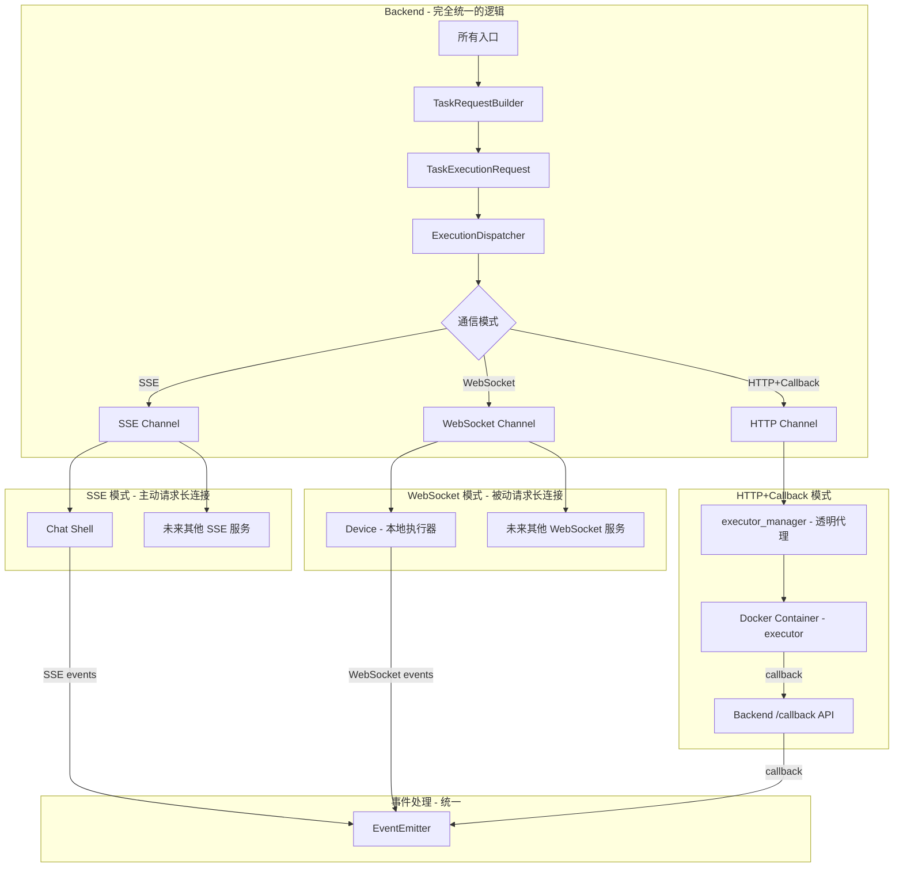

# 任务发送流程重构计划 v8 - 统一执行架构（含 Device）

系统应该有三个任务来源（网页websocket、openapi、订阅器）
三类AI执行器（chat_shell、executor_manager、AI device executor）
三种AI执行模式（sse、http&callback、websocket）
三种结果返回模式（同步流式、同步非流式、异步）

这些逻辑应该是内聚的，不同模式可以自由组合在一起。

> **核心设计原则**:
> 1. **Backend 无执行器概念**: Backend 只知道"执行服务"和"通信模式",不应该有判断chat_shell或者其他executor的逻辑
> 2. **统一请求格式**: 所有执行服务接收相同格式的 `TaskExecutionRequest`
> 3. **三种通信模式**: SSE 模式、WebSocket 模式、HTTP+Callback 模式
> 4. **executor_manager 透明代理**: 在任务派发链路上只做转发，不含业务逻辑
> 5. **无历史兼容路径**: 代码尽可能简化
> 6. **重要！！！！**: 不要保留旧的实现，整个系统最终应该只有新的实现，旧的实现不应该存在。

---

## 1. 核心设计理念

### 1.1 当前问题

当前系统存在多种执行路径，代码中充斥着类型判断：

```python
# 当前代码 - 错误的设计
if supports_direct_chat:
    # Chat Shell 路径 - SSE
    await _trigger_direct_chat(...)
elif device_id:
    # Device 路径 - WebSocket
    await route_task_to_device(...)
else:
    # Executor 路径 - HTTP+Callback
    logger.info("Executor task, handled by executor_manager")
```

### 1.2 目标设计

Backend 只关心：
1. **构建请求数据** - 统一的 `TaskExecutionRequest`
2. **选择通信模式** - SSE / WebSocket / HTTP+Callback
3. **发送到执行服务** - 统一的接口



---

## 2. 三种通信模式

### 2.1 SSE 模式（主动请求的长连接）

**特点**：
- Backend **主动**向执行器发起 HTTP 请求
- 执行器返回 **SSE 流**，实时推送事件
- 适用于可直接访问的执行器
- 单向流：执行器 → Backend

**适用场景**：
- Chat Shell（当前实现）
- 未来其他支持 SSE 的执行器

```
┌─────────────┐    HTTP POST     ┌─────────────┐
│   Backend   │ ───────────────► │  Chat Shell │
│             │                  │             │
│             │ ◄─── SSE Stream ─│             │
│             │   data: {...}    │             │
│             │   data: {...}    │             │
│             │   data: [DONE]   │             │
└─────────────┘                  └─────────────┘
```

### 2.2 WebSocket 模式（被动请求的长连接）

**特点**：
- 执行器 **主动**连接到 Backend
- Backend **被动**接收连接，然后推送任务
- 适用于防火墙后的执行器
- 双向流：Backend ↔ 执行器

**适用场景**：
- Device（本地执行器）
- 未来其他需要穿透防火墙的执行器

```
┌─────────────┐                    ┌─────────────┐
│   Backend   │◄───── WebSocket ───│   Device    │
│             │    (执行器主动连接)  │  (executor) │
│  /local-    │                    │             │
│  executor   │                    │  防火墙后   │
│  namespace  │                    │             │
└─────────────┘                    └─────────────┘
     │                                    │
     │  task:execute ──────────────────►  │
     │                                    │
     │  ◄────────────── task:progress     │
     │  ◄────────────── task:complete     │
     │                                    │
```

### 2.3 HTTP+Callback 模式

**特点**：
- Backend 发送 HTTP 请求启动任务
- 执行器异步执行，通过 **HTTP 回调**返回结果
- 适用于容器化部署
- 无长连接

**适用场景**：
- executor_manager + Docker 容器
- 未来其他异步执行的服务

```
┌─────────────┐    HTTP POST     ┌─────────────────┐    HTTP POST    ┌─────────────┐
│   Backend   │ ───────────────► │ executor_manager │ ──────────────► │  Container  │
│             │                  │   (透明代理)      │                 │  (executor) │
└─────────────┘                  └─────────────────┘                 └─────────────┘
     ▲                                                                      │
     │                                                                      │
     │  HTTP POST /callback  ◄──────────────────────────────────────────────┘
     │
```

### 2.4 三种模式对比

| 特性 | SSE 模式 | WebSocket 模式 | HTTP+Callback 模式 |
|------|---------|---------------|-------------------|
| 连接发起方 | Backend | 执行器 | Backend |
| 连接类型 | 单向长连接 | 双向长连接 | 无长连接 |
| 数据流向 | 执行器 → Backend | 双向 | 执行器 → Backend (回调) |
| 适用场景 | 可直接访问、需要实时流 | 防火墙后、需要双向通信 | 容器化、异步执行 |
| 当前实现 | Chat Shell | Device | executor_manager |
| 取消任务 | 关闭连接 | task:cancel event | HTTP POST /cancel |

---

## 3. 统一请求格式

### 3.1 TaskExecutionRequest

所有执行服务都接收这个统一格式：

```python
# shared/models/execution_request.py

from dataclasses import dataclass, field
from typing import Any, Optional

@dataclass
class TaskExecutionRequest:
    """统一的任务执行请求
    
    所有执行服务（chat_shell、device、executor_manager 等）都接收这个格式。
    执行服务内部根据自己的需要解析和使用这些字段。
    """
    
    # === 任务标识 ===
    task_id: int
    subtask_id: int
    team_id: int
    team_name: str
    
    # === 用户信息 ===
    user: dict  # {id, name, git_domain, git_token, git_id, git_login, git_email}
    
    # === Bot 配置 ===
    bot: list[dict]  # [{id, name, shell_type, agent_config, system_prompt, mcp_servers, skills, role, base_image}]
    
    # === 模型配置 ===
    model_config: dict
    
    # === Prompt ===
    system_prompt: str
    prompt: str
    
    # === 功能开关 ===
    enable_tools: bool = True
    enable_web_search: bool = False
    enable_clarification: bool = False
    enable_deep_thinking: bool = True
    
    # === 技能配置 ===
    skill_names: list[str] = field(default_factory=list)
    skill_configs: list[dict] = field(default_factory=list)
    preload_skills: list[str] = field(default_factory=list)
    user_selected_skills: list[str] = field(default_factory=list)
    
    # === MCP 配置 ===
    mcp_servers: list[dict] = field(default_factory=list)
    
    # === 知识库配置 ===
    knowledge_base_ids: Optional[list[int]] = None
    document_ids: Optional[list[int]] = None
    table_contexts: list[dict] = field(default_factory=list)
    is_user_selected_kb: bool = True
    
    # === 工作空间配置 ===
    workspace: dict = field(default_factory=dict)
    
    # === 会话配置 ===
    message_id: Optional[int] = None
    user_message_id: Optional[int] = None
    is_group_chat: bool = False
    history_limit: Optional[int] = None
    new_session: bool = False
    collaboration_model: str = "single"
    
    # === 认证 ===
    auth_token: str = ""
    task_token: str = ""
    backend_url: str = ""
    
    # === 附件 ===
    attachments: list[dict] = field(default_factory=list)
    
    # === 订阅任务 ===
    is_subscription: bool = False
    system_mcp_config: Optional[dict] = None
    
    # === 追踪 ===
    trace_context: Optional[dict] = None
    
    def to_dict(self) -> dict:
        """转换为字典，用于 JSON 序列化"""
        # ... 实现略
```

---

## 4. 执行服务配置

### 4.1 配置结构

```python
# backend/app/core/config.py

from enum import Enum

class CommunicationMode(str, Enum):
    SSE = "sse"                    # 主动请求的长连接
    WEBSOCKET = "websocket"        # 被动请求的长连接
    HTTP_CALLBACK = "http_callback"  # HTTP+Callback

class Settings:
    # 执行服务配置
    # Backend 只知道通信模式和目标地址，不知道背后是什么
    
    EXECUTION_SERVICES: dict = {
        # SSE 模式的服务
        "Chat": {
            "mode": "sse",
            "url": "http://chat-shell:8100",
            "endpoint": "/v1/execute",
        },
        
        # HTTP+Callback 模式的服务
        "ClaudeCode": {
            "mode": "http_callback",
            "url": "http://executor-manager:8001",
            "endpoint": "/v1/execute",
        },
        "Agno": {
            "mode": "http_callback",
            "url": "http://executor-manager:8001",
            "endpoint": "/v1/execute",
        },
        "Dify": {
            "mode": "http_callback",
            "url": "http://executor-manager:8001",
            "endpoint": "/v1/execute",
        },
        
        # WebSocket 模式的服务
        # Device 特殊处理：根据 device_id 动态路由
        # 当 task 指定了 device_id 时，使用 WebSocket 模式
    }
    
    # 默认配置
    DEFAULT_EXECUTION_MODE: str = "http_callback"
    DEFAULT_EXECUTION_URL: str = "http://executor-manager:8001"
```

### 4.2 路由逻辑

```python
# backend/app/services/execution/router.py

from dataclasses import dataclass
from typing import Optional

@dataclass
class ExecutionTarget:
    """执行目标配置"""
    mode: CommunicationMode
    # SSE/HTTP 模式
    url: Optional[str] = None
    endpoint: str = "/v1/execute"
    # WebSocket 模式
    namespace: Optional[str] = None
    event: str = "task:execute"
    room: Optional[str] = None  # WebSocket room (e.g., device:{user_id}:{device_id})

class ExecutionRouter:
    """执行路由器
    
    根据任务配置决定使用哪种通信模式和目标地址。
    
    设计原则：
    - 不关心执行服务是什么（device? executor? chat_shell?）
    - 只关心通信模式和目标地址
    """
    
    def route(
        self,
        request: TaskExecutionRequest,
        device_id: Optional[str] = None,
    ) -> ExecutionTarget:
        """路由任务到执行目标
        
        路由优先级：
        1. 如果指定了 device_id，使用 WebSocket 模式
        2. 否则根据 shell_type 查找配置
        3. 默认使用 HTTP+Callback 模式
        """
        user_id = request.user.get("id")
        
        # 优先级 1: 指定了 device_id，使用 WebSocket 模式
        if device_id:
            return ExecutionTarget(
                mode=CommunicationMode.WEBSOCKET,
                namespace="/local-executor",
                event="task:execute",
                room=f"device:{user_id}:{device_id}",
            )
        
        # 优先级 2: 根据 shell_type 查找配置
        shell_type = self._get_shell_type(request)
        service_config = settings.EXECUTION_SERVICES.get(shell_type)
        
        if service_config:
            mode = CommunicationMode(service_config["mode"])
            if mode == CommunicationMode.WEBSOCKET:
                return ExecutionTarget(
                    mode=mode,
                    namespace=service_config.get("namespace"),
                    event=service_config.get("event", "task:execute"),
                )
            else:
                # SSE 或 HTTP+Callback
                return ExecutionTarget(
                    mode=mode,
                    url=service_config["url"],
                    endpoint=service_config.get("endpoint", "/v1/execute"),
                )
        
        # 优先级 3: 默认配置
        return ExecutionTarget(
            mode=CommunicationMode.HTTP_CALLBACK,
            url=settings.DEFAULT_EXECUTION_URL,
            endpoint="/v1/execute",
        )
    
    def _get_shell_type(self, request: TaskExecutionRequest) -> str:
        """从请求中获取 shell_type"""
        if request.bot and len(request.bot) > 0:
            return request.bot[0].get("shell_type", "Chat")
        return "Chat"
```

---

## 5. 统一分发器

### 5.1 ExecutionDispatcher

```python
# backend/app/services/execution/dispatcher.py

from typing import AsyncIterator, Optional
import httpx

class ExecutionDispatcher:
    """统一的任务分发器
    
    核心职责：
    1. 使用 ExecutionRouter 确定目标
    2. 根据通信模式发送请求
    3. 统一事件处理
    
    设计原则：
    - 不知道执行服务是什么
    - 只知道通信模式和目标地址
    """
    
    def __init__(self):
        self.router = ExecutionRouter()
        self.http_client = httpx.AsyncClient(timeout=300.0)
        self.event_emitter = EventEmitter()
    
    async def dispatch(
        self,
        request: TaskExecutionRequest,
        device_id: Optional[str] = None,
    ) -> None:
        """分发任务
        
        Args:
            request: 统一的执行请求
            device_id: 可选的设备 ID（指定时使用 WebSocket 模式）
        """
        # 路由到执行目标
        target = self.router.route(request, device_id)
        
        logger.info(
            f"[ExecutionDispatcher] Dispatching: task_id={request.task_id}, "
            f"subtask_id={request.subtask_id}, mode={target.mode.value}"
        )
        
        try:
            if target.mode == CommunicationMode.SSE:
                await self._dispatch_sse(request, target)
            elif target.mode == CommunicationMode.WEBSOCKET:
                await self._dispatch_websocket(request, target)
            else:
                await self._dispatch_http_callback(request, target)
        except Exception as e:
            logger.exception("[ExecutionDispatcher] Error")
            error_event = ExecutionEvent(
                type=EventType.ERROR,
                task_id=request.task_id,
                subtask_id=request.subtask_id,
                error=str(e),
            )
            await self.event_emitter.emit(error_event)
    
    async def _dispatch_sse(
        self,
        request: TaskExecutionRequest,
        target: ExecutionTarget,
    ) -> None:
        """通过 SSE 分发任务（主动请求的长连接）
        
        Backend 主动向执行器发起请求，执行器返回 SSE 流。
        """
        url = f"{target.url}{target.endpoint}"
        
        logger.info(f"[ExecutionDispatcher] SSE dispatch: url={url}")
        
        # 发送 START 事件
        start_event = ExecutionEvent(
            type=EventType.START,
            task_id=request.task_id,
            subtask_id=request.subtask_id,
            message_id=request.message_id,
        )
        await self.event_emitter.emit(start_event)
        
        # 发起 SSE 请求并处理流
        async with self.http_client.stream(
            "POST",
            url,
            json=request.to_dict(),
        ) as response:
            async for line in response.aiter_lines():
                if line.startswith("data: "):
                    data_str = line[6:]
                    if data_str == "[DONE]":
                        continue
                    data = json.loads(data_str)
                    event = self._parse_sse_event(request, data)
                    await self.event_emitter.emit(event)
    
    async def _dispatch_websocket(
        self,
        request: TaskExecutionRequest,
        target: ExecutionTarget,
    ) -> None:
        """通过 WebSocket 分发任务（被动请求的长连接）
        
        执行器已经主动连接到 Backend，Backend 推送任务到指定 room。
        """
        from app.core.socketio import get_sio
        
        sio = get_sio()
        
        # 发送任务到指定 room
        await sio.emit(
            target.event,
            request.to_dict(),
            room=target.room,
            namespace=target.namespace,
        )
        
        logger.info(
            f"[ExecutionDispatcher] WebSocket dispatch: "
            f"namespace={target.namespace}, room={target.room}, event={target.event}"
        )
        
        # WebSocket 模式下，事件通过 DeviceNamespace 的 on_task_progress/on_task_complete 处理
        # 不需要在这里等待响应
    
    async def _dispatch_http_callback(
        self,
        request: TaskExecutionRequest,
        target: ExecutionTarget,
    ) -> None:
        """通过 HTTP+Callback 分发任务
        
        Backend 发送 HTTP 请求，执行器异步执行并通过回调返回结果。
        """
        url = f"{target.url}{target.endpoint}"
        
        # 发送请求
        response = await self.http_client.post(
            url,
            json=request.to_dict(),
        )
        
        if response.status_code != 200:
            raise Exception(f"HTTP dispatch failed: {response.status_code}")
        
        logger.info(
            f"[ExecutionDispatcher] HTTP+Callback dispatch: url={url}, status={response.status_code}"
        )
        
        # HTTP+Callback 模式下，后续事件通过 /callback API 处理
        # 这里只发送 START 事件
        start_event = ExecutionEvent(
            type=EventType.START,
            task_id=request.task_id,
            subtask_id=request.subtask_id,
            message_id=request.message_id,
        )
        await self.event_emitter.emit(start_event)
    
    def _parse_sse_event(self, request: TaskExecutionRequest, data: dict) -> ExecutionEvent:
        """解析 SSE 事件数据"""
        event_type_str = data.get("type", "chunk")
        try:
            event_type = EventType(event_type_str)
        except ValueError:
            event_type = EventType.CHUNK
        
        return ExecutionEvent(
            type=event_type,
            task_id=request.task_id,
            subtask_id=request.subtask_id,
            content=data.get("content", ""),
            offset=data.get("offset", 0),
            result=data.get("result"),
            error=data.get("error"),
            message_id=request.message_id,
        )
    
    async def cancel(
        self,
        request: TaskExecutionRequest,
        device_id: Optional[str] = None,
    ) -> bool:
        """取消任务"""
        target = self.router.route(request, device_id)
        
        if target.mode == CommunicationMode.SSE:
            # SSE 模式：关闭连接即可取消
            # 需要在 _dispatch_sse 中保存连接引用
            return await self._cancel_sse(request, target)
        elif target.mode == CommunicationMode.WEBSOCKET:
            return await self._cancel_websocket(request, target)
        else:
            return await self._cancel_http(request, target)
    
    async def _cancel_sse(
        self,
        request: TaskExecutionRequest,
        target: ExecutionTarget,
    ) -> bool:
        """取消 SSE 任务"""
        # SSE 模式下，发送取消请求到执行器
        url = f"{target.url}/v1/cancel"
        try:
            response = await self.http_client.post(
                url,
                json={"task_id": request.task_id, "subtask_id": request.subtask_id},
            )
            return response.status_code == 200
        except Exception:
            return False
    
    async def _cancel_websocket(
        self,
        request: TaskExecutionRequest,
        target: ExecutionTarget,
    ) -> bool:
        """通过 WebSocket 取消任务"""
        from app.core.socketio import get_sio
        
        sio = get_sio()
        await sio.emit(
            "task:cancel",
            {"task_id": request.task_id, "subtask_id": request.subtask_id},
            room=target.room,
            namespace=target.namespace,
        )
        return True
    
    async def _cancel_http(
        self,
        request: TaskExecutionRequest,
        target: ExecutionTarget,
    ) -> bool:
        """通过 HTTP 取消任务"""
        url = f"{target.url}/v1/cancel"
        try:
            response = await self.http_client.post(
                url,
                json={"task_id": request.task_id, "subtask_id": request.subtask_id},
            )
            return response.status_code == 200
        except Exception:
            return False


# 全局实例
execution_dispatcher = ExecutionDispatcher()
```

---

## 6. executor_manager 透明代理化

### 6.1 当前 executor_manager 的职责

当前 executor_manager 承担了多个职责：
1. **容器编排**: 启动/停止/管理 Docker 容器
2. **任务派发**: 接收任务并转发到容器
3. **回调处理**: 接收容器回调并转发到 Backend
4. **心跳监控**: 监控容器健康状态
5. **Sandbox 管理**: E2B 兼容的沙箱服务

### 6.2 透明代理化改造

在任务派发链路上，executor_manager 应该只做转发：

```python
# executor_manager/routers/routers.py

@api_router.post("/v1/execute")
async def execute_task(request: TaskExecutionRequest):
    """统一的执行接口 - 透明代理
    
    职责：
    1. 接收 TaskExecutionRequest
    2. 根据 shell_type 选择/创建容器
    3. 转发请求到容器
    4. 不做任何业务逻辑处理
    """
    # 从请求中获取容器信息
    executor_name = request.get("executor_name")
    
    if executor_name:
        # 已有容器，直接转发
        return await _forward_to_container(executor_name, request)
    else:
        # 需要创建新容器
        executor = ExecutorDispatcher.get_executor(EXECUTOR_DISPATCHER_MODE)
        result = executor.submit_executor(request.to_dict())
        return result

async def _forward_to_container(executor_name: str, request: dict):
    """转发请求到容器"""
    executor = ExecutorDispatcher.get_executor(EXECUTOR_DISPATCHER_MODE)
    port, error = executor._get_container_port(executor_name)
    
    if not port:
        raise HTTPException(status_code=404, detail=error)
    
    # 直接转发，不做任何处理
    async with httpx.AsyncClient() as client:
        response = await client.post(
            f"http://localhost:{port}/api/tasks/execute",
            json=request,
        )
        return response.json()
```

### 6.3 保留的其他功能

executor_manager 保留以下功能（与任务派发无关）：
- 容器生命周期管理（启动/停止/删除）
- 心跳监控和 OOM 检测
- Sandbox/E2B 服务
- 镜像验证服务

---

## 7. Device 作为独立执行器

### 7.1 Device 的定位

Device 是一个运行在用户本地机器上的独立执行器：
- 与 Docker 容器中的 executor 使用相同的代码
- 因为在防火墙后，使用 WebSocket 模式（被动请求的长连接）
- 主动连接到 Backend，而不是被动接收请求

### 7.2 Device 与 Docker Executor 的统一

```
┌─────────────────────────────────────────────────────────────────┐
│                        executor 代码库                           │
│                                                                  │
│  ┌──────────────────┐    ┌──────────────────┐                   │
│  │   Docker 模式     │    │   Local 模式      │                   │
│  │                  │    │   (Device)        │                   │
│  │  - HTTP API      │    │  - WebSocket      │                   │
│  │  - Callback      │    │  - 主动连接       │                   │
│  │  - 容器内运行    │    │  - 本地运行       │                   │
│  └────────┬─────────┘    └────────┬─────────┘                   │
│           │                       │                              │
│           └───────────┬───────────┘                              │
│                       │                                          │
│              ┌────────▼────────┐                                 │
│              │   Agent 核心    │                                 │
│              │  ClaudeCode     │                                 │
│              │  Agno           │                                 │
│              │  Dify           │                                 │
│              └─────────────────┘                                 │
└─────────────────────────────────────────────────────────────────┘
```

### 7.3 Device 的通信协议

Device 使用 WebSocket 与 Backend 通信，事件格式与其他模式对齐：

```python
# Device -> Backend 事件

# 任务进度
{
    "event": "task:progress",
    "data": {
        "task_id": 123,
        "subtask_id": 456,
        "progress": 50,
        "status": "RUNNING",
        "result": {
            "value": "...",
            "thinking": [...],
            "workbench": {...}
        }
    }
}

# 任务完成
{
    "event": "task:complete",
    "data": {
        "task_id": 123,
        "subtask_id": 456,
        "progress": 100,
        "status": "COMPLETED",
        "result": {
            "value": "...",
            "thinking": [...],
            "workbench": {...}
        }
    }
}

# Backend -> Device 事件

# 执行任务
{
    "event": "task:execute",
    "data": TaskExecutionRequest  # 统一格式
}

# 取消任务
{
    "event": "task:cancel",
    "data": {
        "task_id": 123,
        "subtask_id": 456
    }
}
```

---

## 8. Chat Shell 的 SSE 模式

### 8.1 Chat Shell 的定位

Chat Shell 是一个轻量级的 AI 聊天引擎：
- 使用 SSE 模式（主动请求的长连接）
- Backend 主动向 Chat Shell 发起请求
- Chat Shell 返回 SSE 流，实时推送事件

### 8.2 Chat Shell 的接口

```python
# chat_shell/chat_shell/api/v1/response.py

@router.post("/v1/execute")
async def execute(request: TaskExecutionRequest):
    """统一的执行接口
    
    接收 TaskExecutionRequest，返回 SSE 流。
    """
    async def generate():
        # 处理请求并生成 SSE 事件
        async for event in process_request(request):
            yield f"data: {json.dumps(event)}\n\n"
        yield "data: [DONE]\n\n"
    
    return StreamingResponse(
        generate(),
        media_type="text/event-stream",
    )
```

### 8.3 未来：Chat Shell 也可以支持 WebSocket 模式

如果 Chat Shell 需要部署在防火墙后，也可以支持 WebSocket 模式：

```python
# chat_shell 作为 WebSocket 客户端连接到 Backend
# 类似于 Device 的实现
```

---

## 9. 统一事件处理

### 9.1 EventEmitter

无论是 SSE、WebSocket 还是 HTTP+Callback，最终都通过 EventEmitter 处理事件：

```python
# backend/app/services/execution/event_emitter.py

class EventEmitter:
    """统一的事件发射器
    
    接收来自不同来源的事件，统一处理并转发到前端。
    
    事件来源：
    1. SSE Stream (Chat Shell) - 通过 ExecutionDispatcher._dispatch_sse
    2. WebSocket (Device) - 通过 DeviceNamespace
    3. HTTP Callback - 通过 /callback API
    """
    
    async def emit(self, event: ExecutionEvent) -> None:
        """发射事件到前端"""
        ws_emitter = get_ws_emitter()
        if not ws_emitter:
            return
        
        if event.type == EventType.START:
            await ws_emitter.emit_chat_start(
                task_id=event.task_id,
                subtask_id=event.subtask_id,
                message_id=event.message_id,
            )
        
        elif event.type == EventType.CHUNK:
            await ws_emitter.emit_chat_chunk(
                task_id=event.task_id,
                subtask_id=event.subtask_id,
                content=event.content,
                offset=event.offset,
                result=event.result,
            )
        
        elif event.type == EventType.DONE:
            await ws_emitter.emit_chat_done(
                task_id=event.task_id,
                subtask_id=event.subtask_id,
                offset=event.offset,
                result=event.result,
                message_id=event.message_id,
            )
        
        elif event.type == EventType.ERROR:
            await ws_emitter.emit_chat_error(
                task_id=event.task_id,
                subtask_id=event.subtask_id,
                error=event.error,
                message_id=event.message_id,
            )
```

### 9.2 事件来源统一

| 通信模式 | 事件来源 | 处理方式 |
|---------|---------|---------|
| SSE | ExecutionDispatcher._dispatch_sse | 直接解析 SSE 流并调用 EventEmitter |
| WebSocket | DeviceNamespace.on_task_progress/complete | 在 namespace 中调用 EventEmitter |
| HTTP+Callback | /callback API | 在 API 中调用 EventEmitter |

---

## 10. 重构后的入口点

### 10.1 trigger_ai_response (简化版)

```python
# backend/app/services/chat/trigger/core.py

async def trigger_ai_response(
    task: TaskResource,
    assistant_subtask: Subtask,
    team: Kind,
    user: User,
    message: str,
    payload: Any,
    task_room: str,
    device_id: Optional[str] = None,  # 指定设备时使用 WebSocket 模式
    # ... 其他参数
) -> None:
    """触发 AI 响应
    
    重构后的版本:
    - 没有 supports_direct_chat 判断
    - 没有 device vs executor 判断
    - 没有 chat_shell vs executor 判断
    - 统一使用 TaskRequestBuilder 构建请求
    - 统一使用 ExecutionDispatcher 分发任务
    """
    logger.info(
        f"[ai_trigger] Triggering AI response: task_id={task.id}, "
        f"subtask_id={assistant_subtask.id}, device_id={device_id}"
    )
    
    db = SessionLocal()
    try:
        # 1. 构建统一的执行请求
        builder = TaskRequestBuilder(db)
        request = builder.build(
            subtask=assistant_subtask,
            task=task,
            user=user,
            team=team,
            message=message,
            # ... 其他参数
        )
        
        # 2. 处理上下文（附件、知识库等）
        if user_subtask_id:
            request = await _process_contexts(db, request, user_subtask_id)
        
    finally:
        db.close()
    
    # 3. 分发任务
    # ExecutionDispatcher 根据配置自动选择通信模式：
    # - 指定 device_id -> WebSocket 模式
    # - shell_type=Chat -> SSE 模式
    # - 其他 -> HTTP+Callback 模式
    from app.services.execution.dispatcher import execution_dispatcher
    
    await execution_dispatcher.dispatch(request, device_id=device_id)
```

---

## 11. 架构图

### 11.1 整体架构

```
┌─────────────────────────────────────────────────────────────────────────────┐
│                                  Backend                                     │
│                                                                              │
│  ┌──────────────────┐    ┌──────────────────┐    ┌──────────────────┐       │
│  │ TaskRequestBuilder│───▶│TaskExecutionRequest│───▶│ ExecutionRouter  │       │
│  └──────────────────┘    └──────────────────┘    └────────┬─────────┘       │
│                                                           │                  │
│                                    ┌──────────────────────┼──────────────────┐
│                                    │                      │                  │
│                          ┌─────────▼─────────┐  ┌────────▼────────┐  ┌──────▼──────┐
│                          │   SSE Channel     │  │ WebSocket Channel│  │ HTTP Channel │
│                          │  (主动请求长连接)  │  │ (被动请求长连接) │  │(HTTP+Callback)│
│                          └─────────┬─────────┘  └────────┬────────┘  └──────┬──────┘
│                                    │                     │                  │     │
└────────────────────────────────────┼─────────────────────┼──────────────────┼─────┘
                                     │                     │                  │
                    ┌────────────────┘                     │                  │
                    │                     ┌────────────────┘                  │
                    │                     │                                   │
                    ▼                     ▼                                   ▼
           ┌───────────────┐     ┌───────────────┐                   ┌───────────────┐
           │  Chat Shell   │     │    Device     │                   │executor_manager│
           │               │     │  (本地执行器)  │                   │  (透明代理)    │
           │  SSE 流返回   │     │               │                   │               │
           │               │     │  WebSocket    │                   │  HTTP POST    │
           │               │     │  主动连接     │                   │               │
           └───────┬───────┘     └───────┬───────┘                   └───────┬───────┘
                   │                     │                                   │
                   │                     │                                   ▼
                   │                     │                           ┌───────────────┐
                   │                     │                           │   Container   │
                   │                     │                           │  (executor)   │
                   │                     │                           └───────┬───────┘
                   │                     │                                   │
                   ▼                     ▼                                   ▼
           ┌───────────────────────────────────────────────────────────────────────┐
           │                        EventEmitter                                    │
           │                                                                        │
           │  SSE events ────────────────────────────────────────────────────────►  │
           │  WebSocket events ──────────────────────────────────────────────────►  │
           │  HTTP callback ─────────────────────────────────────────────────────►  │
           │                                                                        │
           └────────────────────────────────────┬──────────────────────────────────┘
                                                │
                                                ▼
                                        ┌───────────────┐
                                        │   Frontend    │
                                        │  (WebSocket)  │
                                        └───────────────┘
```

### 11.2 三种通信模式对比

| 特性 | SSE 模式 | WebSocket 模式 | HTTP+Callback 模式 |
|------|---------|---------------|-------------------|
| 连接发起方 | Backend | 执行器 | Backend |
| 连接类型 | 单向长连接 | 双向长连接 | 无长连接 |
| 数据流向 | 执行器 → Backend | 双向 | 执行器 → Backend (回调) |
| 适用场景 | 可直接访问、需要实时流 | 防火墙后、需要双向通信 | 容器化、异步执行 |
| 当前实现 | Chat Shell | Device | executor_manager |
| 取消任务 | HTTP POST /cancel | task:cancel event | HTTP POST /cancel |
| 事件处理 | 直接解析 SSE 流 | DeviceNamespace | /callback API |

---

## 12. 实施步骤

### Phase 1: 创建统一数据模型和路由

1. 创建 `shared/models/execution_request.py` - TaskExecutionRequest
2. 创建 `shared/models/execution_events.py` - ExecutionEvent
3. 创建 `backend/app/services/execution/router.py` - ExecutionRouter

### Phase 2: 实现统一分发器

1. 创建 `backend/app/services/execution/dispatcher.py` - ExecutionDispatcher
2. 创建 `backend/app/services/execution/event_emitter.py` - EventEmitter
3. 实现 SSE、WebSocket、HTTP+Callback 三种通道

### Phase 3: 重构入口点

1. 重构 `trigger_ai_response` - 移除所有类型判断
2. 重构 `route_task_to_device` - 使用 ExecutionDispatcher
3. 统一 callback 处理

### Phase 4: executor_manager 透明代理化

1. 添加 `/v1/execute` 接口
2. 简化任务派发逻辑为纯转发
3. 保留其他功能（容器管理、心跳监控等）

### Phase 5: Chat Shell 接口统一

1. 添加 `/v1/execute` 接口（替代 `/v1/response`）
2. 统一请求格式为 TaskExecutionRequest
3. 保持 SSE 流返回

### Phase 6: 清理

1. 删除 `supports_direct_chat` 相关逻辑
2. 删除 `ChatConfigBuilder`
3. 删除重复的适配器代码
4. 统一事件处理逻辑

---

## 13. 文件变更清单

### 新增文件

```
shared/models/
├── execution_request.py      # TaskExecutionRequest
└── execution_events.py       # ExecutionEvent

backend/app/services/execution/
├── __init__.py
├── router.py                 # ExecutionRouter
├── dispatcher.py             # ExecutionDispatcher
├── event_emitter.py          # EventEmitter
└── request_builder.py        # TaskRequestBuilder
```

### 修改文件

```
backend/app/services/chat/trigger/core.py
  - 移除 supports_direct_chat 判断
  - 移除 device vs executor 判断
  - 使用 ExecutionDispatcher

backend/app/services/device_router.py
  - 简化为调用 ExecutionDispatcher

backend/app/api/ws/device_namespace.py
  - 事件处理统一到 EventEmitter

executor_manager/routers/routers.py
  - 添加 /v1/execute 接口
  - 简化为透明代理

chat_shell/chat_shell/api/v1/response.py
  - 添加 /v1/execute 接口
  - 统一请求格式
```

### 删除文件

```
backend/app/services/chat/config/chat_config.py
backend/app/services/chat/adapters/interface.py
```

---

## 14. 关键设计决策

### 14.1 为什么使用三种通信模式？

**SSE 模式（主动请求的长连接）**:
- Backend 可以直接访问执行器
- 需要实时流式返回
- 单向数据流，实现简单

**WebSocket 模式（被动请求的长连接）**:
- 执行器在防火墙后，无法被直接访问
- 需要双向实时通信
- 执行器主动连接，Backend 被动接收

**HTTP+Callback 模式**:
- 执行器可被直接访问
- 异步执行，通过回调返回结果
- 适合容器化部署，无需维护长连接

### 14.2 为什么 executor_manager 要透明代理化？

**原因**:
1. 任务派发链路应该尽可能简单
2. 业务逻辑应该在 Backend 或 executor 中，不应该在中间层
3. 透明代理更容易维护和调试
4. 未来可以更容易地替换或扩展

**保留的功能**:
- 容器生命周期管理
- 心跳监控和 OOM 检测
- Sandbox/E2B 服务
- 镜像验证服务

### 14.3 Device、Docker Executor、Chat Shell 的关系？

**相同点**:
- 接收相同格式的 TaskExecutionRequest
- 返回相同格式的事件（通过不同通道）
- 最终都通过 EventEmitter 处理

**不同点**:
- 通信模式不同（WebSocket / HTTP+Callback / SSE）
- 部署位置不同（本地 / 容器 / 独立服务）
- 连接方向不同（主动连接 / 被动接收 / 主动请求）

---

## 15. 总结

本重构方案的核心改进：

1. **统一为三种通信模式**: SSE（主动请求长连接）、WebSocket（被动请求长连接）、HTTP+Callback
2. **Backend 无执行器概念**: 只知道通信模式和目标地址
3. **统一请求格式**: 所有执行服务接收相同的 `TaskExecutionRequest`
4. **executor_manager 透明代理化**: 在任务派发链路上只做转发
5. **Device 作为独立执行器**: 使用 WebSocket 模式
6. **Chat Shell 使用 SSE 模式**: 主动请求，流式返回
7. **统一事件处理**: 所有事件通过 EventEmitter 处理

Backend 只看到：
- 一个统一的请求格式
- 三种通信模式
- 一个统一的事件处理器

Backend 不知道：
- 背后是什么执行服务
- 执行服务如何实现
- 执行服务使用什么技术
