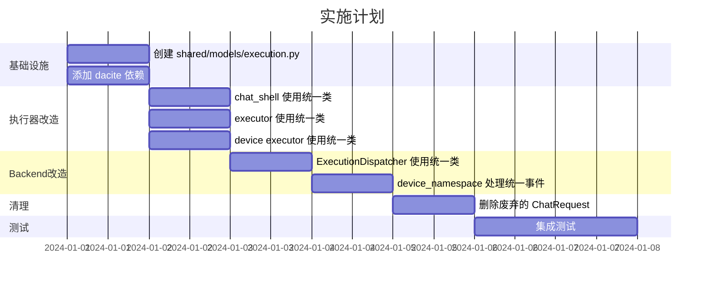

# 任务执行架构重构方案

## 1. 概述

### 1.1 目标架构原则

系统应该有四个任务来源、三类AI执行器、三种AI执行模式、三种结果返回模式，这些逻辑应该是**内聚的**，不同模式可以**自由组合**在一起。

| 维度 | 选项 |
|------|------|
| **任务来源** | 网页WebSocket、OpenAPI、订阅器、IM通道 |
| **AI执行器** | chat_shell、executor_manager、AI device executor |
| **AI执行模式** | SSE、HTTP+Callback、WebSocket |
| **结果返回模式** | 同步流式、同步非流式、异步 |

### 1.2 核心设计理念

#### 1.2.1 统一数据协议，所有模块共用

```
┌─────────────────────────────────────────────────────────────────┐
│                    shared/models/                               │
│  ┌─────────────────┐    ┌─────────────────┐                     │
│  │ ExecutionRequest │    │ ExecutionEvent  │                     │
│  │ (唯一 dataclass) │    │ (唯一 dataclass) │                     │
│  └─────────────────┘    └─────────────────┘                     │
│                                                                  │
│  所有模块共用：backend、chat_shell、executor、executor_manager    │
│  新增字段只改这一处                                               │
└─────────────────────────────────────────────────────────────────┘
```

#### 1.2.2 核心原则

1. **唯一数据类**：`ExecutionRequest` 和 `ExecutionEvent` 定义在 `shared/models/`
2. **所有模块共用**：backend、chat_shell、executor、executor_manager 都 import 同一个类
3. **新增字段只改一处**：在 shared 中加字段，所有模块自动获得
4. **自动序列化**：使用 `dataclasses.asdict()` 自动转 dict，无需手写 `to_dict()`

---

## 2. 当前问题分析

### 2.1 当前数据类分布

| 模块 | 数据类 | 位置 |
|------|--------|------|
| backend | TaskExecutionRequest | shared/models/execution_request.py |
| chat_shell | ChatRequest | chat_shell/chat_shell/interface.py |
| executor | Task | shared/models/task.py |
| executor_manager | TasksRequest | shared/models/task.py |

### 2.2 问题

1. **多个数据类**：ChatRequest、TaskExecutionRequest、Task 字段不完全一致
2. **手写序列化**：`to_dict()` 和 `from_dict()` 需要显式列出每个字段
3. **新增字段要改多处**：加一个字段要改多个文件

---

## 3. 统一数据协议设计

### 3.1 统一请求类：ExecutionRequest

**位置**：`shared/models/execution.py`

**设计原则**：
- 使用 `@dataclass` 保持类型安全
- 使用 `dataclasses.asdict()` 自动序列化，无需手写 `to_dict()`
- 使用 `dacite.from_dict()` 自动反序列化，无需手写 `from_dict()`
- 所有模块 import 同一个类

```python
# shared/models/execution.py

from dataclasses import dataclass, field, asdict
from typing import Any, Optional
from dacite import from_dict, Config

@dataclass
class ExecutionRequest:
    """统一执行请求 - 所有模块共用
    
    backend、chat_shell、executor、executor_manager 都使用这个类。
    新增字段只需要在这里加一次。
    """
    
    # === 任务标识 ===
    task_id: int = 0
    subtask_id: int = 0
    team_id: int = 0
    team_name: str = ""
    
    # === 用户信息 ===
    user: dict = field(default_factory=dict)
    # {id, name, git_domain, git_token, git_id, git_login, git_email}
    
    # === Bot配置 ===
    bot: list = field(default_factory=list)
    # [{id, name, shell_type, agent_config, system_prompt, mcp_servers, skills, role, base_image}]
    
    # === 模型配置 ===
    model_config: dict = field(default_factory=dict)
    # {provider, model_id, api_key, base_url, ...}
    
    # === 提示词 ===
    system_prompt: str = ""
    prompt: str = ""  # 用户消息
    
    # === 功能开关 ===
    enable_tools: bool = True
    enable_web_search: bool = False
    enable_clarification: bool = False
    enable_deep_thinking: bool = True
    
    # === Skill配置 ===
    skill_names: list = field(default_factory=list)
    skill_configs: list = field(default_factory=list)
    preload_skills: list = field(default_factory=list)
    user_selected_skills: list = field(default_factory=list)
    
    # === MCP配置 ===
    mcp_servers: list = field(default_factory=list)
    
    # === 知识库配置 ===
    knowledge_base_ids: Optional[list] = None
    document_ids: Optional[list] = None
    table_contexts: list = field(default_factory=list)
    is_user_selected_kb: bool = True
    
    # === 工作空间配置 ===
    workspace: dict = field(default_factory=dict)
    
    # === 会话配置 ===
    message_id: Optional[int] = None
    user_message_id: Optional[int] = None
    is_group_chat: bool = False
    history_limit: Optional[int] = None
    new_session: bool = False
    collaboration_model: str = "single"
    
    # === 认证 ===
    auth_token: str = ""
    task_token: str = ""
    backend_url: str = ""
    
    # === 附件 ===
    attachments: list = field(default_factory=list)
    
    # === 订阅任务 ===
    is_subscription: bool = False
    system_mcp_config: Optional[dict] = None
    
    # === 追踪 ===
    trace_context: Optional[dict] = None
    
    # ========================================
    # 新增字段只需要在这里加一行
    # 所有模块自动获得，无需修改其他文件
    # ========================================
    
    def to_dict(self) -> dict:
        """转换为 dict - 自动序列化所有字段"""
        return asdict(self)
    
    @classmethod
    def from_dict(cls, data: dict) -> "ExecutionRequest":
        """从 dict 创建 - 自动反序列化"""
        return from_dict(
            data_class=cls,
            data=data,
            config=Config(strict=False)  # 忽略未知字段
        )
```

### 3.2 统一事件类：ExecutionEvent

```python
# shared/models/execution.py (续)

from enum import Enum

class EventType(str, Enum):
    """统一事件类型"""
    START = "start"
    CHUNK = "chunk"
    THINKING = "thinking"
    TOOL_START = "tool_start"
    TOOL_RESULT = "tool_result"
    PROGRESS = "progress"
    DONE = "done"
    ERROR = "error"
    CANCELLED = "cancelled"

@dataclass
class ExecutionEvent:
    """统一执行事件 - 所有模块共用
    
    chat_shell、executor、executor_manager 都返回这个格式。
    backend 统一处理这个格式。
    """
    
    # === 事件标识 ===
    type: str = "chunk"  # EventType 的值
    task_id: int = 0
    subtask_id: int = 0
    
    # === 内容数据 ===
    content: str = ""
    offset: int = 0
    
    # === 结果数据 ===
    result: Optional[dict] = None
    # {value, thinking, workbench, blocks, ...}
    
    # === 进度数据 ===
    progress: int = 0
    
    # === 错误数据 ===
    error: Optional[str] = None
    error_code: Optional[str] = None
    
    # === 工具数据 ===
    tool_name: Optional[str] = None
    tool_input: Optional[dict] = None
    tool_output: Optional[Any] = None
    
    # === 元数据 ===
    message_id: Optional[int] = None
    executor_name: Optional[str] = None
    executor_namespace: Optional[str] = None
    timestamp: Optional[str] = None
    
    # ========================================
    # 新增字段只需要在这里加一行
    # ========================================
    
    def to_dict(self) -> dict:
        """转换为 dict"""
        return asdict(self)
    
    def to_sse(self) -> str:
        """转换为 SSE 格式"""
        import json
        return f"data: {json.dumps(self.to_dict())}\n\n"
    
    @classmethod
    def from_dict(cls, data: dict) -> "ExecutionEvent":
        """从 dict 创建"""
        return from_dict(
            data_class=cls,
            data=data,
            config=Config(strict=False)
        )
```

### 3.3 自动序列化的优势

```python
# ❌ 之前：手写 to_dict()，每个字段都要列出
def to_dict(self):
    return {
        "task_id": self.task_id,
        "subtask_id": self.subtask_id,
        # ... 30+ 行
    }

# ✅ 现在：使用 dataclasses.asdict() 自动序列化
def to_dict(self):
    return asdict(self)  # 一行搞定，自动包含所有字段

# ❌ 之前：手写 from_dict()，每个字段都要列出
@classmethod
def from_dict(cls, data):
    return cls(
        task_id=data.get("task_id", 0),
        subtask_id=data.get("subtask_id", 0),
        # ... 30+ 行
    )

# ✅ 现在：使用 dacite.from_dict() 自动反序列化
@classmethod
def from_dict(cls, data):
    return from_dict(data_class=cls, data=data, config=Config(strict=False))
```

---

## 4. 各模块改造

### 4.1 chat_shell 改造

**删除** `ChatRequest`，改用 `ExecutionRequest`：

```python
# chat_shell/chat_shell/api/v1/execute.py

from shared.models.execution import ExecutionRequest, ExecutionEvent, EventType

@router.post("/v1/execute")
async def execute(request_data: dict = Body(...)):
    """统一执行接口"""
    # 使用统一的 ExecutionRequest
    request = ExecutionRequest.from_dict(request_data)
    
    async def generate_events():
        # 发送开始事件
        yield ExecutionEvent(
            type=EventType.START,
            task_id=request.task_id,
            subtask_id=request.subtask_id,
        ).to_sse()
        
        # 流式生成
        async for token in agent.stream(request):
            yield ExecutionEvent(
                type=EventType.CHUNK,
                task_id=request.task_id,
                subtask_id=request.subtask_id,
                content=token,
                offset=current_offset,
            ).to_sse()
        
        # 完成事件
        yield ExecutionEvent(
            type=EventType.DONE,
            task_id=request.task_id,
            subtask_id=request.subtask_id,
            result={"value": full_content, "thinking": thinking},
        ).to_sse()
    
    return StreamingResponse(generate_events(), media_type="text/event-stream")
```

### 4.2 executor 改造

```python
# executor/callback/callback_handler.py

from shared.models.execution import ExecutionEvent, EventType

def send_progress(task_id, subtask_id, content, offset, **kwargs):
    """发送进度事件"""
    event = ExecutionEvent(
        type=EventType.CHUNK,
        task_id=task_id,
        subtask_id=subtask_id,
        content=content,
        offset=offset,
    )
    requests.post(callback_url, json=event.to_dict())

def send_done(task_id, subtask_id, result, **kwargs):
    """发送完成事件"""
    event = ExecutionEvent(
        type=EventType.DONE,
        task_id=task_id,
        subtask_id=subtask_id,
        result=result,
    )
    requests.post(callback_url, json=event.to_dict())
```

### 4.3 executor_manager 改造

```python
# executor_manager/routers/routers.py

from shared.models.execution import ExecutionRequest, ExecutionEvent

@api_router.post("/v1/execute")
async def execute(request_data: dict = Body(...)):
    """统一执行接口"""
    request = ExecutionRequest.from_dict(request_data)
    task_processor.process_tasks([request.to_dict()])
    return {"status": "submitted"}

@api_router.post("/callback")
async def callback(event_data: dict = Body(...)):
    """统一回调接口"""
    event = ExecutionEvent.from_dict(event_data)
    await forward_to_backend(event.to_dict())
    return {"status": "ok"}
```

### 4.4 device executor 改造

```python
# executor/modes/local/progress_reporter.py

from shared.models.execution import ExecutionEvent, EventType

class WebSocketProgressReporter:
    async def send_chunk(self, content: str, offset: int):
        """发送内容块"""
        event = ExecutionEvent(
            type=EventType.CHUNK,
            task_id=self.task_id,
            subtask_id=self.subtask_id,
            content=content,
            offset=offset,
        )
        await self.client.emit("task:event", event.to_dict())
    
    async def send_done(self, result: dict):
        """发送完成事件"""
        event = ExecutionEvent(
            type=EventType.DONE,
            task_id=self.task_id,
            subtask_id=self.subtask_id,
            result=result,
        )
        await self.client.emit("task:event", event.to_dict())
```

### 4.5 backend 改造

```python
# backend/app/services/execution/dispatcher.py

from shared.models.execution import ExecutionRequest, ExecutionEvent

class ExecutionDispatcher:
    async def dispatch(self, request: ExecutionRequest, device_id: str = None):
        """调度执行"""
        request_dict = request.to_dict()
        
        if device_id:
            await self._dispatch_websocket(request_dict, device_id)
        elif self._get_shell_type(request) == "Chat":
            async for event_dict in self._dispatch_sse(request_dict):
                event = ExecutionEvent.from_dict(event_dict)
                yield event
        else:
            await self._dispatch_http(request_dict)
```

---

## 5. 新增字段流程

### 5.1 新增字段只改一处

```python
# 示例：新增 enable_rag 字段

# Step 1: 在 shared/models/execution.py 中添加字段
@dataclass
class ExecutionRequest:
    # ... 现有字段
    enable_rag: bool = False  # 新增字段 ✅
    
# Step 2: 完成！
# - to_dict() 自动包含新字段（asdict 自动处理）
# - from_dict() 自动解析新字段（dacite 自动处理）
# - 所有模块自动获得新字段（import 同一个类）
```

### 5.2 对比

| 操作 | 之前 | 现在 |
|------|------|------|
| 新增字段 | 改 dataclass + to_dict + from_dict | 只改 dataclass |
| 修改文件数 | 3+ 处 | 1 处 |
| 风险 | 容易遗漏 | 不会遗漏 |

---

## 6. 依赖管理

### 6.1 添加 dacite 依赖

```toml
# shared/pyproject.toml
[project]
dependencies = [
    "dacite>=1.8.0",  # 用于 dataclass 反序列化
]
```

### 6.2 各模块依赖 shared

```toml
# chat_shell/pyproject.toml
[project]
dependencies = [
    "shared @ file:///${PROJECT_ROOT}/shared",
]

# executor/pyproject.toml
[project]
dependencies = [
    "shared @ file:///${PROJECT_ROOT}/shared",
]

# executor_manager/pyproject.toml
[project]
dependencies = [
    "shared @ file:///${PROJECT_ROOT}/shared",
]
```

---

## 7. 实施计划

### 7.1 文件变更清单

#### 新增/修改文件

| 文件路径 | 变更说明 |
|----------|----------|
| `shared/models/execution.py` | 新增：统一的 ExecutionRequest 和 ExecutionEvent |
| `shared/pyproject.toml` | 添加 dacite 依赖 |

#### 删除/废弃文件

| 文件路径 | 说明 |
|----------|------|
| `chat_shell/chat_shell/interface.py` | ChatRequest 废弃，改用 ExecutionRequest |
| `shared/models/execution_request.py` | 合并到 execution.py |

#### 修改文件

| 文件路径 | 变更说明 |
|----------|----------|
| `chat_shell/chat_shell/api/v1/execute.py` | 使用 ExecutionRequest/ExecutionEvent |
| `executor/callback/callback_handler.py` | 使用 ExecutionEvent |
| `executor/modes/local/progress_reporter.py` | 使用 ExecutionEvent |
| `executor_manager/routers/routers.py` | 使用 ExecutionRequest/ExecutionEvent |
| `backend/app/services/execution/dispatcher.py` | 使用 ExecutionRequest/ExecutionEvent |
| `backend/app/api/ws/device_namespace.py` | 处理 ExecutionEvent |

### 7.2 实施步骤



---

## 8. 总结

### 8.1 设计原则

1. **唯一数据类**：ExecutionRequest 和 ExecutionEvent 定义在 shared
2. **所有模块共用**：backend、chat_shell、executor、executor_manager 都 import 同一个类
3. **自动序列化**：使用 `asdict()` 和 `dacite.from_dict()`，无需手写
4. **新增字段只改一处**：在 shared 中加字段，所有模块自动获得

### 8.2 收益

| 维度 | 改进前 | 改进后 |
|------|--------|--------|
| 数据类数量 | 3+ 个（ChatRequest, TaskExecutionRequest, Task） | 2 个（ExecutionRequest, ExecutionEvent） |
| 新增字段 | 改 dataclass + to_dict + from_dict | 只改 dataclass |
| 序列化代码 | 手写 30+ 行 | 自动（asdict） |
| 反序列化代码 | 手写 30+ 行 | 自动（dacite） |
| 模块一致性 | 各自定义 | 统一 |

### 8.3 关键改动

1. **创建** `shared/models/execution.py`，定义统一的 ExecutionRequest 和 ExecutionEvent
2. **使用** `dataclasses.asdict()` 自动序列化
3. **使用** `dacite.from_dict()` 自动反序列化
4. **删除** ChatRequest，所有模块使用 ExecutionRequest
5. **统一** 所有执行器的事件格式为 ExecutionEvent
