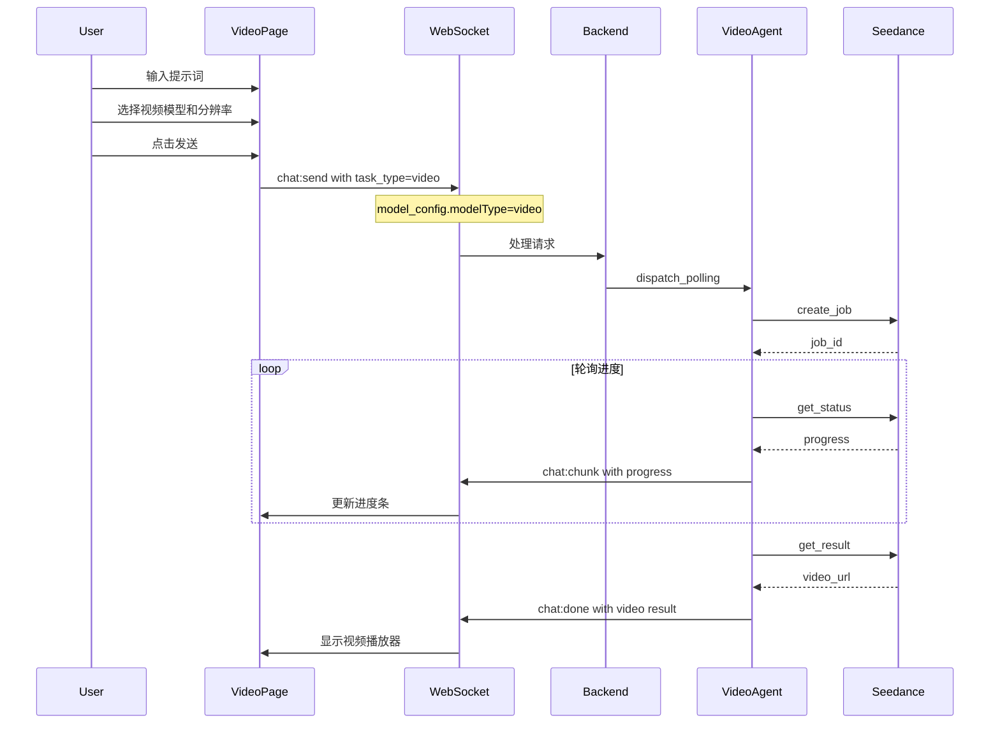
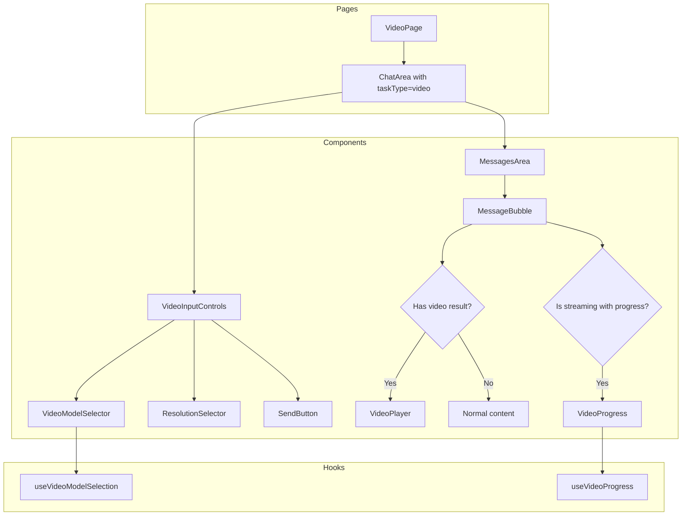

# 视频生成模式前端实现计划

## 1. 概述

本计划描述如何在前端增加视频生成模式，包括：
1. **模型设置页面** - 支持创建和编辑视频类型模型（`modelType: video`）
2. **视频生成界面** - 允许用户选择视频生成模型和视频分辨率
3. **调用后端服务** - 对接已实现的视频生成服务链路（Seedance API）

### 1.1 后端架构回顾

根据 [`plans/video-generation.md`](./video-generation.md)，后端视频生成服务已完整实现：

**架构层级：**
```
CommunicationMode
├── SSE (Chat Shell)
├── WebSocket (Local Device)
├── HTTP_CALLBACK (Executor Manager)
└── POLLING (Long-running Agents)
    ├── ResearchAgent (gemini-deep-research)
    └── VideoAgent (modelType=video)    ← 已实现
        ├── SeedanceProvider
        ├── RunwayProvider (future)
        └── PikaProvider (future)
```

**关键路由机制：**
- 当 `modelType == "video"` 时，路由到 `POLLING` 模式
- `PollingDispatcher` 根据 `modelType` 分发到 `VideoAgent`
- `VideoAgent` 使用 `secondaryModelRef` 进行意图识别

**已实现的后端文件：**
- [`backend/app/services/execution/agents/video/video_agent.py`](../backend/app/services/execution/agents/video/video_agent.py)
- [`backend/app/services/execution/agents/video/providers/seedance.py`](../backend/app/services/execution/agents/video/providers/seedance.py)
- [`backend/app/services/execution/agents/video/intent_analyzer.py`](../backend/app/services/execution/agents/video/intent_analyzer.py)
- [`backend/app/services/execution/polling_dispatcher.py`](../backend/app/services/execution/polling_dispatcher.py)

### 1.2 Seedance API 参数说明

根据火山引擎 Seedance API 文档，视频生成支持以下关键参数：

| 参数 | 类型 | 说明 | 可选值 |
|------|------|------|--------|
| `model` | string | 模型 ID | `doubao-seedance-1-5-pro-251215`, `doubao-seedance-1-0-pro`, etc. |
| `resolution` | string | 视频分辨率 | `480p`, `720p`, `1080p` |
| `ratio` | string | 宽高比 | `16:9`, `4:3`, `1:1`, `3:4`, `9:16`, `21:9`, `adaptive` |
| `duration` | integer | 视频时长（秒） | `4-12`（Seedance 1.5），`2-12`（其他） |
| `generate_audio` | boolean | 是否生成音频 | `true`/`false`（仅 Seedance 1.5 pro） |
| `draft` | boolean | 样片模式 | `true`/`false`（仅 Seedance 1.5 pro） |
| `seed` | integer | 随机种子 | `-1` 到 `2^32-1` |
| `camera_fixed` | boolean | 固定摄像头 | `true`/`false` |
| `watermark` | boolean | 是否含水印 | `true`/`false` |

**分辨率与宽高比对应的像素值（Seedance 1.5 pro）：**

| 分辨率 | 16:9 | 4:3 | 1:1 | 3:4 | 9:16 | 21:9 |
|--------|------|-----|-----|-----|------|------|
| 480p | 864×496 | 752×560 | 640×640 | 560×752 | 496×864 | 992×432 |
| 720p | 1280×720 | 1112×834 | 960×960 | 834×1112 | 720×1280 | 1470×630 |
| 1080p | 1920×1080 | 1664×1248 | 1440×1440 | 1248×1664 | 1080×1920 | 2206×946 |

### 1.3 前端需要实现的功能

**Part A: 模型设置页面**
1. **视频模型类型支持** - 在 ModelEditDialog 中添加 `video` 类型选项
2. **视频配置表单** - 添加 VideoGenerationConfig 配置字段（resolution, ratio, duration 等）
3. **视频模型协议** - 支持 `seedance` 协议类型

**Part B: 视频生成界面**
1. **视频模式入口** - 新增视频生成模式页面或模式切换
2. **视频模型选择器** - 筛选并显示 `modelType: video` 的模型
3. **视频分辨率选择器** - 允许用户选择视频分辨率（从模型配置获取）
4. **视频生成进度显示** - 显示视频生成进度（通过 `chat:chunk` 的 `progress` 字段）
5. **视频结果展示** - 在消息中展示生成的视频（通过 `chat:done` 的 `result.video` 字段）

## 2. 系统架构

### 2.1 整体数据流



### 2.2 前端组件架构



## 3. Part A: 模型设置页面实现

### 3.1 更新前端类型定义

**文件：** `frontend/src/apis/models.ts`

```typescript
// 更新 ModelCategoryType 添加 video
export type ModelCategoryType = 'llm' | 'tts' | 'stt' | 'embedding' | 'rerank' | 'video'

// 新增 VideoGenerationConfig 类型（对应后端 VideoGenerationConfig）
export interface VideoGenerationConfig {
  resolution?: '480p' | '720p' | '1080p'
  ratio?: '16:9' | '4:3' | '1:1' | '3:4' | '9:16' | '21:9' | 'adaptive'
  duration?: number  // 4-12 秒
  generate_audio?: boolean  // 仅 Seedance 1.5 pro
  draft?: boolean  // 样片模式，仅 Seedance 1.5 pro
  seed?: number  // 随机种子
  camera_fixed?: boolean  // 固定摄像头
  watermark?: boolean  // 是否含水印
}

// 更新 ModelCRD.spec 添加 videoConfig
export interface ModelCRD {
  // ... existing fields
  spec: {
    // ... existing fields
    modelType?: ModelCategoryType
    videoConfig?: VideoGenerationConfig  // 新增
  }
}
```

### 3.2 更新 ModelEditDialog 组件

**文件：** `frontend/src/features/settings/components/ModelEditDialog.tsx`

需要修改以下部分：

#### 3.2.1 添加 video 到 MODEL_CATEGORY_OPTIONS

```typescript
const MODEL_CATEGORY_OPTIONS: { value: ModelCategoryType; labelKey: string }[] = [
  { value: 'llm', labelKey: 'models.model_category_type_llm' },
  { value: 'embedding', labelKey: 'models.model_category_type_embedding' },
  { value: 'rerank', labelKey: 'models.model_category_type_rerank' },
  { value: 'video', labelKey: 'models.model_category_type_video' },  // 新增
]
```

#### 3.2.2 添加 video 协议选项

```typescript
const PROTOCOL_BY_CATEGORY: Record<
  ModelCategoryType,
  { value: string; label: string; hint?: string }[]
> = {
  // ... existing protocols
  video: [
    { value: 'seedance', label: 'Seedance', hint: '火山引擎视频生成' },
    { value: 'runway', label: 'Runway', hint: 'Runway Gen-3' },
    { value: 'pika', label: 'Pika', hint: 'Pika Labs' },
    { value: 'custom', label: 'Custom API' },
  ],
}
```

#### 3.2.3 添加 Seedance 模型选项

```typescript
const SEEDANCE_MODEL_OPTIONS = [
  { value: 'doubao-seedance-1-5-pro-251215', label: 'Seedance 1.5 Pro (推荐)' },
  { value: 'doubao-seedance-1-0-pro', label: 'Seedance 1.0 Pro' },
  { value: 'doubao-seedance-1-0-pro-fast', label: 'Seedance 1.0 Pro Fast' },
  { value: 'doubao-seedance-1-0-lite-t2v', label: 'Seedance 1.0 Lite (文生视频)' },
  { value: 'doubao-seedance-1-0-lite-i2v', label: 'Seedance 1.0 Lite (图生视频)' },
  { value: 'custom', label: 'Custom...' },
]
```

#### 3.2.4 添加视频配置状态

```typescript
// Video-specific config state
const [videoResolution, setVideoResolution] = useState<string>('1080p')
const [videoRatio, setVideoRatio] = useState<string>('16:9')
const [videoDuration, setVideoDuration] = useState<number>(5)
const [videoGenerateAudio, setVideoGenerateAudio] = useState<boolean>(true)
const [videoDraft, setVideoDraft] = useState<boolean>(false)
const [videoSeed, setVideoSeed] = useState<number>(-1)
const [videoCameraFixed, setVideoCameraFixed] = useState<boolean>(false)
const [videoWatermark, setVideoWatermark] = useState<boolean>(false)
```

#### 3.2.5 添加视频配置表单 UI

```tsx
{/* Video-specific fields */}
{modelCategoryType === 'video' && (
  <div className="space-y-4 p-4 bg-muted rounded-lg">
    <h4 className="text-sm font-medium text-text-secondary">
      {t('common:models.video_config_title')}
    </h4>
    
    {/* Resolution and Ratio */}
    <div className="grid grid-cols-2 gap-4">
      <div className="space-y-2">
        <Label htmlFor="video_resolution" className="text-sm font-medium">
          {t('common:models.video_resolution')}
        </Label>
        <Select
          value={videoResolution}
          onValueChange={setVideoResolution}
        >
          <SelectTrigger className="bg-base">
            <SelectValue />
          </SelectTrigger>
          <SelectContent>
            <SelectItem value="480p">480p (标清)</SelectItem>
            <SelectItem value="720p">720p (高清)</SelectItem>
            <SelectItem value="1080p">1080p (全高清)</SelectItem>
          </SelectContent>
        </Select>
      </div>
      
      <div className="space-y-2">
        <Label htmlFor="video_ratio" className="text-sm font-medium">
          {t('common:models.video_ratio')}
        </Label>
        <Select
          value={videoRatio}
          onValueChange={setVideoRatio}
        >
          <SelectTrigger className="bg-base">
            <SelectValue />
          </SelectTrigger>
          <SelectContent>
            <SelectItem value="16:9">16:9 (横屏)</SelectItem>
            <SelectItem value="9:16">9:16 (竖屏)</SelectItem>
            <SelectItem value="1:1">1:1 (方形)</SelectItem>
            <SelectItem value="4:3">4:3</SelectItem>
            <SelectItem value="3:4">3:4</SelectItem>
            <SelectItem value="21:9">21:9 (超宽)</SelectItem>
            <SelectItem value="adaptive">自适应</SelectItem>
          </SelectContent>
        </Select>
      </div>
    </div>
    
    {/* Duration and Audio */}
    <div className="grid grid-cols-2 gap-4">
      <div className="space-y-2">
        <Label htmlFor="video_duration" className="text-sm font-medium">
          {t('common:models.video_duration')}
        </Label>
        <Input
          id="video_duration"
          type="number"
          min={4}
          max={12}
          value={videoDuration}
          onChange={e => setVideoDuration(parseInt(e.target.value) || 5)}
          className="bg-base"
        />
        <p className="text-xs text-text-muted">
          {t('common:models.video_duration_hint')}
        </p>
      </div>
      
      <div className="space-y-2">
        <Label className="text-sm font-medium">
          {t('common:models.video_generate_audio')}
        </Label>
        <Select
          value={videoGenerateAudio ? 'true' : 'false'}
          onValueChange={v => setVideoGenerateAudio(v === 'true')}
        >
          <SelectTrigger className="bg-base">
            <SelectValue />
          </SelectTrigger>
          <SelectContent>
            <SelectItem value="true">{t('common:yes')}</SelectItem>
            <SelectItem value="false">{t('common:no')}</SelectItem>
          </SelectContent>
        </Select>
        <p className="text-xs text-text-muted">
          {t('common:models.video_generate_audio_hint')}
        </p>
      </div>
    </div>
    
    {/* Advanced Options */}
    <details className="group">
      <summary className="cursor-pointer text-sm text-text-secondary hover:text-text-primary">
        {t('common:models.video_advanced_options')}
      </summary>
      <div className="mt-3 space-y-4">
        {/* Draft Mode */}
        <div className="flex items-center justify-between">
          <div>
            <Label className="text-sm font-medium">
              {t('common:models.video_draft_mode')}
            </Label>
            <p className="text-xs text-text-muted">
              {t('common:models.video_draft_mode_hint')}
            </p>
          </div>
          <Switch
            checked={videoDraft}
            onCheckedChange={setVideoDraft}
          />
        </div>
        
        {/* Camera Fixed */}
        <div className="flex items-center justify-between">
          <div>
            <Label className="text-sm font-medium">
              {t('common:models.video_camera_fixed')}
            </Label>
            <p className="text-xs text-text-muted">
              {t('common:models.video_camera_fixed_hint')}
            </p>
          </div>
          <Switch
            checked={videoCameraFixed}
            onCheckedChange={setVideoCameraFixed}
          />
        </div>
        
        {/* Watermark */}
        <div className="flex items-center justify-between">
          <div>
            <Label className="text-sm font-medium">
              {t('common:models.video_watermark')}
            </Label>
          </div>
          <Switch
            checked={videoWatermark}
            onCheckedChange={setVideoWatermark}
          />
        </div>
        
        {/* Seed */}
        <div className="space-y-2">
          <Label htmlFor="video_seed" className="text-sm font-medium">
            {t('common:models.video_seed')}
          </Label>
          <Input
            id="video_seed"
            type="number"
            value={videoSeed}
            onChange={e => setVideoSeed(parseInt(e.target.value) || -1)}
            placeholder="-1 (随机)"
            className="bg-base"
          />
          <p className="text-xs text-text-muted">
            {t('common:models.video_seed_hint')}
          </p>
        </div>
      </div>
    </details>
  </div>
)}
```

#### 3.2.6 更新 handleSave 函数

```typescript
const handleSave = async () => {
  // ... existing validation
  
  // Build video config
  const videoConfig: VideoGenerationConfig | undefined =
    modelCategoryType === 'video'
      ? {
          resolution: videoResolution as '480p' | '720p' | '1080p',
          ratio: videoRatio as '16:9' | '4:3' | '1:1' | '3:4' | '9:16' | '21:9' | 'adaptive',
          duration: videoDuration,
          generate_audio: videoGenerateAudio,
          draft: videoDraft,
          seed: videoSeed !== -1 ? videoSeed : undefined,
          camera_fixed: videoCameraFixed,
          watermark: videoWatermark,
        }
      : undefined

  const modelCRD: ModelCRD = {
    // ... existing fields
    spec: {
      // ... existing fields
      modelType: modelCategoryType,
      ...(videoConfig && { videoConfig }),
    },
  }
  
  // ... rest of save logic
}
```

### 3.3 添加 i18n 翻译（模型设置）

**文件：** `frontend/src/i18n/locales/zh-CN/common.json`

```json
{
  "models": {
    "model_category_type_video": "视频生成",
    "video_config_title": "视频生成配置",
    "video_resolution": "默认分辨率",
    "video_ratio": "默认宽高比",
    "video_duration": "默认时长（秒）",
    "video_duration_hint": "Seedance 1.5 支持 4-12 秒",
    "video_generate_audio": "生成音频",
    "video_generate_audio_hint": "仅 Seedance 1.5 Pro 支持",
    "video_advanced_options": "高级选项",
    "video_draft_mode": "样片模式",
    "video_draft_mode_hint": "快速预览，消耗更少 token",
    "video_camera_fixed": "固定摄像头",
    "video_camera_fixed_hint": "保持摄像头位置不变",
    "video_watermark": "添加水印",
    "video_seed": "随机种子",
    "video_seed_hint": "-1 表示随机，相同种子生成相似结果"
  }
}
```

**文件：** `frontend/src/i18n/locales/en/common.json`

```json
{
  "models": {
    "model_category_type_video": "Video Generation",
    "video_config_title": "Video Generation Config",
    "video_resolution": "Default Resolution",
    "video_ratio": "Default Aspect Ratio",
    "video_duration": "Default Duration (seconds)",
    "video_duration_hint": "Seedance 1.5 supports 4-12 seconds",
    "video_generate_audio": "Generate Audio",
    "video_generate_audio_hint": "Only Seedance 1.5 Pro supported",
    "video_advanced_options": "Advanced Options",
    "video_draft_mode": "Draft Mode",
    "video_draft_mode_hint": "Quick preview with less token consumption",
    "video_camera_fixed": "Fixed Camera",
    "video_camera_fixed_hint": "Keep camera position fixed",
    "video_watermark": "Add Watermark",
    "video_seed": "Random Seed",
    "video_seed_hint": "-1 for random, same seed produces similar results"
  }
}
```

### 3.4 更新后端 VideoGenerationConfig（如需要）

**文件：** `backend/app/schemas/kind.py`

当前后端的 `VideoGenerationConfig` 定义较简单，需要扩展以支持 Seedance API 的完整参数：

```python
class VideoGenerationConfig(BaseModel):
    """Video generation specific configuration"""

    resolution: Optional[str] = Field("1080p", description="Video resolution: 480p, 720p, 1080p")
    ratio: Optional[str] = Field("16:9", description="Aspect ratio: 16:9, 4:3, 1:1, 3:4, 9:16, 21:9, adaptive")
    duration: Optional[int] = Field(5, ge=2, le=12, description="Video duration in seconds")
    generate_audio: Optional[bool] = Field(True, description="Generate audio (Seedance 1.5 Pro only)")
    draft: Optional[bool] = Field(False, description="Draft mode for quick preview")
    seed: Optional[int] = Field(None, description="Random seed for reproducibility")
    camera_fixed: Optional[bool] = Field(False, description="Keep camera position fixed")
    watermark: Optional[bool] = Field(False, description="Add watermark to video")
    
    # Legacy fields (kept for backward compatibility)
    fps: Optional[int] = Field(24, description="Frames per second")
    max_duration: Optional[int] = Field(None, description="Maximum duration in seconds (deprecated, use duration)")
```

---

## 4. Part B: 视频生成界面实现

### 4.1 类型定义更新

**文件：** `frontend/src/types/api.ts`

```typescript
// 更新 TaskType 添加 video
export type TaskType = 'chat' | 'code' | 'knowledge' | 'task' | 'video'

// 视频结果类型（对应后端 VideoAgent 返回的 result.video）
export interface VideoResult {
  attachment_id: number
  video_url: string
  thumbnail?: string  // Base64 缩略图
  duration?: number   // 视频时长（秒）
}

// 扩展 SubtaskResult 支持视频
export interface SubtaskResult {
  // ... existing fields
  video?: VideoResult
  image?: string  // 用于多轮对话的参考图片
}
```

**文件：** `frontend/src/types/socket.ts`

```typescript
// 更新 ChatSendPayload
export interface ChatSendPayload {
  // ... existing fields
  task_type?: 'chat' | 'code' | 'knowledge' | 'task' | 'video'
}

// ChatChunkPayload 已有 progress 字段（result.progress）
// 无需修改，只需在前端正确处理
```

### 3.2 视频模型选择 Hook

**新文件：** `frontend/src/features/tasks/hooks/useVideoModelSelection.ts`

```typescript
import { useState, useEffect, useMemo } from 'react'
import { getModels } from '@/apis/models'

export interface VideoModel {
  name: string
  displayName?: string
  namespace: string
  type: 'public' | 'user'
  protocol: string  // seedance, runway, etc.
  videoConfig?: {
    resolution: string
    fps: number
    max_duration?: number
  }
}

export interface UseVideoModelSelectionOptions {
  enabled?: boolean
}

export function useVideoModelSelection(options: UseVideoModelSelectionOptions = {}) {
  const { enabled = true } = options
  
  const [videoModels, setVideoModels] = useState<VideoModel[]>([])
  const [selectedModel, setSelectedModel] = useState<VideoModel | null>(null)
  const [selectedResolution, setSelectedResolution] = useState<string>('1080p')
  const [isLoading, setIsLoading] = useState(false)
  const [error, setError] = useState<string | null>(null)
  
  // 加载视频模型列表
  useEffect(() => {
    if (!enabled) return
    
    const loadVideoModels = async () => {
      setIsLoading(true)
      try {
        // 获取所有模型，筛选 modelType === 'video'
        const response = await getModels({ modelType: 'video' })
        const models = response.items.map(item => ({
          name: item.metadata.name,
          displayName: item.metadata.displayName,
          namespace: item.metadata.namespace,
          type: item.metadata.labels?.type || 'public',
          protocol: item.spec.protocol || 'seedance',
          videoConfig: item.spec.videoConfig,
        }))
        setVideoModels(models)
        
        // 自动选择第一个模型
        if (models.length > 0 && !selectedModel) {
          setSelectedModel(models[0])
          if (models[0].videoConfig?.resolution) {
            setSelectedResolution(models[0].videoConfig.resolution)
          }
        }
      } catch (err) {
        setError(err instanceof Error ? err.message : 'Failed to load video models')
      } finally {
        setIsLoading(false)
      }
    }
    
    loadVideoModels()
  }, [enabled])
  
  // 可用的分辨率选项
  const availableResolutions = useMemo(() => {
    // 默认分辨率选项
    const defaultResolutions = ['480p', '720p', '1080p', '4k']
    
    // 如果选中的模型有特定配置，可以根据模型限制
    // 目前返回默认选项
    return defaultResolutions
  }, [selectedModel])
  
  // 处理模型选择
  const handleModelSelect = (model: VideoModel) => {
    setSelectedModel(model)
    // 如果模型有默认分辨率，使用它
    if (model.videoConfig?.resolution) {
      setSelectedResolution(model.videoConfig.resolution)
    }
  }
  
  return {
    videoModels,
    selectedModel,
    setSelectedModel: handleModelSelect,
    selectedResolution,
    setSelectedResolution,
    availableResolutions,
    isLoading,
    error,
  }
}
```

### 3.3 视频模型选择器组件

**新文件：** `frontend/src/features/tasks/components/selector/VideoModelSelector.tsx`

```typescript
'use client'

import React, { useState } from 'react'
import { Video, ChevronDown, Check } from 'lucide-react'
import { cn } from '@/lib/utils'
import { useTranslation } from '@/hooks/useTranslation'
import {
  Popover,
  PopoverContent,
  PopoverTrigger,
} from '@/components/ui/popover'
import {
  Command,
  CommandEmpty,
  CommandGroup,
  CommandInput,
  CommandItem,
  CommandList,
} from '@/components/ui/command'
import type { VideoModel } from '../../hooks/useVideoModelSelection'

export interface VideoModelSelectorProps {
  models: VideoModel[]
  selectedModel: VideoModel | null
  onModelChange: (model: VideoModel) => void
  disabled?: boolean
  isLoading?: boolean
  compact?: boolean
}

export function VideoModelSelector({
  models,
  selectedModel,
  onModelChange,
  disabled = false,
  isLoading = false,
  compact = false,
}: VideoModelSelectorProps) {
  const { t } = useTranslation('common')
  const [isOpen, setIsOpen] = useState(false)
  
  const displayText = selectedModel?.displayName || selectedModel?.name || t('video.model_selector')
  
  return (
    <Popover open={isOpen} onOpenChange={setIsOpen}>
      <PopoverTrigger asChild>
        <button
          type="button"
          disabled={disabled || isLoading}
          className={cn(
            'flex items-center gap-1 min-w-0 rounded-full pl-2.5 pr-3 py-2.5 h-9',
            'border border-border bg-base text-text-primary hover:bg-hover',
            'transition-colors focus:outline-none focus:ring-0',
            'disabled:cursor-not-allowed disabled:opacity-50',
            isLoading && 'animate-pulse'
          )}
        >
          <Video className="h-4 w-4 flex-shrink-0" />
          {!compact && (
            <span className="truncate text-xs min-w-0">{displayText}</span>
          )}
          <ChevronDown className="h-2.5 w-2.5 flex-shrink-0 opacity-60" />
        </button>
      </PopoverTrigger>
      
      <PopoverContent
        className="p-0 w-auto min-w-[280px] max-w-[320px]"
        align="start"
      >
        <Command>
          <CommandInput placeholder={t('video.search_model')} />
          <CommandList>
            <CommandEmpty>{t('common:models.no_models')}</CommandEmpty>
            <CommandGroup>
              {models.map(model => (
                <CommandItem
                  key={`${model.namespace}/${model.name}`}
                  value={`${model.name} ${model.displayName || ''}`}
                  onSelect={() => {
                    onModelChange(model)
                    setIsOpen(false)
                  }}
                  className="flex items-center justify-between"
                >
                  <div className="flex flex-col min-w-0 flex-1">
                    <span className="font-medium text-sm">
                      {model.displayName || model.name}
                    </span>
                    <span className="text-xs text-text-muted">
                      {model.protocol}
                    </span>
                  </div>
                  <Check
                    className={cn(
                      'h-3.5 w-3.5 shrink-0',
                      selectedModel?.name === model.name
                        ? 'opacity-100 text-primary'
                        : 'opacity-0'
                    )}
                  />
                </CommandItem>
              ))}
            </CommandGroup>
          </CommandList>
        </Command>
      </PopoverContent>
    </Popover>
  )
}

export default VideoModelSelector
```

### 3.4 分辨率选择器组件

**新文件：** `frontend/src/features/tasks/components/selector/ResolutionSelector.tsx`

```typescript
'use client'

import React, { useState } from 'react'
import { Monitor, ChevronDown, Check } from 'lucide-react'
import { cn } from '@/lib/utils'
import { useTranslation } from '@/hooks/useTranslation'
import {
  Popover,
  PopoverContent,
  PopoverTrigger,
} from '@/components/ui/popover'

export interface ResolutionSelectorProps {
  selectedResolution: string
  onResolutionChange: (resolution: string) => void
  availableResolutions?: string[]
  disabled?: boolean
  compact?: boolean
}

const RESOLUTION_LABELS: Record<string, { zh: string; en: string }> = {
  '480p': { zh: '480p (标清)', en: '480p (SD)' },
  '720p': { zh: '720p (高清)', en: '720p (HD)' },
  '1080p': { zh: '1080p (全高清)', en: '1080p (Full HD)' },
  '4k': { zh: '4K (超高清)', en: '4K (Ultra HD)' },
}

export function ResolutionSelector({
  selectedResolution,
  onResolutionChange,
  availableResolutions = ['480p', '720p', '1080p', '4k'],
  disabled = false,
  compact = false,
}: ResolutionSelectorProps) {
  const { t, i18n } = useTranslation('common')
  const [isOpen, setIsOpen] = useState(false)
  
  const currentLang = i18n.language?.startsWith('zh') ? 'zh' : 'en'
  const displayText = RESOLUTION_LABELS[selectedResolution]?.[currentLang] || selectedResolution
  
  return (
    <Popover open={isOpen} onOpenChange={setIsOpen}>
      <PopoverTrigger asChild>
        <button
          type="button"
          disabled={disabled}
          className={cn(
            'flex items-center gap-1 min-w-0 rounded-full pl-2.5 pr-3 py-2.5 h-9',
            'border border-border bg-base text-text-primary hover:bg-hover',
            'transition-colors focus:outline-none focus:ring-0',
            'disabled:cursor-not-allowed disabled:opacity-50'
          )}
        >
          <Monitor className="h-4 w-4 flex-shrink-0" />
          {!compact && (
            <span className="truncate text-xs min-w-0">{displayText}</span>
          )}
          <ChevronDown className="h-2.5 w-2.5 flex-shrink-0 opacity-60" />
        </button>
      </PopoverTrigger>
      
      <PopoverContent className="p-1 w-auto min-w-[160px]" align="start">
        <div className="flex flex-col">
          {availableResolutions.map(resolution => (
            <button
              key={resolution}
              onClick={() => {
                onResolutionChange(resolution)
                setIsOpen(false)
              }}
              className={cn(
                'flex items-center justify-between px-3 py-2 text-sm rounded-md',
                'hover:bg-hover transition-colors',
                selectedResolution === resolution && 'bg-primary/10'
              )}
            >
              <span>{RESOLUTION_LABELS[resolution]?.[currentLang] || resolution}</span>
              {selectedResolution === resolution && (
                <Check className="h-3.5 w-3.5 text-primary" />
              )}
            </button>
          ))}
        </div>
      </PopoverContent>
    </Popover>
  )
}

export default ResolutionSelector
```

### 3.5 视频进度显示组件

**新文件：** `frontend/src/features/tasks/components/message/VideoProgress.tsx`

```typescript
'use client'

import React from 'react'
import { Video, X } from 'lucide-react'
import { cn } from '@/lib/utils'
import { useTranslation } from '@/hooks/useTranslation'
import { Progress } from '@/components/ui/progress'

export interface VideoProgressProps {
  progress: number
  message?: string
  onCancel?: () => void
  className?: string
}

export function VideoProgress({
  progress,
  message,
  onCancel,
  className,
}: VideoProgressProps) {
  const { t } = useTranslation('common')
  
  return (
    <div className={cn('flex flex-col gap-3 p-4 rounded-lg bg-surface', className)}>
      <div className="flex items-center justify-between">
        <div className="flex items-center gap-2">
          <Video className="h-5 w-5 text-primary animate-pulse" />
          <span className="text-sm font-medium">
            {message || t('video.generating')}
          </span>
        </div>
        {onCancel && (
          <button
            onClick={onCancel}
            className="p-1 rounded-full hover:bg-hover transition-colors"
            title={t('common:actions.cancel')}
          >
            <X className="h-4 w-4 text-text-muted" />
          </button>
        )}
      </div>
      
      <div className="flex items-center gap-3">
        <Progress value={progress} className="flex-1 h-2" />
        <span className="text-xs text-text-muted min-w-[40px] text-right">
          {progress}%
        </span>
      </div>
    </div>
  )
}

export default VideoProgress
```

### 3.6 视频播放器组件

**新文件：** `frontend/src/features/tasks/components/message/VideoPlayer.tsx`

```typescript
'use client'

import React, { useState, useRef } from 'react'
import { Play, Pause, Download, Maximize2 } from 'lucide-react'
import { cn } from '@/lib/utils'
import { useTranslation } from '@/hooks/useTranslation'

export interface VideoPlayerProps {
  videoUrl: string
  thumbnail?: string
  duration?: number
  attachmentId?: number
  className?: string
}

export function VideoPlayer({
  videoUrl,
  thumbnail,
  duration,
  attachmentId,
  className,
}: VideoPlayerProps) {
  const { t } = useTranslation('common')
  const videoRef = useRef<HTMLVideoElement>(null)
  const [isPlaying, setIsPlaying] = useState(false)
  const [showControls, setShowControls] = useState(false)
  
  const togglePlay = () => {
    if (videoRef.current) {
      if (isPlaying) {
        videoRef.current.pause()
      } else {
        videoRef.current.play()
      }
      setIsPlaying(!isPlaying)
    }
  }
  
  const handleDownload = () => {
    const link = document.createElement('a')
    link.href = videoUrl
    link.download = `video_${attachmentId || Date.now()}.mp4`
    document.body.appendChild(link)
    link.click()
    document.body.removeChild(link)
  }
  
  const handleFullscreen = () => {
    if (videoRef.current) {
      if (videoRef.current.requestFullscreen) {
        videoRef.current.requestFullscreen()
      }
    }
  }
  
  const formatDuration = (seconds?: number) => {
    if (!seconds) return ''
    const mins = Math.floor(seconds / 60)
    const secs = Math.floor(seconds % 60)
    return `${mins}:${secs.toString().padStart(2, '0')}`
  }
  
  return (
    <div
      className={cn(
        'relative rounded-lg overflow-hidden bg-black max-w-md',
        className
      )}
      onMouseEnter={() => setShowControls(true)}
      onMouseLeave={() => setShowControls(false)}
    >
      <video
        ref={videoRef}
        src={videoUrl}
        poster={thumbnail ? `data:image/jpeg;base64,${thumbnail}` : undefined}
        className="w-full h-auto"
        onPlay={() => setIsPlaying(true)}
        onPause={() => setIsPlaying(false)}
        onEnded={() => setIsPlaying(false)}
        controls={false}
      />
      
      {/* 播放按钮覆盖层 */}
      {!isPlaying && (
        <button
          onClick={togglePlay}
          className="absolute inset-0 flex items-center justify-center bg-black/30 hover:bg-black/40 transition-colors"
        >
          <div className="w-16 h-16 rounded-full bg-white/90 flex items-center justify-center">
            <Play className="h-8 w-8 text-black ml-1" />
          </div>
        </button>
      )}
      
      {/* 控制栏 */}
      <div
        className={cn(
          'absolute bottom-0 left-0 right-0 p-3 bg-gradient-to-t from-black/80 to-transparent',
          'flex items-center justify-between transition-opacity',
          showControls || !isPlaying ? 'opacity-100' : 'opacity-0'
        )}
      >
        <div className="flex items-center gap-2">
          <button
            onClick={togglePlay}
            className="p-1.5 rounded-full hover:bg-white/20 transition-colors"
          >
            {isPlaying ? (
              <Pause className="h-4 w-4 text-white" />
            ) : (
              <Play className="h-4 w-4 text-white" />
            )}
          </button>
          {duration && (
            <span className="text-xs text-white/80">
              {formatDuration(duration)}
            </span>
          )}
        </div>
        
        <div className="flex items-center gap-1">
          <button
            onClick={handleDownload}
            className="p-1.5 rounded-full hover:bg-white/20 transition-colors"
            title={t('video.download')}
          >
            <Download className="h-4 w-4 text-white" />
          </button>
          <button
            onClick={handleFullscreen}
            className="p-1.5 rounded-full hover:bg-white/20 transition-colors"
            title={t('common:actions.fullscreen')}
          >
            <Maximize2 className="h-4 w-4 text-white" />
          </button>
        </div>
      </div>
    </div>
  )
}

export default VideoPlayer
```

### 3.7 消息气泡视频支持

**修改文件：** `frontend/src/features/tasks/components/message/MessageBubble.tsx`

在消息气泡组件中添加视频结果检测和渲染：

```typescript
// 在 MessageBubble 组件中添加
import VideoPlayer from './VideoPlayer'
import VideoProgress from './VideoProgress'

// 在渲染逻辑中添加
const renderContent = () => {
  // 检查是否有视频结果
  if (message.result?.video) {
    return (
      <VideoPlayer
        videoUrl={message.result.video.video_url}
        thumbnail={message.result.video.thumbnail}
        duration={message.result.video.duration}
        attachmentId={message.result.video.attachment_id}
      />
    )
  }
  
  // 检查是否正在生成视频（有 progress 字段）
  if (message.isStreaming && message.result?.progress !== undefined) {
    return (
      <VideoProgress
        progress={message.result.progress}
        message={message.content}
        onCancel={onCancel}
      />
    )
  }
  
  // ... 其他渲染逻辑
}
```

### 3.8 视频输入控件组件

**新文件：** `frontend/src/features/tasks/components/input/VideoInputControls.tsx`

```typescript
'use client'

import React from 'react'
import VideoModelSelector from '../selector/VideoModelSelector'
import ResolutionSelector from '../selector/ResolutionSelector'
import SendButton from './SendButton'
import type { VideoModel } from '../../hooks/useVideoModelSelection'

export interface VideoInputControlsProps {
  // 视频模型
  videoModels: VideoModel[]
  selectedModel: VideoModel | null
  onModelChange: (model: VideoModel) => void
  isModelsLoading?: boolean
  
  // 分辨率
  selectedResolution: string
  onResolutionChange: (resolution: string) => void
  availableResolutions?: string[]
  
  // 状态
  isLoading: boolean
  isStreaming: boolean
  disabled?: boolean
  canSubmit?: boolean
  
  // 操作
  onSend: () => void
  onStop?: () => void
}

export function VideoInputControls({
  videoModels,
  selectedModel,
  onModelChange,
  isModelsLoading = false,
  selectedResolution,
  onResolutionChange,
  availableResolutions,
  isLoading,
  isStreaming,
  disabled = false,
  canSubmit = true,
  onSend,
  onStop,
}: VideoInputControlsProps) {
  const isDisabled = disabled || isLoading || isStreaming
  
  return (
    <div className="flex items-center justify-between px-3 pb-2 pt-1 gap-2">
      <div className="flex-1 min-w-0 flex items-center gap-3">
        {/* 视频模型选择器 */}
        <VideoModelSelector
          models={videoModels}
          selectedModel={selectedModel}
          onModelChange={onModelChange}
          disabled={isDisabled}
          isLoading={isModelsLoading}
        />
        
        {/* 分辨率选择器 */}
        <ResolutionSelector
          selectedResolution={selectedResolution}
          onResolutionChange={onResolutionChange}
          availableResolutions={availableResolutions}
          disabled={isDisabled}
        />
      </div>
      
      <div className="ml-auto flex items-center gap-2 flex-shrink-0">
        {/* 发送/停止按钮 */}
        {isStreaming && onStop ? (
          <button
            onClick={onStop}
            className="p-2 rounded-full bg-orange-100 hover:bg-orange-200 transition-colors"
          >
            {/* Stop icon */}
          </button>
        ) : (
          <SendButton
            onClick={onSend}
            disabled={!canSubmit || isDisabled || !selectedModel}
            isLoading={isLoading}
          />
        )}
      </div>
    </div>
  )
}

export default VideoInputControls
```

### 3.9 视频生成页面

**新文件：** `frontend/src/app/(tasks)/video/page.tsx`

```typescript
'use client'

import React from 'react'
import ChatArea from '@/features/tasks/components/chat/ChatArea'
import { useTeams } from '@/hooks/useTeams'

export default function VideoPage() {
  const { teams, isLoading: isTeamsLoading, refresh: refreshTeams } = useTeams()
  
  // 筛选支持视频模式的 Team（bind_mode 包含 'video' 或为空）
  const videoTeams = teams.filter(team => {
    if (!team.bind_mode || team.bind_mode.length === 0) return true
    return team.bind_mode.includes('video')
  })
  
  return (
    <div className="flex-1 flex flex-col min-h-0">
      <ChatArea
        teams={videoTeams}
        isTeamsLoading={isTeamsLoading}
        taskType="video"
        showRepositorySelector={false}
        onRefreshTeams={refreshTeams}
      />
    </div>
  )
}
```

### 3.10 i18n 翻译更新

**修改文件：** `frontend/src/i18n/locales/zh-CN/common.json`

```json
{
  "video": {
    "title": "视频生成",
    "model_selector": "选择视频模型",
    "search_model": "搜索视频模型...",
    "resolution_selector": "选择分辨率",
    "resolution": {
      "480p": "480p (标清)",
      "720p": "720p (高清)",
      "1080p": "1080p (全高清)",
      "4k": "4K (超高清)"
    },
    "generating": "正在生成视频...",
    "progress": "生成进度: {{progress}}%",
    "completed": "视频生成完成",
    "failed": "视频生成失败",
    "download": "下载视频",
    "reference_image": "参考图片（可选）",
    "no_models": "暂无可用的视频模型"
  }
}
```

**修改文件：** `frontend/src/i18n/locales/en/common.json`

```json
{
  "video": {
    "title": "Video Generation",
    "model_selector": "Select Video Model",
    "search_model": "Search video models...",
    "resolution_selector": "Select Resolution",
    "resolution": {
      "480p": "480p (SD)",
      "720p": "720p (HD)",
      "1080p": "1080p (Full HD)",
      "4k": "4K (Ultra HD)"
    },
    "generating": "Generating video...",
    "progress": "Progress: {{progress}}%",
    "completed": "Video generation completed",
    "failed": "Video generation failed",
    "download": "Download Video",
    "reference_image": "Reference Image (Optional)",
    "no_models": "No video models available"
  }
}
```

## 4. WebSocket 事件处理

### 4.1 进度事件处理

在 `useChatStreamHandlers` 或相关 hook 中处理视频进度：

```typescript
// 处理 chat:chunk 事件
const handleChunk = (payload: ChatChunkPayload) => {
  // 检查是否有 progress 字段（视频生成进度）
  if (payload.result?.progress !== undefined) {
    // 更新消息状态，显示进度
    updateMessage(payload.subtask_id, {
      content: payload.content,
      result: {
        ...currentResult,
        progress: payload.result.progress,
      },
    })
  } else {
    // 普通文本流式更新
    // ...
  }
}
```

### 4.2 完成事件处理

```typescript
// 处理 chat:done 事件
const handleDone = (payload: ChatDonePayload) => {
  // 检查是否有视频结果
  if (payload.result?.video) {
    // 更新消息状态，显示视频播放器
    updateMessage(payload.subtask_id, {
      isStreaming: false,
      result: payload.result,
    })
  } else {
    // 普通完成处理
    // ...
  }
}
```

## 5. 实现步骤

### Phase 1: 模型设置页面 - 视频模型支持

- [ ] 更新 `frontend/src/apis/models.ts` 添加 `video` 到 `ModelCategoryType`，添加 `VideoGenerationConfig` 类型
- [ ] 更新 `frontend/src/features/settings/components/ModelEditDialog.tsx`：
  - [ ] 添加 `video` 到 `MODEL_CATEGORY_OPTIONS`
  - [ ] 添加 `video` 协议选项（seedance, runway, pika, custom）
  - [ ] 添加 Seedance 模型选项列表
  - [ ] 添加视频配置状态变量
  - [ ] 添加视频配置表单 UI（分辨率、宽高比、时长、音频等）
  - [ ] 更新 `handleSave` 函数构建 `videoConfig`
- [ ] 添加 i18n 翻译（模型设置相关）
- [ ] 更新后端 `VideoGenerationConfig` 支持完整 Seedance API 参数（如需要）

### Phase 2: 基础类型和 API

- [ ] 更新 `frontend/src/types/api.ts` 添加 `video` 到 `TaskType`，添加 `VideoResult` 类型
- [ ] 更新 `frontend/src/types/socket.ts` 支持 `video` task_type
- [ ] 添加 i18n 翻译（视频生成界面相关）
- [ ] 添加获取视频模型的 API 支持（`modelCategoryType: 'video'` 筛选）

### Phase 3: 视频模型选择

- [ ] 创建 `useVideoModelSelection` hook
- [ ] 创建 `VideoModelSelector` 组件
- [ ] 创建 `ResolutionSelector` 组件
- [ ] 创建 `RatioSelector` 组件（宽高比选择）

### Phase 4: 视频进度和结果显示

- [ ] 创建 `VideoProgress` 组件
- [ ] 创建 `VideoPlayer` 组件
- [ ] 更新 `MessageBubble` 支持视频结果渲染

### Phase 5: 视频输入控件

- [ ] 创建 `VideoInputControls` 组件
- [ ] 集成到 `ChatInputControls` 或创建独立控件
- [ ] 处理视频配置参数传递到 WebSocket

### Phase 6: 页面集成和测试

- [ ] 创建视频生成页面 `/video`
- [ ] 更新 ChatArea 支持 `taskType="video"`
- [ ] 端到端测试
- [ ] 错误处理完善

## 6. 文件清单

### 需要新建的文件

| 文件路径 | 描述 |
|---------|------|
| `frontend/src/features/tasks/hooks/useVideoModelSelection.ts` | 视频模型选择 hook |
| `frontend/src/features/tasks/components/selector/VideoModelSelector.tsx` | 视频模型选择器 |
| `frontend/src/features/tasks/components/selector/ResolutionSelector.tsx` | 分辨率选择器 |
| `frontend/src/features/tasks/components/selector/RatioSelector.tsx` | 宽高比选择器 |
| `frontend/src/features/tasks/components/input/VideoInputControls.tsx` | 视频输入控件 |
| `frontend/src/features/tasks/components/message/VideoProgress.tsx` | 视频进度显示 |
| `frontend/src/features/tasks/components/message/VideoPlayer.tsx` | 视频播放器 |
| `frontend/src/app/(tasks)/video/page.tsx` | 视频生成页面 |

### 需要修改的文件

| 文件路径 | 修改内容 |
|---------|---------|
| `frontend/src/apis/models.ts` | 添加 `video` 到 `ModelCategoryType`，添加 `VideoGenerationConfig` 类型 |
| `frontend/src/features/settings/components/ModelEditDialog.tsx` | 添加视频模型类型支持和配置表单 |
| `frontend/src/types/api.ts` | 添加 `video` 到 `TaskType`，添加 `VideoResult` 类型 |
| `frontend/src/types/socket.ts` | 更新 `ChatSendPayload.task_type` 支持 `video` |
| `frontend/src/features/tasks/components/message/MessageBubble.tsx` | 添加视频结果和进度渲染 |
| `frontend/src/features/tasks/components/input/ChatInputControls.tsx` | 添加视频模式控件支持 |
| `frontend/src/features/tasks/components/chat/ChatArea.tsx` | 支持 `taskType="video"` |
| `frontend/src/i18n/locales/zh-CN/common.json` | 添加视频相关翻译（模型设置 + 生成界面） |
| `frontend/src/i18n/locales/en/common.json` | 添加视频相关翻译（模型设置 + 生成界面） |
| `backend/app/schemas/kind.py` | 扩展 `VideoGenerationConfig` 支持完整 Seedance API 参数 |

## 7. 注意事项

### 7.1 与后端的对接

- 前端发送 `chat:send` 时，确保选中的视频模型的 `modelType === 'video'`
- 后端会根据 `model_config.modelType` 路由到 `VideoAgent`
- 进度通过 `chat:chunk` 的 `result.progress` 字段传递
- 视频结果通过 `chat:done` 的 `result.video` 字段传递

### 7.2 模型配置传递

视频模型的配置（包括分辨率）需要通过 `model_config` 传递：

```typescript
// 发送消息时的 model_config
{
  modelType: 'video',
  protocol: 'seedance',
  videoConfig: {
    resolution: selectedResolution,
    fps: 24,
  },
  // ... 其他配置
}
```

### 7.3 多轮对话支持

后端的 `VideoIntentAnalyzer` 会自动处理多轮对话的意图识别，前端无需特殊处理。上一轮生成的视频缩略图会作为 `result.image` 返回，用于下一轮的参考。

### 7.4 移动端适配

- `VideoPlayer` 组件需要适配移动端触摸操作
- 进度条和控制按钮需要足够大的触摸区域（至少 44px）
- 视频播放器需要支持移动端全屏

# 参考文档
plans/seedance-api.md seedance api文档
plans/video-generation.md 视频生成整体架构