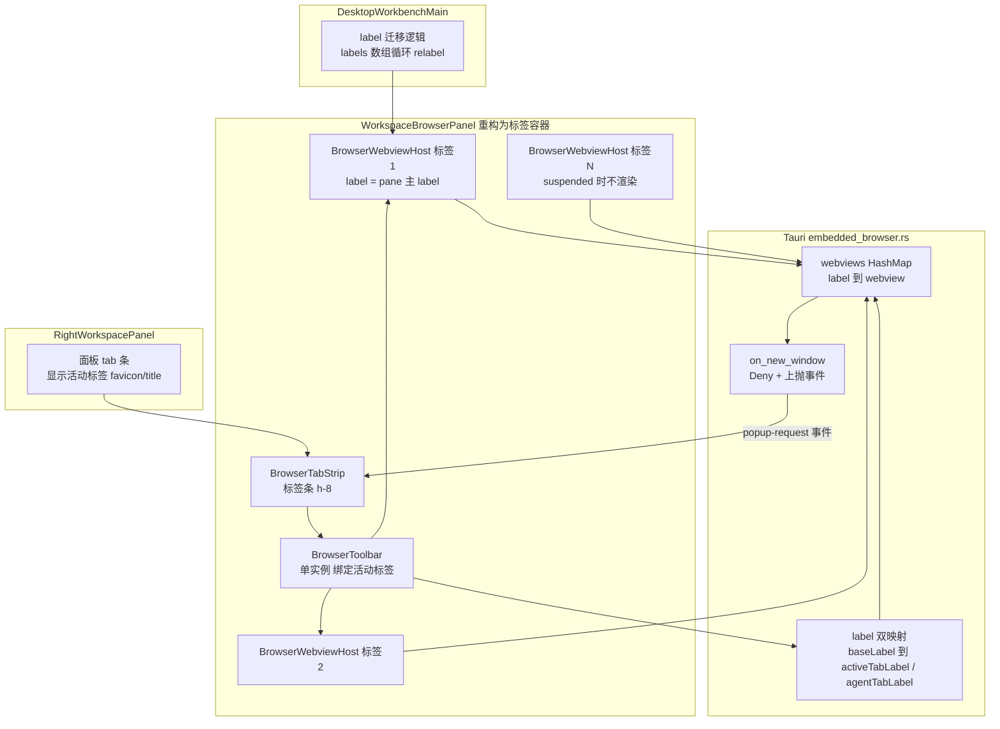
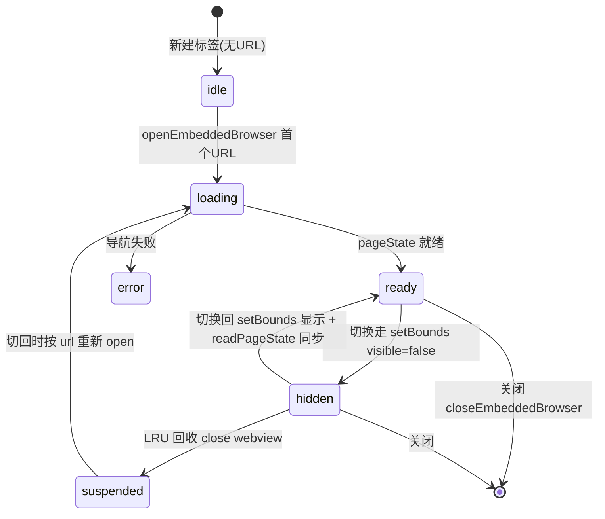

# Wework 内置浏览器多标签页技术方案

## 背景与现状

Wework 内置浏览器当前为单实例：右侧面板 `browser` tab 内一次只能浏览一个页面。经代码勘察，底层已具备多实例能力，本方案主要是前端架构重构 + 少量 Tauri 端弹窗策略调整。

### 现状关键事实

| 层 | 文件 | 现状 |
| --- | --- | --- |
| Tauri | `wework/src-tauri/src/embedded_browser.rs` | `EmbeddedBrowserState.webviews: HashMap<String, EmbeddedBrowserEntry>` 按 label 管理多 webview；同 label open 复用并导航，新 label 创建新 webview；所有 label 共享同一 data_directory(cookie/session 互通) |
| Tauri | `embedded_browser.rs` `on_new_window` | popup 按 URL 分类:file→当前窗口导航,external_scheme/payment→Deny,oauth/unknown→Allow(系统新窗口) |
| 前端 lib | `wework/src/lib/embedded-browser.ts` | 全部 API 已参数化 `label`,默认 `workspace-browser` |
| 前端容器 | `DesktopWorkbenchMain.tsx` | 每 pane 生成 `workspace-browser-{taskId\|paneKey}` label;blank→task 切换时通过 `relabel` 迁移浏览器保留状态 |
| 前端面板 | `RightWorkspacePanel.tsx` | `browser` 是右面板 tab 之一;持有 `browserFaviconUrl`/`browserTitle` 用于 tab 条展示;⌘T 打开 |
| 前端宿主 | `WorkspaceBrowserPanel.tsx`(约 2352 行) | 单实例宿主:地址栏/导航/下载/注释/agent 状态/TLS 警告/bounds 同步/遮挡;已接受 `label` prop 与 `onTitleChange`/`onFaviconChange` 回调 |
| Bridge | `wework/src-tauri/src/embedded_browser/bridge_server.rs` | bridge 是应用级单个 HTTP 服务;runtime 文件写在 local executor home,不是 per task/pane 文件 |
| Executor MCP | `executor/src/browser_mcp.rs` / `executor/src/agents/codex.rs` | `browser_mcp` 会把 `WEWORK_EMBEDDED_BROWSER_LABEL` 写进 bridge payload;Codex 启动配置按 taskId 生成 `workspace-browser-{taskId}` |
| Agent | `embedded_browser/agent_control.rs` | paused/approval 按 label 隔离 |

### 已确认决策

1. 非活动标签 webview **保活 + 上限回收**(上限 10,超限 LRU 休眠)
2. 外部打开请求(聊天链接等)**总是新建标签**
3. `window.open`/`target=_blank` **拦截为新标签**
4. 前端**渐进重构**:抽离 per-tab webview 宿主 + 标签容器,工具栏单实例绑定活动标签

## 总体架构



## 核心设计

### 1. 标签模型与 label 规则

新目录 `wework/src/features/browser-tabs/`:

```ts
// browserTabs.ts — 纯函数,可单测
interface BrowserTab {
  id: string              // crypto.randomUUID()
  label: string           // Tauri webview label
  baseLabel: string        // pane/task 的 agent 入口 label;首标签 label === baseLabel
  nativeLabel: string | null
  url: string | null
  title: string | null
  faviconUrl: string | null
  status: 'idle' | 'loading' | 'ready' | 'error'
  suspended: boolean      // LRU 休眠:webview 已关闭,仅留元信息
  lastActiveAt: number    // LRU 依据
  agentControlled: boolean // 派生自 agent 锚定(label === agentTabLabel 且锚定存活),非独立 state;禁止回收,tab 条显示标识
  hasActiveDownload: boolean // 派生自下载 store(nativeLabel 有 started/progress 记录),非独立 state;禁止回收
  needsUserAttention: boolean // approval 待处理/TLS 警告/导航错误等标签条提示;禁止回收,用户处理或关闭标签时清除
}
```

label 规则(兼容设计,关键):

- **首个标签沿用 pane 现有 `embeddedBrowserLabel`**(`workspace-browser-{taskId|paneKey}`),作为该 pane/task 的 `baseLabel`;agent、blank→task 迁移、现有 openRequest 均先兼容落到该 base label
- 后续标签:`{paneLabel}--tab-{短id}`,经现有 `sanitizeEmbeddedBrowserLabelSegment` 规则清洗
- Tauri 新增 `baseLabel -> activeTabLabel`(UI 活动态)与 `baseLabel -> agentTabLabel`(agent 锚定)两条显式映射;agent bridge 请求携带 base label 时,运行时优先解析锚定 label,未锚定时解析到当前活动标签并建立锚定(详见第 4 节 agent 锚定决策)
- 不靠 label 前缀反推 pane。前端维护 `label -> pane/baseLabel` 注册表,用于 popup/openRequest/relabel 路由,避免 relabel 后或 label 前缀碰撞时串扰
- 上限 `MAX_BROWSER_LIVE_WEBVIEWS = 10`（指同时保活的 native webview 数量；逻辑标签可以被 suspend，但前端仍必须保证总标签数不无限增长，超出时优先回收可回收标签）

**label 分配的唯一归属(决策)**:前端(标签容器)是新建 tab label 的唯一分配者。

- 现状同 label `open` 会复用并导航(`open_reuse_navigate`),Tauri/bridge 对调用方传入的 label 不区分"复用"还是"新建"。多标签后必须避免 Tauri 侧或调用方各自造 label 导致碰撞。
- 规则:`disposition='new-tab'` 的 openRequest/popup-request 携带 `baseLabel` 作为 pane 路由提示,不携带新 tab label;容器收到后自行分配 `{paneLabel}--tab-{短id}` 并 open。Tauri bridge 发出的 agent open-request 也只携带 base label,不让 bridge 自行造新 tab label。
- Tauri `open` 命令对不存在的 label 才创建 webview;对已存在 label 保持现状(复用导航),这是 `disposition='current-tab'` 的底层语义。
- label 碰撞防御:容器用本地 UUID/短 id 生成新 label;若 Tauri `open`/`relabel` 返回占用冲突,容器重试生成新 id。不要依赖额外的 `list` 快照做并发前检查。

**label 生命周期与 baseLabel 悬空(决策)**:

- baseLabel 对应的**首标签不允许单独关闭**:tab 条上首标签(或更准确说,label === baseLabel 的标签)的关闭按钮在其为"唯一剩余标签"时禁用;当还有其他标签时,关闭首标签前**先把 baseLabel 身份迁移给保留的第一个标签**(Tauri `relabel` 该 tab label → baseLabel,`baseLabel -> activeTabLabel` 映射不变,`label -> pane` 注册表更新)。这样 baseLabel 作为 agent 入口永不悬空。
- 简化约束:**pane 内永远至少保留一个标签,且永远存在 label === baseLabel 的标签**。关闭最后一个标签 = 重置为空白首标签(保留 label,navigate about:blank 或仅清空 URL 元数据),而不是销毁 webview 后让 baseLabel 悬空。
- 由此 agent 对 baseLabel 的非 open 动作不存在"目标 label 已关闭"路径:活动标签要么是存活 webview,要么是 suspended(走 restore),不存在显式关闭后的悬空态。
- **agent 会话标识(补充决策)**:browser MCP 进程启动时生成稳定的 `browserSessionId` 并随每次 bridge 请求携带。Tauri 侧的 agent 锚定、approval 归属与释放都以 `(baseLabel, browserSessionId)` 为主键,不要仅靠一次请求里的 label 断言会话边界。当前 `idle` 事件只是单次操作完成,不是会话结束信号;释放只在显式会话结束、进程退出或超时无请求时发生,且 paused/approval 等待期间暂停超时计时。

### 2. 组件拆分(渐进重构)

`WorkspaceBrowserPanel.tsx` 拆为三层:

| 组件 | 职责 | 实例数 |
| --- | --- | --- |
| `BrowserTabStrip` | 标签条 UI:favicon+title+关闭/loading 态,点击切换、中键关闭、拖拽排序、右键菜单(关闭其他/复制链接)、末尾新建按钮 | 1 |
| `BrowserToolbar` | 现工具栏(前进/后退/刷新/地址栏/下载/注释/外部打开) + agent 状态条 + TLS 警告条;props 绑定活动标签状态,命令回调带 label | 1 |
| `BrowserWebviewHost` | per-tab webview 生命周期:open/close/bounds 同步/遮挡/pageState 轮询;上报 url/title/favicon/status | 每标签 1 个(suspended 除外) |

拆分映射:现有面板中 per-label 的状态(nativeLabelRef、pageState、downloads、annotations、agentState、invalidTls)归入标签模型或 host;单实例假设的 DOM/工具栏状态(address draft、downloadsOpen、annotationMode 可视态)留容器层按活动标签读取。

状态归属必须明确:

- `url/title/favicon/status/invalidTls/agentState/annotationMode/annotations` 归属单个 `BrowserTab`
- `downloads` 按 `nativeLabel` 归属具体 tab;后台下载中的 tab 显示 badge,且不参与 LRU 回收
- `clearEmbeddedBrowserData` 是 profile 级操作,影响所有标签,菜单文案与刷新策略需说明为"清除所有内置浏览器标签的数据"
- `RightWorkspacePanel` 外层 browser tab 标题/图标显示当前活动浏览器标签;活动标签为空时显示 `browser_new_tab`

实现上按 A/B 两个内部工作阶段推进，属于同一个多标签页功能和同一个交付目标，不要求拆成两个版本或让用户先使用半成品。阶段边界只用于控制改动顺序和验证范围：

- **阶段 A(行为不变重构)**:抽离 `BrowserWebviewHost` 与 `BrowserToolbar`,`WorkspaceBrowserPanel` 变为"容器+单标签",全部现有测试保持通过
- **阶段 B(多标签)**:引入标签模型、标签条、LRU 回收、openRequest 新建标签、popup 事件接入

开发原则：阶段 A 的重构完成并通过现有回归测试后，立即在同一开发分支继续阶段 B；最终合并和验收以完整多标签功能为准。除非阶段 A 暴露出必须单独修复的基础回归，不单独发布阶段 A，也不把阶段 A 当作用户可用的交付版本。

### 3. 标签生命周期



- **新建**:push tab 并设为活动;有 URL 才 open webview(懒创建);旧活动标签 `setBounds({0,0,1,1}, false)` 隐藏保活
- **切换**:新活动标签未 open→open;已 open→显示 + `readEmbeddedBrowserPageState` 同步地址栏;沿用现有 generation ref 防 bounds 竞态
- **关闭内部标签**:`closeEmbeddedBrowser(label)`;关活动标签→激活相邻(复用 `closeWorkspaceTab` 同款逻辑);关最后一个→保留空状态(新建按钮 + 空页引导)
- **关闭首标签(label === baseLabel)**:不允许直接销毁。当仅剩一个标签时关闭按钮禁用(见第 1 节 label 生命周期决策);当有多个标签时,先将相邻保留标签 `relabel` 为 baseLabel 再关闭原首标签,保证 baseLabel 永不悬空。从用户视角这只是普通关闭,迁移对用户透明。
- **关闭下载中的标签**:用户主动关闭 `hasActiveDownload` 的标签时弹确认(文案:关闭将中断正在进行的下载);确认后先取消/忽略该 nativeLabel 的下载记录,再 close webview。中键/快捷键关闭同样走确认。
- **关闭外层 Browser 右面板 tab**:关闭该 pane 下所有浏览器标签并清理 `baseLabel -> activeTabLabel`/`label -> pane` 注册;不能只关闭当前活动标签
- **关闭外层面板时存在下载中标签**:逐个提示成本高,统一策略为:若任一标签 `hasActiveDownload`,弹一次确认(列出下载中数量),确认后全部中断并关闭;取消则中止关闭面板。
- **外层关闭必须可等待**:RightWorkspacePanel 不能在确认前直接卸载 WorkspaceBrowserPanel。新增异步关闭回调/关闭中状态,确认、取消下载和逐 tab 清理完成后才从外层 tab 列表移除;失败时保留面板和可重试状态。
- **下载中断能力**:现有 Tauri 仅有暂停/恢复占位和失败后删除,关闭 webview 不等于明确取消 native WebKit 下载。v1 要么增加按 download id 的取消命令并在关闭前调用,要么把文案和验收改为“移除前端记录,不保证中断”;不能在没有底层能力时承诺“全部中断”。
- **LRU 回收**:新建标签导致 live webview 数量超过 10 时,选 `lastActiveAt` 最小且非 `agentControlled`、非 `hasActiveDownload`、非 `needsUserAttention` 的 live 标签→close webview、标记 `suspended`(保留 url/title/favicon,nativeLabel 清空);切回时重新 open 恢复
- **suspended 标签的下载归属**:下载 store 以 `nativeLabel` 为键。LRU 回收只允许无活动下载的标签,已完成/失败的下载记录随 webview close 时由前端从 store 移除该 nativeLabel 历史(下载面板只展示存活标签的下载;suspended 标签恢复后下载历史为空,与"重开丢失浏览器页面"的 v1 不持久化原则一致)。
- **LRU 无候选**:所有 live webview 均被 agent/download/approval 保护时,拒绝新建请求并提示用户关闭或处理一个标签,不静默超过上限
- **suspended 唤醒**:前端持有 suspended tab 的 `url` 元数据。Tauri 对不存在/未 ready label 的非 open 动作不能自行恢复,需 emit restore 请求并等待前端按原 label reopen;或同步在 Tauri 保存 suspended `label/url`。v1 推荐前端持有,bridge 侧仅发 `restore-tab` 请求

### 4. 各入口行为变更

**打开请求(openRequest)**:`listenEmbeddedBrowserOpenRequests` → `embeddedBrowserOpenRequest` 链路保留,但 payload 必须扩展来源与意图,避免用户链接、agent open、popup、suspended restore 混淆:

```ts
interface EmbeddedBrowserOpenRequest {
  id: string
  url: string
  baseLabel: string
  source: 'user' | 'agent' | 'popup' | 'restore'
  disposition: 'new-tab' | 'current-tab' | 'restore-tab'
  targetLabel?: string
  parentLabel?: string
  browserSessionId?: string
}
```

- 聊天链接/外部打开请求:`source='user'`,`disposition='new-tab'`,容器新建并聚焦标签
- agent `open`/`navigate` 首次打开:`source='agent'`,`disposition='current-tab'`,落到锚定标签(未锚定时为当前活动标签并建立锚定),不误建新标签
- popup:`source='popup'`,`disposition='new-tab'`,按 `parentLabel` 的显式注册路由到同 pane
- suspended 恢复:`source='restore'`,`disposition='restore-tab'`,按 `targetLabel` 重新 open,不分配新 label
- `id` 必须是稳定字符串,不要再依赖 React state 自增数字
- `handledOpenRequestIdRef` 去重逻辑保留,但 id 应由 Tauri/调用方提供稳定值,而不是仅依赖 React state 自增
- **监听器结构**:`listenEmbeddedBrowserOpenRequests` 现状为多 handler Set + 引用计数延迟 unlisten(防 React StrictMode 双挂载抖动)。新增的 `listenEmbeddedBrowserPopupRequests` 复用同一结构模式(handler Set + release timer),不新建裸 `listen`;两个事件的 release timer 相互独立,避免 popup 监听被 open-request 的 timer 误清理。open-request 现有 handler 在 `DesktopWorkbenchMain`,popup handler 同样注册在 `DesktopWorkbenchMain` 层,再按 `parentLabel -> pane` 注册表分发到容器,保证两个入口的路由逻辑同层、可统一单测。
- **tab 归属同步(补充)**:前端在切换/新建/关闭/suspend/restore/迁移时,通过显式 Tauri 命令更新 `baseLabel -> activeTabLabel`;不要把这件事只留在 React 本地状态里。该命令需校验标签属于对应 pane,并与 `open/close/relabel/restore` 使用同一生命周期协调器串行化。

**agent 操作的标签锚定(决策,替换"agent 跟随用户切换")**:

agent 的多步操作(打开→登录→填表)是有状态流程,用户切走标签后 agent 下一步落到新活动标签几乎必然错误。因此:

- agent 会话开始时(首次对该 pane 的 bridge 请求)把 `baseLabel -> agentTabLabel` 锚定到**当时的活动标签**;此后该 agent 会话内所有请求解析到锚定标签,**不随用户切换活动标签移动**
- 用户切换标签只改变 `baseLabel -> activeTabLabel`(UI 活动态),不改变 agent 锚定
- 锚定释放条件:单次操作完成时的 `idle` 只更新状态,不释放会话锚定;锚定按 `browserSessionId` 在显式会话结束、进程退出或 60s 无请求时释放。paused/approval 等待期间暂停超时计时,释放后下一次 agent 请求重新锚定到当时活动标签
- 锚定标签被 suspended 时走 restore 流程恢复在原 label;被用户显式关闭时(首标签迁移规则保证 baseLabel 不悬空,但 agent 锚定的非首标签可以被关闭),agent 后续请求返回明确错误 `agent tab was closed`,bridge 不静默改投活动标签
- agent 锚定期间标签条显示 `agentControlled` 标识(已有设计);用户在 agent 控制中点击该标签可正常查看(UI 活动态与 agent 锚定是两条独立状态)
- 由此"用户切换标签后 agent 落到新活动标签"**不是**期望行为,测试断言改为:用户切换后 agent 仍操作锚定标签

**⌘T 语义补全(决策)**:

- `!browserOpen`:保持现状,打开右面板 browser tab(并聚焦),等价于打开空首标签
- `browserOpen` 且右面板当前活动 tab 就是 browser:新建浏览器标签并聚焦
- `browserOpen` 但右面板活动 tab 是 chat/files/review:切到 browser tab 并新建浏览器标签(⌘T 是"浏览器"快捷键,意图明确)
- 新标签初始状态:`idle` 空页(不 open webview,懒创建),空页引导显示地址栏占位提示 + 常用操作;地址栏自动 focus,用户输入即导航
- 快捷键注册点在 `RightWorkspacePanel` 的 keydown handler,扩展现有分支,不新增全局监听

**Popup 拦截(Tauri 端改动)**:

- `on_new_window` 中**可安全接管的** `observe_and_allow` 分支由 `NewWindowResponse::Allow` 改为:emit 新事件 `wework:embedded-browser-popup-request`(payload 含 popupId/parentLabel/parentNativeLabel/url/kind/strategy)+ `NewWindowResponse::Deny`; opener 依赖型站点继续保留系统窗口
- file→当前窗口导航、external_scheme/payment→Deny,均保持现状;`emit_popup_observed` 诊断事件保留
- 前端 `embedded-browser.ts` 新增 `listenEmbeddedBrowserPopupRequests`;主窗口统一监听,按 `parentLabel -> pane/baseLabel` 注册表路由到对应 pane 容器新建标签
- 风险点:OAuth 登录原走系统新窗口,改后留在应用内标签,并不完全等价。需要重点验证 `window.opener`/`postMessage`/自动关闭/target name/features 等 popup 语义;若目标站点依赖 opener 回传,需考虑保留系统新窗口或实现受控回传机制
- **v1 兼容边界**:对明显依赖 `window.opener` / `postMessage` / 自动关闭语义的站点,先保留系统新窗口兜底,不把“全部 popup 都强制转标签”作为 v1 硬承诺。只有通过本地 fixture 和真实 Tauri 验证的 popup 类型才转为内置标签。

**快捷键**:

- ⌘T(Win: Ctrl+T):`browserOpen` 时由"无操作"扩展为"新建浏览器标签"(现 keydown 分支仅在 `!browserOpen` 时触发,改动局部)
- 中键点击标签关闭;标签条关闭按钮
- ⌘W **不占用**(与 `WorkspaceTabStrip` 关闭工作区标签冲突,v1 不做)

### 5. 遮挡与 agent 兼容

- 遮挡(`useEmbeddedBrowserOcclusion`/overlay 检测)只作用于活动标签的 host;切换标签时重新评估;非活动标签 webview 已隐藏,天然无遮挡问题
- agent 状态事件按 label 过滤(现有逻辑);per-tab 跟踪,标签条给 `agentControlled` 标签加状态标识;agent 暂停/审批 UI 只在活动标签的工具栏区域显示
- LRU 回收跳过 `agentControlled` 标签
- agent 状态和 approval 事件归属锚定 label(见 agent 锚定决策),不要使用 base label 或 UI 活动标签,否则 UI 无法准确归属到标签
- agent 操作的标签归属使用**锚定 label**(见第 4 节"agent 操作的标签锚定"),不使用 UI 活动标签;UI 活动标签与 agent 锚定标签是两条独立状态,工具栏 agent 状态条按"锚定 label === 当前 UI 活动标签"时才显示
- **注释(annotation)跨标签语义(决策)**:annotation layer 注入在具体 webview 内,`annotationMode`/`annotations` 归属单个 `BrowserTab`:
  - 切换标签时:退出旧标签的 annotation 模式(执行现有 cleanup,移除注入 layer),未发布的注释草稿**丢弃并 toast 提示**(v1 不做草稿跨标签暂存;已发布的 annotations 已入库到 code comment,不受影响)
  - 切回标签时:annotation 模式默认关闭,需用户重新进入;已发布注释在该标签的标记由现有 pageState/annotation 恢复逻辑重建
  - LRU suspended 的标签:其未发布草稿随 suspend 丢弃,`needsUserAttention` 不因 annotation 设置(annotation 不是阻塞态)
- **`clearEmbeddedBrowserData` 语义(决策)**:profile 级清除影响所有标签的 cookie/session。执行时:
  1. 前端先逐标签 close 所有存活 webview(保留标签元信息 url/title/favicon)
  2. 调用 `clearEmbeddedBrowserData` 清除 data_directory
  3. 仅重新 open 当前活动标签(其余标签标记 suspended,切回时按需恢复)
  - 菜单文案明确为"清除所有内置浏览器标签的数据",确认对话框说明"将退出所有网站的登录状态"
  - 清除期间 agent 锚定全部失效,进行中的下载全部中断(清除前弹确认,与关闭面板共用确认组件)
- **共享会话空间声明(预期行为)**:所有标签共享同一 `data_directory`,cookie/session/登录态跨标签互通。这是预期行为而非缺陷,写入测试断言(标签 A 登录后标签 B 同源页面为已登录态),避免后续误报。

### 6. 工作区迁移(blank→task)

- `latestBlankBrowserMigration.browserLabel: string` 扩展为 `browserLabels: string[]`
- 迁移时循环调用现有 `relabelEmbeddedBrowser`,主标签优先;执行前预检查目标 label 是否已存在,避免 Rust 返回 `Embedded browser destination label is already open` 后出现部分迁移
- 多 label 迁移需要原子性策略:推荐先生成完整 from/to 列表并预检,再顺序 relabel;若中途失败,保留源组件 mounted 并阻止旧 label 被卸载清理,由用户重试或自动回滚
- `markEmbeddedBrowserLabelTransferred`/`consumeEmbeddedBrowserLabelTransfer` 按多 label 适配
- 容器通过新回调(如 `onTabsChange`)向 DesktopWorkbenchMain 上报 labels 列表、activeTabLabel、baseLabel;迁移完成后同步更新 `baseLabel -> activeTabLabel` 映射
- **transfer 丢失兜底(决策)**:`markEmbeddedBrowserLabelTransferred` 现状是"标记-消费"一次性机制,消费超时或组件未挂载会导致 webview 泄漏(无任何组件持有其 label,永不 close)。多标签下泄漏面更大,补充:
  - 迁移结构增加 `createdAt`(已有 TTL 机制,沿用)与完整 `browserLabels`
  - DesktopWorkbenchMain 在消费 TTL 过期时,对未消费的 labels 逐个调用 `closeEmbeddedBrowser`(防泄漏),并记录 warn 日志
  - 应用退出/pane 卸载的统一清理:pane 销毁时遍历其注册表所有 label close;应用退出时 Tauri 侧 `webviews` 随进程销毁,无需额外处理
- **迁移期间 agent 锚定**:relabel 后锚定 label 失效,迁移完成时统一把 `baseLabel -> agentTabLabel` 重置为新 baseLabel 下的原锚定标签新 label;迁移失败回滚时锚定不变
- **迁移与关闭的原子性(补充)**:`relabel`、`close`、`open`、`restore` 都要由同一层 tab coordinator 串行化,不能只靠“先查后做”。若批量迁移或关闭过程中有一步失败,必须保留源 tab 的可见状态并给出重试路径,不能让用户进入半迁移半关闭状态。Opening 状态下关闭要有明确的等待/取消语义,并丢弃过期的 page-load/page-state 回调。

### 7. 持久化

v1 不持久化标签列表(与现状"重开丢失浏览器页面"一致);标签组随 pane 存活,工作区切换靠 relabel 迁移保留。

## UI 规范(遵循 wework/DESIGN.md)

- 标签条高 28px(h-7~h-8 区间取 app-shell tabs 密度),16px 图标,4px~8px 间距
- 标签项:与 `WorkspaceTabStrip` 同款视觉(h-8、rounded-md、active `bg-white/55 dark:bg-white/[0.09]`、hover 显示关闭钮)
- loading 时 favicon 位显示 `Loader2` 旋转;error 时显示 `CircleAlert`
- data-testid:`browser-tab-strip`、`browser-tab-{id}`、`browser-tab-close-{id}`、`browser-tab-add`、`browser-tab-context-menu`
- i18n:新文案入 wework namespace `workbench.browser_tab_*`(en + zh-CN)
- 10 个标签时标签条采用横向滚动或稳定压缩宽度,不能挤压工具栏;关闭按钮和新增按钮保持稳定 hit area
- 使用 `role="tablist"`/`role="tab"`/`aria-selected`;补键盘切换(左右箭头/Home/End)与关闭按钮可访问名称
- **响应式(遵循 wework 断点规则)**:内置浏览器只出现在桌面右面板,但面板可被拖窄;标签条最小宽度下采用横向滚动(不压缩标签到不可读),标签项最小宽度 96px、最大 160px,超出滚动;新建按钮固定在标签条末尾不滚动区。移动端(<=767px)不提供内置浏览器面板(现状如此,多标签不改变该边界),无需 44px 触控适配;平板宽度下右面板整体按现有响应式规则隐藏/折叠,标签条不单独适配。

## 测试与验证

1. 单测:`browserTabs.ts` 纯函数(create/close/move/select/LRU 回收边界/首标签关闭迁移/label 分配防撞);容器组件测试;现有 `WorkspaceBrowserPanel.test.tsx` 随阶段 A 重构适配,保持行为覆盖不退化
2. E2E:`e2e/desktop/` 新增多标签回归——新建/切换/关闭/链接打开新标签/popup 拦截新标签/上限回收与恢复/blank→task 迁移保留标签组/关闭外层 browser tab 清理全部 webview/下载中标签关闭确认/agent 锚定不随用户切换移动/共享会话(标签 A 登录态在标签 B 同源可见)。**checkpoint 设计(遵循 AGENTS.md)**:多标签回归合并为**单个 checkpoint**(`browser-multi-tabs`),内部串联全部子场景;该 checkpoint 自建最小 fixture(创建 task → 打开 browser 面板 → 建立首个标签),不依赖任何先前 checkpoint 产生的 task/UI 状态,保证 `--segment browser-multi-tabs` 单独可跑、`--from-segment` 语义正确
3. 真实 Tauri 验证:`ai:verify` 全流程,重点:OAuth 登录弹窗改标签后的完整流程(含依赖 `window.opener` 的站点)、快速切换标签的 bounds 竞态、agent 锚定标签的保护与恢复、后台下载 tab 不被回收及其中断确认、clear data 全量清除流程、关闭外层 browser tab 清理全部 webview
4. `pnpm --filter wework test` / `prettier --check` / `eslint`

## 对 agent(AI)操作浏览器的影响

### 现有链路(已勘察确认)

```
agent(MCP 工具) → executor/src/browser_mcp.rs
  → bridge payload 默认注入 WEWORK_EMBEDDED_BROWSER_LABEL
  → HTTP bridge(127.0.0.1, token 鉴权) → wework/src-tauri/.../bridge_server.rs
  → handle_bridge_request → browser_label(request.label.or(env label))
  → 对该 label 执行 navigate/open/click/fill/...
  → 若 label 未 open: request_browser_open emit "wework:embedded-browser-open-request"{url,label}
  → 前端 DesktopWorkbenchMain 监听 open-request
  → WorkspaceBrowserPanel 消费 openRequest → openEmbeddedBrowser(label)
  → pageState/title/agent 状态事件按 label 过滤回传
```

### 需要解决的核心问题

| # | 问题 | 说明 |
| --- | --- | --- |
| 1 | 默认 label 不能再等于“唯一浏览器” | 多标签后，agent 的默认目标必须是某个明确的活动标签，而不是隐含第一个标签 |
| 2 | openRequest 需要表达意图 | 用户链接、agent open、popup、suspended 恢复不能再共用同一种请求语义 |
| 3 | suspended 恢复需要 URL 来源 | 关闭 webview 后，Tauri 不能凭空恢复页面，必须能从前端或持久元数据拿回 URL |
| 4 | popup 不能简单视为 Allow | 改成新标签会改变 `window.opener` / postMessage / 自动关闭 等语义，OAuth 需要单独回归 |
| 5 | LRU 需要硬边界 | 所有 tab 都被保护时，必须拒绝新建而不是悄悄超限 |

### 设计原则

- agent 会话锚定到开始时的活动标签，不随用户切换移动（见第 4 节“agent 操作的标签锚定”）
- agent 不需要感知多标签本身，但系统必须能把默认 label 解析到正确的目标标签（锚定 label 或建立锚定时的活动标签）
- openRequest、popup、restore、agent open 都要通过显式来源字段区分

### 具体变更

**A. 活动标签解析与 agent 锚定**(存储与并发:两条映射与锚定元信息存于 Tauri `EmbeddedBrowserState` 新增 `HashMap`,与 `webviews` 同锁作用域操作,避免"解析时映射已变"的 TOCTOU;`embedded_browser_relabel`/`close` 必须同事务维护这两条映射与 `label -> pane` 相关的 Tauri 侧索引)

- 维持 `baseLabel` 作为 pane/task 的 agent 入口 label
- 新增两条显式映射：`baseLabel -> activeTabLabel`（UI 活动态，随用户切换）与 `baseLabel -> agentTabLabel`（agent 锚定，会话内固定）
- `browser_label(None)` 继续回落到 base label；bridge 侧处理 agent 请求时优先解析 `agentTabLabel`（锚定存活时），否则锚定到当前 `activeTabLabel`
- 前端切换标签时只更新 `activeTabLabel`；单次操作完成的 `idle` 不释放会话锚定,释放按 `(baseLabel, browserSessionId)` 的显式会话结束/进程退出/60s 无请求处理。前端通过显式 `setActiveTab` 命令同步活动标签,Tauri 的 relabel/close/restore 同步更新映射。
- baseLabel 永不悬空：首标签关闭触发相邻标签 relabel 为 baseLabel（第 1/3 节），最后一个标签关闭 = 重置为空白首标签

**B. 打开请求语义**

`EmbeddedBrowserOpenRequest` 扩展为：

```ts
interface EmbeddedBrowserOpenRequest {
  id: string
  url: string
  baseLabel: string
  source: 'user' | 'agent' | 'popup' | 'restore'
  disposition: 'new-tab' | 'current-tab' | 'restore-tab'
  targetLabel?: string
  parentLabel?: string
  browserSessionId?: string
}
```

- `user` / `popup` → 新建标签并聚焦
- `agent` → 在活动标签导航，除非后续显式增加 `openInNewTab`
- `restore` → 按 `targetLabel` 恢复 suspended 标签,不分配新 label
- `id` 必须是稳定字符串,不要再依赖 React state 自增数字

**C. suspended 恢复**

- 前端保存 tab 的 `url/title/favicon/nativeLabel`
- Tauri 对缺失 label 的非 open 动作只发出 restore 请求，不自行猜测 URL
- restore 完成后再恢复 label 对应的 agent/approval 状态

**D. agent 状态和 LRU**

- `emit_agent_state` 归属到具体 `BrowserTab`
- `agentControlled`、下载中、approval/错误提示态都参与 LRU 排除
- 所有 live webview 都被保护时，新建请求必须失败并提示用户;逻辑标签数与 live webview 数分开计数。

**E. popup**

- `on_new_window` 保留分类，但 `observe_and_allow` 改为 `Deny + popup-request`
- `popup-request` 必须携带 `popupId/parentLabel/parentNativeLabel/url/kind/strategy`
- 不假设所有 OAuth 都能直接等价迁移到内置标签，必须做站点级回归

### 影响汇总

| 层 | 改动 | 风险 |
| --- | --- | --- |
| executor/browser_mcp | 维持现有 label 注入 | 低 |
| Tauri bridge_server | baseLabel -> agentTabLabel(优先)/activeTabLabel 解析;锚定建立与释放;必要时发 restore 请求 | 中 |
| Tauri embedded_browser | 新增 active label 管理、restore 流程、LRU 硬边界 | 中 |
| 前端 DesktopWorkbenchMain | 维护 baseLabel / activeTabLabel / pane 注册表 | 低 |
| 前端 WorkspaceBrowserPanel | 标签状态机、tab strip、suspended 恢复 | 中 |
| MCP 工具签名 | 暂不改 | 低 |

### 回归重点(agent 相关)

- agent 在锚定标签 click/fill 与该标签实际内容一致
- 用户切换标签后，agent 后续操作仍落到锚定标签（不跟随 UI 活动态）
- agent 锚定标签被 suspended 时按原 label restore，恢复后继续操作
- agent 锚定标签被用户关闭时，后续 agent 请求返回明确错误，不静默改投
- agent 操作中标签不被 LRU 回收
- agent open 不误建新标签
- 多 pane 场景不串扰
- approval/paused 只显示在对应活动标签工具栏


| 风险 | 缓解 |
| --- | --- |
| 2352 行面板重构引入回归 | 阶段 A 纯重构先行,现有测试全绿后再做阶段 B |
| OAuth 弹窗改标签后流程破坏 | OAuth 列为 ai:verify 必测项;若依赖 `window.opener`/postMessage,保留系统新窗口策略或补受控回传机制 |
| 标签快速切换 bounds 竞态 | 复用现有 generation ref + debounce 同步模式 |
| 多 webview 内存增长 | 10 上限 + LRU 休眠;agent/下载/用户关注标签豁免;无候选时拒绝新建 |
| agent 操作落错标签 | agent 会话锚定 `agentTabLabel`,不随 UI 切换移动;迁移/restore 后同步锚定映射 |
| suspended 标签无法被 agent 恢复 | openRequest 增加 `source='restore'`/`disposition='restore-tab'`,前端按保存的 URL 恢复 |
| 现有 60K 测试文件适配量大 | 阶段 A 保持 props/行为兼容,测试随重构同步迁移 |
| agent 随用户切换标签误操作 | agent 会话锚定 tab label,UI 活动态与 agent 锚定分离;锚定标签被关闭返回明确错误 |
| baseLabel 悬空导致 agent 请求无路由 | 首标签关闭前迁移 baseLabel 身份给保留标签;最后一个标签关闭 = 重置空白首标签,baseLabel 永不销毁 |
| label 分配多方碰撞 | 前端容器是新 tab label 唯一分配者,冲突由 Tauri open/relabel 返回值触发重试,不依赖 list 快照 |
| transfer 丢失导致多 webview 泄漏 | TTL 过期对未消费 labels 逐个 close;pane 销毁遍历注册表清理 |

## 开发前置契约

阶段 B 开始前必须先冻结以下接口和状态规则,否则各模块会对“活动标签”和“会话结束”产生不同解释:

- **路由同步**:新增 Tauri 命令 `set_active_tab(baseLabel, activeTabLabel)`;前端是 pane 注册表的唯一来源,Tauri 负责校验并保存活动/锚定映射。切换、创建、关闭、suspend、restore、relabel 都必须更新映射。
- **Agent 会话**:browser MCP 进程生成 `browserSessionId`,bridge payload 和 open-request 携带该 ID。每次操作产生的 `idle` 不能释放锚定;释放由显式会话结束、进程退出或无请求超时触发,approval/paused 期间暂停超时。
- **生命周期协调**:open、close、relabel、restore 和批量迁移使用同一 coordinator。Opening 状态允许取消或等待,过期回调必须带 generation/token 并被忽略。
- **标签上限**:明确区分逻辑标签数与 live webview 数。`MAX_BROWSER_LIVE_WEBVIEWS = 10` 时先 suspend 可回收标签;所有标签受保护时拒绝新建并保留原 UI 状态。不要用 list-then-open 解决并发冲突。
- **外层关闭**:关闭 browser 面板必须走异步确认/清理流程,清理完成前不卸载面板。下载中断要么提供真正的 cancel download 命令,要么降低 UI 文案和验收承诺。
- **Popup 兼容性**:popup-request 只承诺 URL 在新标签打开;对依赖 opener、postMessage 或自动关闭的站点保留系统窗口兜底,并用真实 Tauri fixture 验证后再扩大接管范围。

## 实施任务清单

1. **阶段 A:面板拆分(行为不变重构)** — 从 `WorkspaceBrowserPanel.tsx` 抽离 `BrowserWebviewHost`(per-label webview 生命周期:bounds 同步/遮挡/pageState 轮询/open/close)与 `BrowserToolbar`(工具栏/地址栏/agent 状态条/TLS 条,label 参数化);容器保持单标签;适配现有 `WorkspaceBrowserPanel.test.tsx`,全部测试保持通过
2. **阶段 B:标签模型** — 新建 `src/features/browser-tabs/browserTabs.ts`:BrowserTab 模型、create/close/move/select/LRU 回收（最多 10 个 live webview,跳过 agentControlled/download/attention）纯函数 + 单测
3. **阶段 B:标签条 UI** — `BrowserTabStrip.tsx`:favicon+title+loading/error 态,点击切换/中键关闭/拖拽排序/右键菜单/末尾新建按钮;遵循 DESIGN.md 28px 密度;`browser-tab-*` data-testid;i18n 文案(en + zh-CN)
4. **阶段 B:容器接入标签状态机** — WorkspaceBrowserPanel 改为容器:tabs state + activeTabId;新建/切换/关闭流程(含首标签关闭的 baseLabel 迁移、下载中标签关闭确认);非活动标签 setBounds visible=false 保活;suspended 标签按保存 URL restore;遮挡逻辑仅作用活动标签;关闭外层 Browser tab 时关闭全部内部标签(含下载确认)
5. **阶段 B:入口行为变更** — 扩展 `EmbeddedBrowserOpenRequest` 的 id/baseLabel/targetLabel/source/disposition/parentLabel/browserSessionId;前端容器为新 tab label 唯一分配者;用户链接和经验证可接管的 popup 新建标签,agent open 复用活动标签,restore 按 targetLabel 恢复;⌘T 三分支语义(未开面板/已聚焦/未聚焦)
6. **Tauri:active label 映射与 agent 锚定** — `EmbeddedBrowserState` 新增 `baseLabel -> activeTabLabel` 与 `baseLabel -> agentTabLabel` 双映射(与 `webviews` 同协调器,relabel/close 同事务维护);bridge 解析优先 agentTabLabel;browser MCP 携带 `browserSessionId`;单次 idle 不释放锚定,按会话结束/超时释放;锚定标签关闭时报错;agent state/approval 归属解析后的锚定 label
7. **Tauri:popup 拦截** — 对可安全接管的 `on_new_window` 分支改为 Deny + emit `wework:embedded-browser-popup-request`(popupId/parentLabel/parentNativeLabel/url/kind/strategy);依赖 opener 语义的站点保留系统窗口;前端新增 `listenEmbeddedBrowserPopupRequests`,按显式 `parentLabel -> pane/baseLabel` 注册路由到对应 pane 新建标签
8. **迁移与上报** — DesktopWorkbenchMain:迁移结构 browserLabel→browserLabels 数组、预检目标 label、循环 relabel、失败时保留源 mounted;transfer TTL 过期兜底 close;pane 销毁遍历注册表清理;容器新增 onTabsChange 上报 labels/activeTabLabel/baseLabel;label transfer 机制多 label 适配
9. **验证** — `pnpm --filter wework test`/prettier/eslint;`e2e/desktop/` 新增 `browser-multi-tabs` 单 checkpoint 回归(自建 fixture);ai:verify 真实 Tauri 验证(重点:OAuth 登录流程含 window.opener 站点、快速切换 bounds 竞态、agent 锚定路由与释放、下载标签豁免与中断确认、clear data 全量流程、关闭外层 browser tab 清理全部 webview、共享会话断言)
