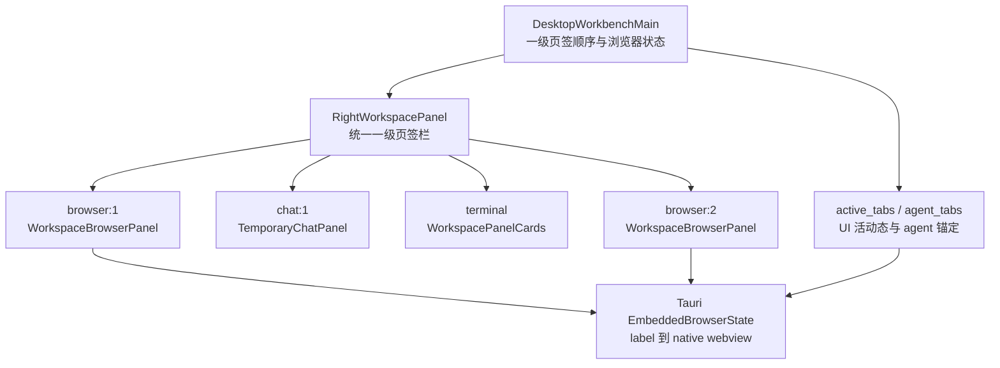

# Wework 内置浏览器多页签最终实现方案

> 状态：已实现
>
> 对应实现提交：`fa9c25589 feat(wework): make browsers top-level workspace tabs`

## 1. 背景与最终产品决策

Wework 右侧工作区原来只允许存在一个浏览器页签。最初方案曾计划在这个浏览器页签内部再增加一层浏览器标签条，但人工体验后确认，这种“页签组 + 子页签”结构与目标交互不符。

最终产品决策如下：

1. 每个浏览器页签都是右侧工作区的一级页签。
2. 浏览器、临时聊天、终端、审查、文件和计划可以按创建顺序自由混排。
3. 点击右侧页签栏加号菜单中的“浏览器”，每次都创建一个新的一级浏览器页签。
4. `Cmd+T`（Windows 为 `Ctrl+T`）每次都创建一个新的一级浏览器页签。
5. 浏览器内容区内部不再显示第二层标签条，也不存在“浏览器标签组”的概念。
6. 每个一级浏览器页签拥有独立的 native webview 和页面状态，但继续共享内置浏览器 profile，因此 cookie 和登录态可以共享。

目标顺序示例：

```text
浏览器 -> 临时聊天 -> 终端 -> 浏览器
```

以上四个页签在尺寸、层级、切换和关闭交互上完全一致。

## 2. 总体架构



核心原则是只维护一层 UI 页签：

- `rightPanelTabs` 是右侧工作区唯一的页签顺序来源。
- `browser:N`、`chat:N`、`terminal` 等类型直接出现在同一个数组中。
- 每个 `browser:N` 对应一个 `WorkspaceBrowserPanel` 和一个 native browser label。
- `RightWorkspacePanel` 使用同一个 `visibleTabs.map(...)` 渲染所有一级页签标题。
- 不再由 `WorkspaceBrowserPanel` 维护浏览器内部的 tab collection。

## 3. 一级页签与状态模型

模型定义在 `wework/src/components/layout/workspace-panels/RightWorkspacePanel.tsx`：

```ts
export type RightWorkspaceChatTab = `chat:${string}`;
export type RightWorkspaceBrowserTab = `browser:${string}`;

export type RightWorkspacePanelTab =
  | "review"
  | "terminal"
  | "files"
  | "plan"
  | RightWorkspaceChatTab
  | RightWorkspaceBrowserTab;
```

每个浏览器页签的前端状态为：

```ts
export interface RightWorkspaceBrowserState {
  label: string;
  browserSessionId: string;
  title: string | null;
  faviconUrl: string | null;
  hasActiveDownload: boolean;
  openRequest: EmbeddedBrowserOpenRequest | null;
}
```

`DesktopWorkbenchMain` 按一级浏览器页签保存状态：

```ts
Partial<Record<RightWorkspaceBrowserTab, RightWorkspaceBrowserState>>;
```

状态职责如下：

| 字段                | 职责                                                  |
| ------------------- | ----------------------------------------------------- |
| `label`             | 该页签对应的 Tauri 逻辑 webview label                 |
| `browserSessionId`  | agent 浏览器会话路由标识，默认使用 `browser:N` 的后缀 |
| `title`             | 页面标题，显示在一级页签上                            |
| `faviconUrl`        | 页面 favicon，显示在一级页签上                        |
| `hasActiveDownload` | 关闭页签前是否需要下载确认                            |
| `openRequest`       | 定向到该页签的待处理打开请求                          |

页面 URL、地址栏、导航、下载、注释、TLS 和 agent 操作状态仍由对应的 `WorkspaceBrowserPanel` 实例管理。一级容器只保留跨组件路由和页签展示所需的最小状态。

## 4. 页签 ID 与 native label 规则

### 4.1 一级页签 ID

- 新建浏览器时由 `DesktopWorkbenchMain.allocateBrowserTab()` 分配 `browser:N`。
- `N` 使用 pane 内递增序号，恢复已有工作区状态时先计算已有最大序号，防止重复。
- `browser:N` 是 React 状态和 UI 页签身份，不直接作为 Tauri native webview label。

### 4.2 browser label

设当前 pane 的基础 label 为 `baseLabel`：

- `browser:1` 使用 `baseLabel`，兼容现有 agent 和默认浏览器入口。
- `browser:N`（`N > 1`）使用 `${baseLabel}-${N}`。
- 每个 `RightWorkspaceBrowserState.label` 都显式保存最终 label。
- popup 和 open request 通过状态表查找 label 对应的一级页签，不依靠字符串前缀反推 pane。

### 4.3 Tauri 双重映射

Tauri `EmbeddedBrowserState` 保留两类路由：

- `active_tabs: baseLabel -> activeBrowserLabel`：记录用户当前选中的一级浏览器页签。
- `agent_tabs: (baseLabel, browserSessionId) -> AgentTabRoute`：记录 agent 会话锚定的浏览器页签。

这两类状态必须分离。用户切换页签只更新 `active_tabs`，不能把正在运行的 agent 静默切换到另一个页面。

## 5. 创建、切换与关闭生命周期

### 5.1 创建

创建入口包括：

- 右侧工作区初始 launcher 中的浏览器入口。
- 一级页签栏加号菜单中的“浏览器”。
- `Cmd+T` / `Ctrl+T`。
- 用户链接打开请求。
- 可被接管的网页 popup。

创建流程：

1. 分配新的 `browser:N`。
2. 创建对应的 `RightWorkspaceBrowserState`。
3. 将 `browser:N` 追加到 `rightPanelTabs`，因此自然保留与其他页签的插入顺序。
4. 将新页签设为 `rightPanelView` 并打开右侧工作区。
5. 无 URL 时显示空白新页签；收到 URL 后由该页签自己的 `WorkspaceBrowserPanel` 打开 native webview。

### 5.2 切换

- 点击任意一级页签只更新 `rightPanelView`。
- 所有已打开的浏览器 panel 作为同级实例保持挂载。
- 活动浏览器容器显示，其他浏览器容器使用 `hidden` 隐藏。
- `WorkspaceBrowserPanel` 原有的 active/bounds 逻辑同步控制 native webview 的可见性，避免 native 内容覆盖其他工作区页签。
- 切换到浏览器时调用 `embedded_browser_set_active_tab`，同步 `baseLabel -> activeBrowserLabel`。

### 5.3 关闭

关闭单个一级浏览器页签时：

1. 若 `hasActiveDownload` 为真，先显示关闭确认；取消后不改变任何状态。
2. 调用 `closeEmbeddedBrowsers([label])` 关闭对应 native webview 并清理 Tauri 映射。
3. 删除 `browserStates[tab]`。
4. 从 `rightPanelTabs` 中删除该页签。
5. 若关闭的是活动页签，沿用右侧工作区现有规则激活剩余页签。
6. 若没有任何剩余页签，关闭右侧工作区并回到 launcher。

浏览器页签与终端、临时聊天一样可以独立关闭。不存在“必须保留首个浏览器子标签”或“关闭浏览器组”的规则。

### 5.4 资源策略

当前最终实现中，每个一级浏览器页签都对应一个保持挂载的 panel；页签打开 URL 后，对应的 native webview 会保活到用户关闭该页签或 pane 被销毁。未实现浏览器内部标签方案中的 `MAX_BROWSER_LIVE_WEBVIEWS`、LRU 回收或 suspended 恢复。

这是一级页签产品模型下的明确边界。后续若需要限制资源，应作为整个右侧工作区的统一页签资源策略设计，不能重新引入浏览器内部标签组。

## 6. 打开请求与 popup 路由

打开请求协议保留来源和意图字段：

```ts
interface EmbeddedBrowserOpenRequest {
  id: string;
  url: string;
  label?: string;
  baseLabel: string;
  source: "user" | "agent" | "popup" | "restore";
  disposition: "new-tab" | "current-tab" | "restore-tab";
  targetLabel?: string;
  parentLabel?: string;
  browserSessionId?: string;
}
```

路由规则：

| 请求                    | 行为                                                                              |
| ----------------------- | --------------------------------------------------------------------------------- |
| `source='user'`         | 创建并聚焦新的一级浏览器页签                                                      |
| `source='popup'`        | 根据 `parentLabel` 显式找到所属 pane，再创建新的一级浏览器页签                    |
| `disposition='new-tab'` | 创建并聚焦新的一级浏览器页签                                                      |
| agent `current-tab`     | 优先按 `targetLabel` 找现有页签，否则使用当前活动浏览器页签；没有浏览器时创建一个 |
| `restore-tab`           | 按 `targetLabel` 找到原一级页签，不创建浏览器子标签                               |

`DesktopWorkbenchMain` 是 open request 和 popup 的统一路由层。`RightWorkspacePanel` 与 `WorkspaceBrowserPanel` 不自行猜测请求属于哪个 pane。

Popup 仍遵循 Tauri 分类策略：

- 可安全接管的 popup：Tauri `Deny` 原窗口并发送 `wework:embedded-browser-popup-request`，前端创建新的一级浏览器页签。
- 依赖 `window.opener`、`postMessage` 或自动关闭语义的 OAuth 场景：保留系统窗口兜底。
- `file`、外部 scheme、支付等类型继续沿用既有安全策略。

## 7. Agent 路由与锚定

Agent 多步操作必须始终作用于同一个浏览器页签：

1. 首次携带 `browserSessionId` 的 bridge 请求，解析当时的 `active_tabs[baseLabel]` 并建立锚定。
2. 同一 `(baseLabel, browserSessionId)` 的后续请求继续路由到已锚定 label。
3. 用户在 UI 中切换浏览器、终端或临时聊天，不改变 agent 锚定。
4. 锚定路由 60 秒无请求后释放；paused 或待 approval 状态不参与超时清理。
5. 锚定页签被用户关闭时保留关闭标记，后续请求明确返回 `agent tab was closed`，不能改投当前活动页签。
6. `relabel` 和 blank pane 迁移会同步更新 active/agent 路由中的 label。

没有 `browserSessionId` 的 bridge 请求按 `active_tabs` 解析，以兼容非会话调用。

## 8. Blank pane 到 task pane 迁移

用户可能先在空白 pane 中建立多个混排页签，再启动或切换到 task pane。迁移对象必须是完整工作区状态，而不是单个浏览器组：

- 保存 `rightPanelTabs` 的完整顺序。
- 保存每个 `browser:N` 对应的 `RightWorkspaceBrowserState`。
- 保存 `rightPanelView`、展开和打开状态。
- 消费迁移时标记全部旧 browser label 已 transfer，避免旧 panel 卸载时关闭正在迁移的 webview。
- 按 `browser:N` 逐个把旧 label relabel 为新 task pane 的目标 label。
- relabel 成功后更新对应 `browserStates[tab].label`。

迁移后混排顺序保持不变。例如空白 pane 中的“浏览器、临时聊天、终端、浏览器”在 task pane 中仍保持相同顺序。

## 9. 工作区状态兼容

旧版本持久化状态可能包含单例 `'browser'` 页签。恢复时做一次明确转换：

```text
'browser' -> 'browser:1'
```

同时：

- 旧 `rightPanelView === 'browser'` 转为 `'browser:1'`。
- 旧 browser label 作为 `browser:1` 的 label 使用。
- 浏览器序号从恢复后的最大 `browser:N` 继续递增。

该兼容仅位于工作区状态恢复边界，运行时统一使用 `RightWorkspaceBrowserTab`，不维持两套并行模型。

## 10. 组件职责

| 组件                                 | 最终职责                                                                               |
| ------------------------------------ | -------------------------------------------------------------------------------------- |
| `DesktopWorkbenchMain.tsx`           | 管理一级页签顺序、浏览器状态、创建/关闭、open request、popup、迁移和 active label 同步 |
| `RightWorkspacePanel.tsx`            | 统一渲染所有一级页签、加号菜单、快捷键和各类 panel 实例                                |
| `WorkspaceBrowserPanelContainer.tsx` | 单浏览器 panel 的薄包装，直接渲染 `WorkspaceBrowserTabPanel`                           |
| `WorkspaceBrowserPanel.tsx`          | 单个 label 的完整浏览器 UI 与 native webview 生命周期                                  |
| `embedded-browser.ts`                | Tauri API、open/popup 事件监听、active/relabel/close-many 调用                         |
| `embedded_browser.rs`                | 多 webview map、active/agent 路由、relabel、批量关闭和 popup 策略                      |

`WorkspaceBrowserPanelContainer.tsx` 当前只保留：

```tsx
export function WorkspaceBrowserPanel(props: WorkspaceBrowserPanelProps) {
  return <WorkspaceBrowserTabPanel {...props} />;
}
```

这个命名保留现有导入边界，但不再代表“内部多标签容器”。

## 11. 已废弃的旧方案

以下内容属于早期“浏览器内部多标签”方案，最终实现明确不采用：

- 浏览器内容区内部的 `BrowserTabStrip`。
- `BrowserTab` collection 和 `activeTabId` 子标签状态机。
- 单个 Browser 一级页签内部的拖拽排序、右键菜单和中键关闭。
- 浏览器内部 `agentControlled` / `needsUserAttention` 标签标识。
- `MAX_BROWSER_LIVE_WEBVIEWS = 10` 和内部 LRU/suspended 回收。
- 首个内部标签持有 baseLabel、关闭时向其他内部标签迁移身份。
- “单工具栏 + 多个 BrowserWebviewHost”的三层组件架构。
- 阶段 A（拆 Host/Toolbar）和阶段 B（增加内部标签）的开发安排。
- 关闭一个外层 Browser 页签时批量关闭其全部内部标签的语义。

删除这些设计不是功能缺失，而是产品模型已经调整为统一的一级工作区页签。一级页签需要的标题、favicon、下载确认、agent 路由和 native 清理均已在当前架构中实现。

## 12. 验证与验收

### 12.1 自动化覆盖

- Wework 全量测试：309 个测试文件、3000 项测试通过。
- TypeScript、ESLint、Prettier 和 Node 语法检查通过。
- `DesktopWorkbenchLayout.test.tsx` 覆盖创建多个一级浏览器页签、与聊天/终端混排以及不渲染 `browser-tab-strip`。
- `WorkspaceBrowserPanelContainer.test.tsx` 覆盖容器退化为单 host 后的属性透传。
- Rust 单测覆盖 agent 锚定页签关闭后返回错误且不改投。
- `browser-multi-tabs` 已注册为桌面 E2E checkpoint，并由 CI 使用的共享 desktop runner 调用。
- E2E 场景自建两个浏览器 fixture，验证一级混排顺序、独立页面状态、切换、关闭和不存在内部标签条。

2026-08-09 已补跑共享 desktop runner 的单 checkpoint：

```bash
pnpm --filter wework e2e:desktop -- --segment browser-multi-tabs
```

结果：PASS，`assertion-errors=none`。证据目录：`wework/test-results/desktop-e2e/2026-08-09T15-44-57-117Z-61512`。

### 12.2 真实 Tauri 验证

已通过隔离 Tauri 会话人工验证：

1. 依次创建浏览器、临时聊天、终端、浏览器。
2. 一级页签实际顺序为“新选项卡、临时聊天、终端、新选项卡”。
3. 四个页签均可切换。
4. 两个浏览器保持各自页面状态。
5. 浏览器内容区没有第二层标签条。

验证截图：`wework/test-results/ai-verify/2026-08-09T15-46-26-684Z-63354/top-level-browser-tabs.png`。

### 12.3 人工验收清单

- [x] 加号菜单每次点击“浏览器”都创建新的一级页签。
- [x] 浏览器、临时聊天和终端按创建顺序混排。
- [x] 浏览器内容区无内部标签条。
- [x] 不同浏览器页签保持独立 URL、标题和页面内容。
- [x] 一级页签显示各自标题和 favicon。
- [x] 关闭一个浏览器不影响其他浏览器或其他类型页签。
- [x] 下载中的浏览器关闭前有确认。
- [x] 用户切换页签不会改变已有 agent 会话的锚定目标。
- [x] agent 锚定页签关闭后返回明确错误，不静默操作其他页面。
- [x] blank pane 到 task pane 迁移保留全部浏览器和混排顺序。
- [x] 旧 `'browser'` 工作区状态可以恢复为 `'browser:1'`。

## 13. 实施结论

当前实现已经符合最终产品目标：浏览器页签是右侧工作区的普通一级页签，可以和其他页签任意混排，不存在浏览器页签组或内部子标签层级。

后续功能若涉及页签排序、资源上限、批量关闭或恢复，应优先扩展统一的 `RightWorkspacePanelTab` 模型；不得只为浏览器重新增加第二层标签系统。
