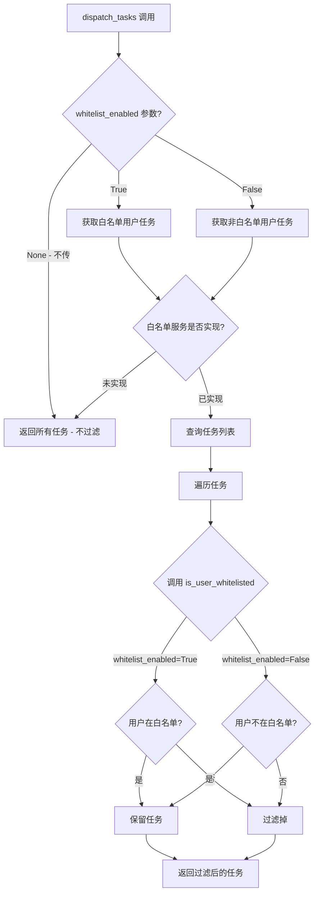

# 任务分发白名单过滤功能设计方案

## 1. 需求概述

在 `dispatch_tasks` 方法中添加用户白名单过滤功能：

- **传入 `whitelist_enabled=True`**：只返回白名单用户的任务
- **传入 `whitelist_enabled=False`**：过滤掉白名单用户的任务（只返回非白名单用户的任务）
- **不传该参数（`whitelist_enabled=None`）**：不做任何过滤，返回所有任务
- **白名单接口未实现时**：不做任何过滤，返回所有任务

## 2. 架构设计

### 2.1 整体流程


### 2.2 组件设计

#### 2.2.1 白名单服务接口 - WhitelistService

创建一个抽象基类，定义白名单检查接口：

```python
# backend/app/services/whitelist/base.py
from abc import ABC, abstractmethod
from typing import Optional

class WhitelistService(ABC):
    """Abstract base class for whitelist service"""
    
    @abstractmethod
    async def is_user_whitelisted(self, user_id: int) -> bool:
        """
        Check if a user is in the whitelist.
        
        Args:
            user_id: The user ID to check
            
        Returns:
            True if user is in whitelist, False otherwise
        """
        pass
    
    @abstractmethod
    def is_implemented(self) -> bool:
        """
        Check if the whitelist service is implemented.
        
        Returns:
            True if implemented, False otherwise
        """
        pass
```

#### 2.2.2 默认实现 - DefaultWhitelistService

提供一个默认的空实现，表示白名单功能未启用：

```python
# backend/app/services/whitelist/default.py
from app.services.whitelist.base import WhitelistService

class DefaultWhitelistService(WhitelistService):
    """Default whitelist service - not implemented"""
    
    async def is_user_whitelisted(self, user_id: int) -> bool:
        """Always returns False as whitelist is not implemented"""
        return False
    
    def is_implemented(self) -> bool:
        """Returns False as this is the default non-implementation"""
        return False
```

#### 2.2.3 服务注册机制

```python
# backend/app/services/whitelist/__init__.py
from typing import Optional
from app.services.whitelist.base import WhitelistService
from app.services.whitelist.default import DefaultWhitelistService

# Global whitelist service instance
_whitelist_service: Optional[WhitelistService] = None

def get_whitelist_service() -> WhitelistService:
    """Get the current whitelist service instance"""
    global _whitelist_service
    if _whitelist_service is None:
        _whitelist_service = DefaultWhitelistService()
    return _whitelist_service

def set_whitelist_service(service: WhitelistService) -> None:
    """Set a custom whitelist service implementation"""
    global _whitelist_service
    _whitelist_service = service
```

### 2.3 修改点

#### 2.3.1 ExecutorKindsService.dispatch_tasks

```python
# backend/app/services/adapters/executor_kinds.py

async def dispatch_tasks(
    self,
    db: Session,
    *,
    status: str = "PENDING",
    limit: int = 1,
    task_ids: Optional[List[int]] = None,
    type: str = "online",
    whitelist_enabled: Optional[bool] = None,  # 新增参数
) -> Dict[str, List[Dict]]:
    """
    Task dispatch logic with subtask support using tasks table
    
    Args:
        status: Subtask status to filter by
        limit: Maximum number of subtasks to return
        task_ids: Optional list of task IDs to filter by
        type: Task type to filter by
        whitelist_enabled:
            - True: Only return tasks from whitelisted users
            - False: Only return tasks from non-whitelisted users
            - None: No filtering, return all tasks
            - If whitelist service is not implemented, no filtering is applied
    """
    # ... existing logic to get tasks ...
    
    # Apply whitelist filtering
    if whitelist_enabled is not None:
        tasks = await self._filter_tasks_by_whitelist(
            db, tasks, whitelist_enabled
        )
    
    # ... rest of existing logic ...
```

#### 2.3.2 新增过滤方法

```python
async def _filter_tasks_by_whitelist(
    self,
    db: Session,
    tasks: List[TaskResource],
    whitelist_enabled: bool,
) -> List[TaskResource]:
    """
    Filter tasks based on whitelist status.
    
    Args:
        db: Database session
        tasks: List of tasks to filter
        whitelist_enabled: If True, keep only whitelisted users tasks;
                          If False, keep only non-whitelisted users tasks
    
    Returns:
        Filtered list of tasks
    """
    from app.services.whitelist import get_whitelist_service
    
    whitelist_service = get_whitelist_service()
    
    # If whitelist service is not implemented, return all tasks
    if not whitelist_service.is_implemented():
        return tasks
    
    filtered_tasks = []
    for task in tasks:
        is_whitelisted = await whitelist_service.is_user_whitelisted(task.user_id)
        
        # whitelist_enabled=True: keep whitelisted users
        # whitelist_enabled=False: keep non-whitelisted users
        if whitelist_enabled == is_whitelisted:
            filtered_tasks.append(task)
    
    return filtered_tasks
```

#### 2.3.3 API 端点修改

```python
# backend/app/api/endpoints/adapter/executors.py

@router.post("/tasks/dispatch")
async def dispatch_tasks(
    task_status: str = Query(default="PENDING"),
    limit: int = Query(default=1, ge=1),
    task_ids: Optional[str] = Query(default=None),
    type: str = Query(default="online"),
    whitelist_enabled: Optional[bool] = Query(
        default=None,
        description="Filter by whitelist: True=only whitelisted, False=only non-whitelisted, None=no filtering"
    ),
    db: Session = Depends(get_db),
):
    # ... existing logic ...
    
    return await executor_kinds_service.dispatch_tasks(
        db=db,
        status=task_status,
        limit=limit,
        task_ids=task_id_list,
        type=type,
        whitelist_enabled=whitelist_enabled,  # 传递新参数
    )
```

#### 2.3.4 Executor Manager 客户端修改

```python
# executor_manager/clients/task_api_client.py

def _do_fetch_tasks(self, whitelist_enabled: Optional[bool] = None):
    url = f"{self.fetch_task_api_base_url}?limit={self.limit}&task_status={self.task_status}"
    if whitelist_enabled is not None:
        url += f"&whitelist_enabled={str(whitelist_enabled).lower()}"
    # ... rest of logic ...
```

## 3. 文件变更清单

| 文件路径 | 变更类型 | 说明 |
|---------|---------|------|
| `backend/app/services/whitelist/__init__.py` | 新增 | 白名单服务模块初始化和注册机制 |
| `backend/app/services/whitelist/base.py` | 新增 | 白名单服务抽象基类 |
| `backend/app/services/whitelist/default.py` | 新增 | 默认空实现 |
| `backend/app/services/adapters/executor_kinds.py` | 修改 | 添加 whitelist_enabled 参数和过滤逻辑 |
| `backend/app/api/endpoints/adapter/executors.py` | 修改 | API 端点添加 whitelist_enabled 参数 |
| `executor_manager/clients/task_api_client.py` | 修改 | 客户端支持 whitelist_enabled 参数 |
| `executor_manager/config/config.py` | 修改 | 可选：添加默认配置 |

## 4. 使用示例

### 4.1 实现自定义白名单服务

```python
# 在项目中创建自定义实现
from app.services.whitelist.base import WhitelistService

class MyWhitelistService(WhitelistService):
    def __init__(self, whitelist_user_ids: set):
        self._whitelist = whitelist_user_ids
    
    async def is_user_whitelisted(self, user_id: int) -> bool:
        return user_id in self._whitelist
    
    def is_implemented(self) -> bool:
        return True

# 在应用启动时注册
from app.services.whitelist import set_whitelist_service

whitelist_service = MyWhitelistService({1, 2, 3})  # 用户ID 1, 2, 3 在白名单中
set_whitelist_service(whitelist_service)
```
### 4.2 API 调用示例

```bash
# 只获取白名单用户的任务
POST /api/executors/tasks/dispatch?whitelist_enabled=true

# 只获取非白名单用户的任务
POST /api/executors/tasks/dispatch?whitelist_enabled=false

# 不传参数 - 返回所有任务，不做过滤
POST /api/executors/tasks/dispatch

# 如果白名单服务未实现，传 whitelist_enabled 参数也不会过滤，返回所有任务
```

### 4.3 Executor Manager 环境变量配置

在 `executor_manager` 中，可以通过环境变量 `WHITELIST_ENABLED` 配置默认的白名单过滤行为：

```bash
# 只获取白名单用户的任务
export WHITELIST_ENABLED=true

# 只获取非白名单用户的任务
export WHITELIST_ENABLED=false

# 不设置或设置为空 - 不做过滤（默认行为）
# export WHITELIST_ENABLED=
```

配置文件位置：`executor_manager/config/config.py`

```python
# Whitelist filter configuration
# WHITELIST_ENABLED: Controls task filtering by user whitelist
#   - "true": Only fetch tasks from whitelisted users
#   - "false": Only fetch tasks from non-whitelisted users
#   - None/empty: No filtering, fetch all tasks (default)
_whitelist_env = os.getenv("WHITELIST_ENABLED", "").lower()
if _whitelist_env == "true":
    WHITELIST_ENABLED = True
elif _whitelist_env == "false":
    WHITELIST_ENABLED = False
else:
    WHITELIST_ENABLED = None
```
```

## 5. 测试用例

### 5.1 单元测试

```python
# backend/tests/services/whitelist/test_whitelist_service.py

import pytest
from app.services.whitelist import get_whitelist_service, set_whitelist_service
from app.services.whitelist.base import WhitelistService
from app.services.whitelist.default import DefaultWhitelistService

class TestDefaultWhitelistService:
    def test_is_implemented_returns_false(self):
        service = DefaultWhitelistService()
        assert service.is_implemented() is False
    
    @pytest.mark.asyncio
    async def test_is_user_whitelisted_returns_false(self):
        service = DefaultWhitelistService()
        assert await service.is_user_whitelisted(1) is False

class MockWhitelistService(WhitelistService):
    def __init__(self, whitelist: set):
        self._whitelist = whitelist
    
    async def is_user_whitelisted(self, user_id: int) -> bool:
        return user_id in self._whitelist
    
    def is_implemented(self) -> bool:
        return True

class TestWhitelistFiltering:
    @pytest.mark.asyncio
    async def test_filter_with_whitelist_enabled_true(self):
        # Setup mock service
        set_whitelist_service(MockWhitelistService({1, 2}))
        # Test that only whitelisted users tasks are returned
        # ...
    
    @pytest.mark.asyncio
    async def test_filter_with_whitelist_enabled_false(self):
        # Test that only non-whitelisted users tasks are returned
        # ...
    
    @pytest.mark.asyncio
    async def test_no_filter_when_service_not_implemented(self):
        set_whitelist_service(DefaultWhitelistService())
        # Test that all tasks are returned
        # ...
```

## 6. 注意事项

1. **性能考虑**：方案B（逐个判断）在任务量大时可能有性能问题，但提供了更好的灵活性。如果后续发现性能瓶颈，可以考虑批量查询优化。

2. **缓存策略**：白名单服务实现可以考虑添加缓存，减少重复查询。

3. **向后兼容**：新增参数为可选，不影响现有调用方。

4. **扩展性**：通过抽象基类设计，可以轻松替换不同的白名单实现（如从数据库、配置文件、外部API获取）。
