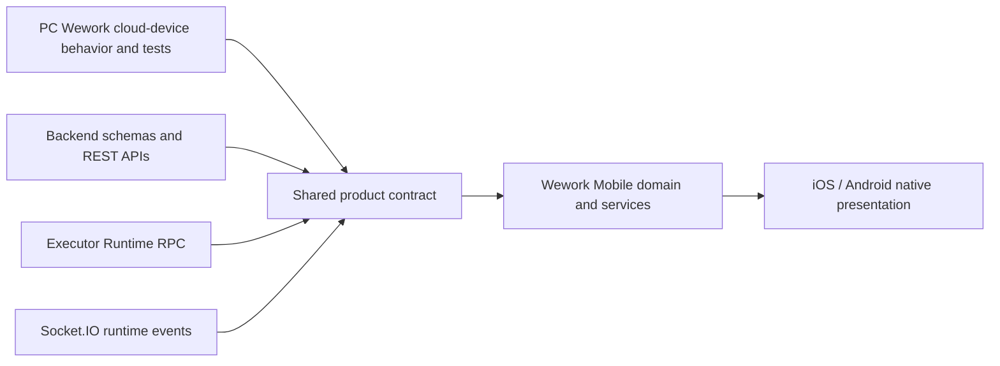

# Wework Mobile contributor guide

Wework Mobile is the iOS and Android client of Wework. It is not an independent product model.
For every Mobile feature, the PC Wework implementation under `../wework/` is the source of truth
for product semantics, protocols, interfaces, data ownership, state transitions, architecture, and
end-to-end flows.

## Highest-priority rule: follow PC Wework cloud-device behavior

Wework Mobile is the mobile client for operating Wework cloud devices. The **PC Wework
cloud-device implementation** is the primary and mandatory reference for every Mobile feature.
Always trace the cloud-device path first, including its protocol, API, device identity, workspace
ownership, data transformation, execution routing, realtime events, task lifecycle, error handling,
and user-visible flow.

Do not copy the PC local-executor path when it differs from the cloud-device path. Do not mix local
App data with cloud-device data. A selected cloud device must expose only the projects, workspaces,
tasks, sessions, capabilities, and state belonging to that device, using the same ownership and
routing rules as PC Wework cloud devices.

## Mandatory PC Wework reference

Before changing `wework-mobile/**`:

1. Locate the corresponding PC Wework **cloud-device** implementation and its tests in `../wework/`.
2. Trace the complete cloud-device flow: source object, storage owner, workspace, executor, task
   address, session lifecycle, request/response schema, and realtime events.
3. Record the relevant PC files in the working notes or final handoff.
4. Implement the same domain behavior in Mobile. Do not invent a Mobile-only protocol, data model,
   fallback, state machine, aggregation rule, or error interpretation.

If no equivalent PC behavior exists, stop and establish the behavior in Wework before adding it to
Mobile. Do not infer a new product contract from screenshots or partial API responses.

## Source-of-truth order

Use these sources in order:

1. PC Wework cloud-device behavior and its tests.
2. Shared Backend and executor schemas and runtime protocol handlers.
3. Other PC Wework behavior when it does not conflict with the cloud-device path.
4. Mobile presentation and platform integration.

Mobile may adapt visual layout, navigation, gestures, keyboard handling, safe areas, and native iOS
or Android controls. Platform adaptation must not change domain meaning, supported operations,
device ownership, execution routing, or lifecycle behavior.

## Architecture boundary



- Mobile is a remote client. It never runs an executor and never receives executor credentials.
- Preserve the distinction between project storage, code workspace location, executor location,
  task ownership, RPC routing device, and session lifecycle.
- Preserve PC Wework field semantics exactly, including optional fields. Do not drop metadata that
  participates in routing or ownership, such as `workspaceSource` or `remoteHostId`.
- Use one canonical domain transformation for all screens. Lists, selectors, creation flows, and
  conversation routing must not independently reinterpret the same runtime data.
- Reuse existing Mobile domain, service, and component abstractions before adding new ones. Delete
  obsolete paths when consolidating behavior.

## Implementation workflow

For any non-trivial change, first draw the relevant Mermaid architecture, state, or sequence diagram.
After each material code change, compare the code against the diagram and update either one when they
diverge.

Protocol and data-flow changes require an explicit parity check against PC Wework for:

- endpoint and RPC method names;
- request, response, and event fields;
- device and workspace identity;
- ordering, filtering, grouping, and deduplication;
- loading, empty, offline, retry, cancellation, and terminal states;
- task creation, continuation, transcript recovery, and reconnect behavior;
- authorization and secret-storage boundaries.

Do not hide a contract mismatch with retries, local caches, synthetic defaults, compatibility shims,
or silent fallbacks. Diagnose the primary flow from actual code, logs, and payloads, then fix it.

## TypeScript and React Native

- Use strict TypeScript, function components, `const`, single quotes, and no semicolons.
- Keep protocol types complete and aligned with the PC types in `../wework/src/types/` and Backend
  schemas. A smaller Mobile UI does not justify a lossy transport type.
- Put domain rules in `src/domain/`, transport behavior in `src/services/`, orchestration in hooks,
  and platform presentation in components.
- New interactive controls need descriptive `testID` values. Preserve existing `testID` values.
- Prefer Expo and React Native platform APIs. Native presentation must preserve the PC operation's
  accessibility label, disabled state, confirmation behavior, and outcome.

## Verification

Read the corresponding PC tests before writing Mobile tests. Every changed behavior needs focused
Mobile coverage for the same primary, boundary, failure, and recovery paths.

Run from `wework-mobile/`:

```bash
pnpm typecheck
pnpm test
pnpm build
```

Do not hand off a change with type errors, failing tests, or a failed iOS or Android export.
