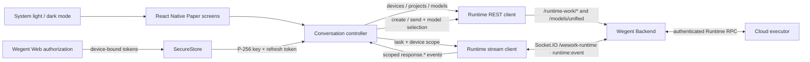

# Wework Mobile

Wework Mobile is the iOS and Android form of Wework. It is an independent Expo application,
but uses the same Backend authorization, REST, Socket.IO, and Runtime protocols as Wework.

## Architecture



There is one execution path. The mobile app never runs an executor and never receives executor
credentials. Login uses `/auth/wework/sessions`, the same Wegent Web authorization page, and the
same ES256 device proof used by Wework. The P-256 private key and refresh token are stored in the
platform keychain/keystore; access tokens stay in memory.

## Supported flow

- Read online cloud executors, remote projects, and active conversations.
- Filter and search conversations.
- Create or register a remote project directory.
- Create a new Codex conversation or continue an existing one.
- Select the executor, project, workspace mode, permission mode, model, and reasoning effort.
- Follow the operating-system light or dark appearance without changing screen structure.
- Load transcript history and consume live `response.*` Socket.IO events.
- Recover from reconnects by reloading the canonical transcript.

## Development

```bash
cd wework-mobile
pnpm install
pnpm start
pnpm device
pnpm typecheck
pnpm test
pnpm build
```

`pnpm device` opens an iOS/Android selector. You can also start a platform directly:

```bash
./scripts/run-mobile.sh ios
./scripts/run-mobile.sh android
```

Set an optional build-time Backend default with `EXPO_PUBLIC_BACKEND_URL`. When it is omitted,
the app asks the user for the Backend address before login and remembers a successfully connected
address on the device. The app reads the Web and Socket.IO origins from `/api/auth/wework/config`;
users never enter or copy an access token.
