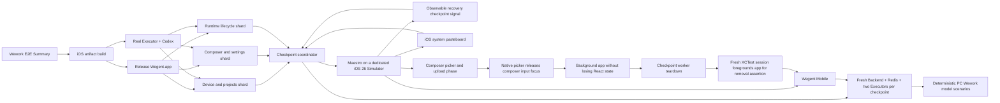

# Wework Mobile E2E

The Mobile E2E suite drives the release application on iOS Simulator and Android Emulator. It
reuses the PC Wework cloud-device environment instead of replacing Backend, Runtime RPC, Executor,
Codex, or transcript behavior with Mobile-specific stubs.

## Architecture



Each checkpoint owns its Backend, Redis, authorization session, workspace, Executors and model
scenario. Checkpoints may share the immutable native build, but never rely on state created by an
earlier checkpoint. The registered catalog is divided into CI shards and validated so every
checkpoint belongs to exactly one shard.

Native side effects are asserted at their owning system boundary. For example, Maestro performs the
message copy action and the checkpoint worker verifies the resulting iOS Simulator pasteboard value.

## Coverage contract

Every row is exercised by a registered checkpoint and therefore by iOS CI. The Composer checkpoint
uses two Maestro phases because iOS hosts its photo picker in another process. The worker first
asserts that the real upload completed and backgrounds the app without clearing state. The
coordinator then creates a fresh XCTest session, foregrounds the running app without restarting it,
and asserts local attachment removal.

| Area               | User-visible contract                                                   | Flow                      |
| ------------------ | ----------------------------------------------------------------------- | ------------------------- |
| Authorization      | Backend validation, device-bound login, credential restoration, logout  | `authorization.yaml`      |
| Device scope       | Device filtering, all-device toggle and selected-device ownership       | `navigation.yaml`         |
| Projects           | Validation, remote directory registration and project-scoped new chat   | `projects.yaml`           |
| Conversation setup | Executor, project, local/worktree mode, branch and permission selection | `conversation-setup.yaml` |
| Models             | Quick selector, advanced catalog, reasoning and speed options           | `models.yaml`             |
| Composer           | Plan, goal, plugin, photo/file entry points and attachment lifecycle    | `composer*.yaml`          |
| Runtime            | Create, stream, stop, continue, tool details and file-change rendering  | `runtime.yaml`            |
| History            | Reopen, search, canonical transcript, older-page loading and copy       | `history.yaml`            |
| Recovery           | Interrupted model stream, app reconnect and canonical convergence       | `recovery.yaml`           |
| Settings           | Open/close settings and disconnect from Backend                         | `settings.yaml`           |
| Appearance         | The same controls remain usable in system light and dark appearance     | `appearance.yaml`         |

Unit tests remain responsible for pure reducers and protocol edge cases. They do not count as a
replacement for any row in this matrix.

## GitHub merge gate

Changes to Mobile or its Backend/Executor contracts are classified by the existing Wework E2E
workflow. GitHub builds one iOS artifact, executes every registered checkpoint across three macOS
jobs, uploads Maestro and runtime diagnostics, and includes the matrix result in `Wework E2E
Summary`. A failed Mobile check, build, or checkpoint therefore fails the existing merge gate.
The artifact job and local runner use the same locked CocoaPods plus native `xcodebuild` script;
Metro and Expo's interactive device launcher are not part of the CI execution path.

## Local execution

Prerequisites are a booted iOS Simulator or Android Emulator, Java 17, Redis, Rust, `uv`, and the
Maestro CLI. The runner starts and owns all server processes and writes diagnostics under
`test-results/mobile-e2e/`.

```bash
pnpm --dir wework-mobile e2e:ios
pnpm --dir wework-mobile e2e:android
```

Run one independently provisioned checkpoint with:

```bash
pnpm --dir wework-mobile e2e:ios -- --flow runtime
```

Run the same shard shape used by GitHub with:

```bash
pnpm --dir wework-mobile e2e:ios -- --checkpoints runtime,history,recovery
```

When only a flow changed and the matching release binary is already installed, skip rebuilding it:

```bash
pnpm --dir wework-mobile e2e:ios -- --flow runtime --reuse-app
```
