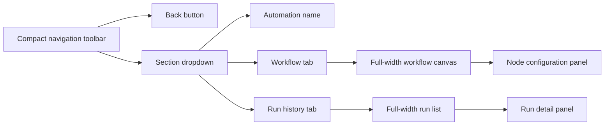
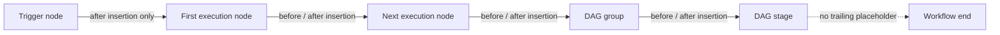

# Automation Editor Compact Navigation Design QA

## Comparison target

- Source visual truth:
  `/Users/hongyu9/.wework/workspace/attachments/draft/1787711552204/image.png`
- Implementation:
  `test-results/desktop-e2e/2026-08-26T02-47-18-044Z-95132/project-automation-00-unified-editor.png`
- Full-view comparison:
  `test-results/desktop-e2e/2026-08-26T02-47-18-044Z-95132/automation-navigation-comparison.png`
- State: workflow editor with the compact navigation dropdown open

## Viewport normalization

- Source pixels: 2400 × 1760
- Implementation pixels: 2880 × 1920
- Implementation CSS viewport: 1440 × 960
- Implementation device scale factor: 2
- Comparison normalization: both images were scaled to 960 pixels high and
  placed side by side. The source and implementation retain their original
  aspect ratios.

## Architecture

## Full-view findings

- The permanent 220-pixel left panel is removed.
- The canvas now uses the recovered left-side area instead of reserving empty
  space for navigation.
- Back navigation and section switching are represented by two compact controls
  in the top-left corner.
- The section dropdown exposes workflow and run-history choices and retains
  automation-name editing without restoring a permanent panel.
- The canvas interaction controls move below the compact navigation toolbar and
  no longer depend on the deleted left-panel width.
- The right configuration panel and top-right save actions retain their
  established alignment.

No actionable P0, P1, or P2 visual mismatch remains for the requested compact
navigation change.

## Required fidelity surfaces

- Fonts and typography: existing Wework semantic typography and system font
  stack are preserved. The compact trigger and menu use the existing small UI
  hierarchy without arbitrary font sizes.
- Spacing and layout rhythm: the large permanent sidebar is replaced by an
  8-pixel action gap and compact 32-pixel controls. The dropdown is transient,
  so it does not reserve canvas width.
- Colors and tokens: navigation uses neutral Wework surfaces, borders, text,
  and focus colors. No new product-chrome color was introduced.
- Image quality and asset fidelity: the target contains no raster product asset
  requiring recreation. Existing Lucide icons remain sharp in the 2× Electron
  capture.
- Copy and content: “编排” and “运行记录” remain unchanged. Automation-name
  editing remains available inside the dropdown.

## Focused-region evidence

The side-by-side comparison is sufficient because the requested change concerns
the large left-region composition. The implementation capture is 2880 × 1920,
so the compact controls, dropdown contents, canvas recovery, and right-panel
alignment are all readable without a separate crop.

## Interaction verification

- Focused Vitest: `ProjectAutomationView.test.tsx` — 10 passed.
- Prettier checks passed for all changed files.
- ESLint reported no errors; the legacy JSX file is ignored by the current
  ESLint configuration.
- Production Electron package build passed using the repository's cached
  Electron 43.4.1 artifact.
- Isolated real Electron E2E opened the automation editor, opened the new
  dropdown, edited the automation name, interacted with the canvas, saved the
  rule, and produced the implementation capture.
- Unit coverage verifies switching from workflow to run history through the new
  dropdown.

The broader `project-automation` checkpoint continued beyond this UI flow and
failed later because the unrelated public API matrix case `AUTO-5` produced no
automation run. The editor UI, dropdown interaction, save path, and screenshot
completed before that downstream failure.

## Comparison history

1. Source state:
   - A permanent left sidebar reserved substantial width for back navigation,
     two section tabs, and a trigger summary.
2. Implementation:
   - Deleted the permanent sidebar and obsolete layout recipes.
   - Added a compact back button and section dropdown.
   - Moved automation-name editing into the dropdown.
   - Repositioned canvas controls and run-list padding around the new structure.
3. Post-change evidence:
   - The recovered canvas area is visible in
     `automation-navigation-comparison.png`.
   - No remaining actionable P0, P1, or P2 visual issue was found.

## Follow-up polish

- None required for this change.

final result: passed

---

# Automation Node Insertion Design QA

## Comparison target

- Source visual truth:
  `/Users/hongyu9/.wework/workspace/attachments/draft/1787712294853/image.png`
- Available implementation capture:
  `test-results/desktop-e2e/2026-08-26T03-05-10-596Z-38001/project-automation-node-insert-hover.png`
- Full-view comparison:
  `test-results/desktop-e2e/2026-08-26T03-05-10-596Z-38001/automation-node-insertion-comparison.png`
- Intended state: an execution node is selected or hovered, exposing insertion
  controls before and after the node.

## Viewport normalization

- Source pixels: 1422 × 768.
- Implementation pixels: 2880 × 1920.
- Implementation CSS viewport: 1440 × 960.
- Implementation device scale factor: 2.
- Comparison normalization: both images were scaled to 960 pixels high and
  placed side by side.

## Architecture

## Findings

- [P1] Final hover-state screenshot is unavailable.
  Location: workflow node insertion controls.
  Evidence: the available real Electron capture shows the correct canvas and
  removal of the trailing placeholder, but the hover state was lost before the
  screenshot was written, so the plus controls are not visibly proven in the
  comparison image.
  Impact: code and DOM assertions prove the interaction exists, but visual
  fidelity against the Dify reference cannot be signed off from the rendered
  artifact.
  Fix: capture the selected execution node after the unrelated automation
  execution checkpoint is healthy.

## Required fidelity surfaces

- Fonts and typography: existing Wework node typography is preserved; no new
  display font or arbitrary type scale was introduced.
- Spacing and layout rhythm: insertion controls are attached to node side
  centers. The obsolete post-final-stage line and placeholder are deleted.
- Colors and tokens: controls use existing focus, surface, border, and text
  tokens.
- Image quality and asset fidelity: no raster or non-standard source asset is
  replaced; the plus icon remains a vector icon from the existing icon system.
- Copy and content: insertion menus retain the existing task-node and dynamic
  node labels.

## Interaction verification

- Focused Vitest on August 26, 2026:
  `ProjectAutomationView.test.tsx` — 12 passed.
- Unit coverage verifies:
  - the trigger exposes only an after control;
  - every execution stage exposes before and after controls;
  - insertion before a node rewires its dependency through the new node;
  - the obsolete trailing insertion node and append edge are absent.
- TypeScript project check passed.
- Production Electron package build passed.
- A prior real Electron run reached the editor, inserted nodes, saved the rule,
  and captured the available implementation image.
- The final real Electron rerun was blocked before the editor by the unrelated
  `AUTO-2 project_robot` execution producing no completed execution record.

## Full-view comparison evidence

The combined comparison confirms the workflow remains a node-and-edge canvas
and that no synthetic final-stage extension is visible. It cannot verify the
requested hover affordance because the available capture does not retain that
interaction state.

## Focused-region evidence

Blocked. A focused selected/hovered node capture could not be produced because
the project-automation checkpoint fails in the unrelated cloud execution phase
before reaching the editor.

## Comparison history

1. Initial implementation:
   - Moved insertion actions from edge placeholders onto workflow nodes.
   - Added before and after controls to execution and DAG-stage nodes.
   - Removed the final append edge and trailing insertion node.
2. Interaction correction:
   - Added selected-state visibility so the controls remain visible after node
     selection and are capturable in Electron.
3. Verification:
   - DOM and persistence assertions pass.
   - Final visual capture remains blocked by the upstream automation execution
     failure described above.

## Implementation checklist

- Restore the unrelated `AUTO-2 project_robot` execution fixture.
- Rerun the `project-automation` Electron checkpoint.
- Compare a focused selected-node capture against the Dify source.

## Follow-up polish

- None identified from code, DOM, or the available full-view evidence.

final result: blocked
