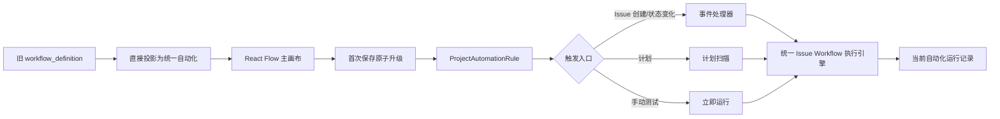

# Automation UI Design QA

## Scope

- Home: automation list, filters, template entry, rule cards
- Editor: trigger rule, horizontal workflow canvas, node settings
- AI dynamic allocation: editable DAG subgraph on the main canvas
- Runs: execution history for the current automation
- API integration: list, create, update, enable, disable, execute, migrate, and
  current-automation run history
- Legacy workflow support: project `workflow_definition` is directly projected
  into the unified editor and remains executable before conversion

## Architecture

## Visual truth

- Home reference: `/Users/hongyu9/.wework/workspace/attachments/draft/1787664889567/image.png`
- Editor reference: `/Users/hongyu9/.wework/workspace/attachments/draft/1787664890945/image.png`
- DAG reference: `/Users/hongyu9/.wework/workspace/attachments/draft/1787654320742/image.png`

## Verification evidence

- Home implementation: `test-results/ai-verify/automation-home-final.png`
- Trigger editor: `test-results/ai-verify/automation-editor-final.png`
- AI DAG editor: `test-results/ai-verify/automation-dag-final-fixed.png`
- Current automation runs: `test-results/ai-verify/automation-runs-final.png`
- Home comparison: `test-results/design-qa/home-comparison.png`
- Editor comparison: `test-results/design-qa/editor-comparison.png`

The implementation was verified in the real Wework Electron application at a
1440 × 897 CSS viewport with a device scale factor of 2. Reference and
implementation screenshots were normalized to the same dimensions before
side-by-side comparison.

## Interaction verification

- Open an automation from the home card
- Open and apply a built-in template
- Pan and zoom the infinite React Flow canvas
- Drag workflow nodes
- Select trigger, execution, and AI allocation nodes
- Edit the AI allocation DAG inside the main canvas
- Open execution history without leaving the current automation
- Open and use legacy Issue orchestration without a migration step
- Save a legacy orchestration once and atomically convert it to the canonical
  automation graph
- Trigger automation through Issue creation, Issue status changes, schedules,
  and manual test runs

## Findings and fixes

1. The editor navigation initially collapsed because its layout class was
   missing. Added the explicit editor navigation layout.
2. The DAG constraint copy initially wrapped vertically in the settings panel.
   Rebuilt that row with a minimum-width-safe flex layout.
3. Legacy preset DAGs keep their original start semantics: an Issue created in
   Inbox waits until it enters Pending or In Progress. Legacy AI orchestration
   starts its coordinator when the Issue is created.
4. No remaining actionable P0, P1, or P2 visual or interaction issues were
   found.
5. Project-list content differs between the product reference and the isolated
   verification fixture. This is test data, not a UI deviation.

## Engineering checks

- Backend automation and Issue API tests: 90 passed
- Frontend test files: 521 passed
- Frontend tests: 4969 passed
- Desktop runtime tests: 41 passed
- TypeScript production compilation: passed
- Lint: passed with 3 pre-existing warnings outside automation
- Production build: passed
- Electron package build: passed
- Real Electron automation E2E: passed
- E2E evidence:
  `test-results/desktop-e2e/2026-08-25T19-48-20-021Z-58072`
- Legacy automation demo names and stylesheet references: none found

final result: passed
