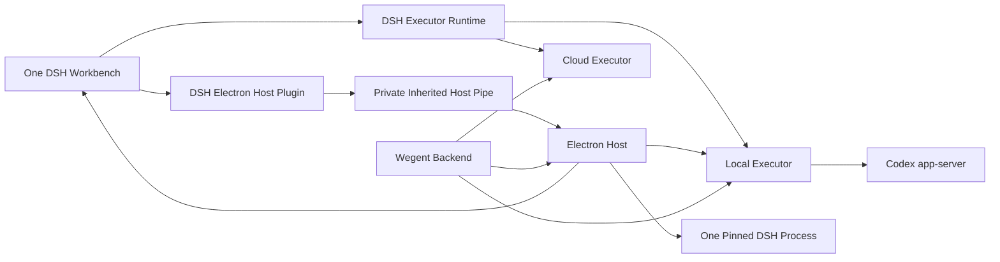

# Complete Wework migration from Tauri to Electron + DSH

> Project Space issue: `WEWORKC2FA61-351`.
>
> The Chinese plan is the canonical implementation and continuation record. Read it in full after context compaction or handoff.

## Outcome

Replace the complete Wework Tauri desktop with Electron + DSH. Electron is the desktop host. One pinned DeepSeek Harness process and one primary DSH `WebContentsView` own all product UI. The existing Wegent executor remains an independent runtime component used by both local and cloud devices.

Host features such as the sidebar browser, native windows, file pickers, and
system menus remain native Electron capabilities. The DSH frontend owns only
their entry points, routes, and business state through restricted desktop
capabilities; it does not reimplement browser or native lifecycles in React.

The final product has three non-removable built-in tabs, all implemented inside DSH:

- Tasks
- Project Space
- Agents

The Smart Workbench continues to discover, install, run, authorize, and restore additional DSH apps as dynamic tabs. Switching tabs never starts another DSH backend.

## Invariants

- One bundled Core DSH backend/profile and one primary View own the three fixed
  tabs. Each active smart-app tab may own an isolated Workbench DSH process and
  embedded View.
- DSH owns built-in and dynamic product tabs; Electron owns only native windows and process lifecycle.
- Codex threads are authoritative for local AI conversation and execution history.
- DSH session logs are rebuildable UI projections, never a second source of truth.
- Wegent Backend remains authoritative for cloud project collaboration.
- Local and cloud Wegent executors implement the same logical runtime contract.
- DSH pages never receive raw Electron IPC, Node.js, shell, filesystem, child-process, or executor-stdin access.
- Replaced Tauri and legacy React UI paths are deleted after acceptance.

## Target topology

## Communication boundaries

Core DSH-to-Electron is a desktop control plane. Electron passes a dedicated
anonymous pipe only to the Core DSH child process. A
`@wegent/dsh-electron-host` backend plugin exposes narrow capabilities through
DSH's existing browser transport. Workbench processes do not inherit this pipe
or Executor credentials by default.

DSH-to-executor is a separate execution plane. `@wegent/dsh-executor-runtime` uses one logical protocol for local and cloud devices:

- Local executor: a current-user Unix domain socket or Windows named pipe.
- Cloud executor: the existing authenticated device/runtime transport.

Electron supervises the local processes and passes opaque connection metadata. It does not interpret task, thread, turn, approval, or workspace methods.

The P0 localhost RPC/SSE bridge is only a connectivity spike and must be deleted after both final transports exist.

## First product plugin: a modular monolith

The first complete migration does not split Tasks, Project Space, and Agents into separately installed DSH plugins. It uses three Wework-internal modules, all located under `wework/`; none is promoted to the repository-level `packages/` directory based on hypothetical reuse:

- `@wegent/dsh-electron-host`: privileged desktop boundary.
- `@wegent/dsh-executor-runtime`: local/cloud executor transport, Codex provider, and projection.
- `@wegent/dsh-app-wework`: the complete product UI, including the three fixed tabs and Smart Workbench.

`@wegent/dsh-app-wework` is internally separated into feature, service, and shared modules from day one, but it builds and runs as one DSH bundle. Existing React components and business services are migrated into DSH routes and contributions, not embedded through a long-lived iframe. A feature is extracted into a child plugin only after its public API, lifecycle, tests, permissions, and independent delivery value are stable.

The package names may remain build identifiers, but their source and release lifecycle belong to Wework. Extraction to a repository-level shared package requires a proven second non-Wework consumer.

## Reference implementation adoption

On August 22, 2026, the plan reviewed
[`anywhere-labs/deepseek-harness-desktop`](https://github.com/anywhere-labs/deepseek-harness-desktop).
It strongly overlaps with Wework at the Electron host, DSH profile/plugin,
renderer-health, update, and diagnostics layers, but it does not provide
Wegent Executor device routing, Backend project collaboration, Codex-thread
authority, or the three fixed product tabs.

Wework closely adopts:

- Typed Desktop Cordis service boundaries, exposed as `ctx.weworkDesktop`.
- Staged profile installation, closure validation, atomic activation, boot
  audit, known-good generations, and rollback.
- Renderer health and recovery state machines.
- Electron sandbox, context isolation, navigation, and external-link defaults.
- Separate Electron/DSH/Executor logs, redacted diagnostics, update channels,
  tray behavior, and non-reentrant shutdown.

Wework adapts:

- Marketplace into the Smart Workbench, with browser-only, reviewed Host
  plugin, and immutable first-party infrastructure permission classes.
- Terminal and sandbox UI onto target-device Executor PTY and capability APIs.
- Profile generations onto the latest approved DSH plus isolated compatible
  legacy versions and `requirements.dsh` selection.
- Browser controls onto an Electron-native auxiliary `WebContentsView` managed
  through `ctx.weworkDesktop.browser.*`; browser MCP, session, downloads, TLS,
  popups, and lifecycle remain host-owned.

Wework explicitly does not adopt the reference implementation's in-process DSH
Host topology. DSH remains a supervised child process connected through the
private authenticated Host pipe, preserving Electron and Executor when DSH
fails. DSH Sessions and Workspaces never replace Codex threads, Wework project
spaces, stable workspace IDs, or Executor authority. Marketplace Host plugins
never receive implicit Electron, filesystem, process, Executor credential,
Backend token, or Codex token access.

The mapping is:

| Reference concept                | Wework target                                             |
| -------------------------------- | --------------------------------------------------------- |
| `ElectronShellGeneration`        | Main window, primary DSH view, and auxiliary native views |
| `RendererHealthService`          | Electron renderer-health service                          |
| `ProfileInstallationCoordinator` | Staged Smart Workbench profile installer                  |
| `desktopRuntime`                 | `ctx.weworkDesktop`                                       |
| `desktopProfiles`                | Smart Workbench profile service                           |
| `desktopUpdates`                 | Wework update service                                     |
| `desktopTerminal`                | Executor PTY adapter and native terminal window           |
| `desktopSandbox`                 | Executor sandbox capability adapter                       |
| `desktopShell`                   | Restricted dialog, window, and external-URL capabilities  |

Upstream synchronization records the reviewed commit, files, adoption or
rejection rationale, and corresponding contract tests. It tracks desktop
services, profile transactions, renderer health, Electron security,
Marketplace state machines, updates, diagnostics, and packaging, but does not
automatically follow tighter process coupling, product-domain redefinition,
single-version patches, or implicit Host-plugin privilege.

## Delivery stages

### P0 — Host and connectivity spike: complete

- Electron package, shell, secure DSH View, basic multi-View tab spike.
- Managed optional DSH/executor processes.
- Executor NDJSON client and localhost RPC/SSE spike.
- Initial Codex event mapping and focused tests.

The multi-View tab model and localhost bridge are not final architecture.

### P1 — Production foundation

- Pin and package the complete DSH profile for offline startup.
- Version the common executor runtime protocol.
- Implement lifecycle supervision, crash recovery, logs, and process-tree cleanup.
- Implement the private DSH-to-Electron host pipe and capability router.
- Implement the unified local/cloud DSH executor runtime.
- Run one Core DSH backend and one primary View with the three fixed tabs.
- Run each smart-app tab in an isolated Workbench DSH process whose lifecycle
  is owned by that tab.

### P2 — Complete frontend migration into one DSH app

- Create `@wegent/dsh-app-wework`.
- Extract host-neutral Backend, task, project-space, agent, workspace, and preference services.
- Migrate Project Space, Agents, Tasks, Smart Workbench, settings, browser, files, Git, and terminal surfaces.
- Keep all features in one modular bundle while eliminating Tauri imports from product components.

### P3 — Complete execution migration

- Implement Codex event projection and transcript rebuild.
- Implement the Codex-backed DSH Agent provider.
- Complete approvals, concurrency, follow-up, steer, cancel, recovery, and write leases.
- Run equivalent real E2E against local and cloud device executors.

### P4 — Parity, legacy deletion, and extraction readiness

- Complete the feature-by-feature parity matrix.
- Delete legacy React route hosts, Tauri-specific UI adapters, the P0 multi-View tab code, and the localhost bridge.
- Enforce public feature contracts and dependency boundaries.
- Extract child plugins gradually only where permissions, lazy loading, or independent release justify it.

### P5 — Product completeness

- Complete user-data migration, accessibility, performance, security, diagnostics, packaging, signing, notarization, update, and rollback.
- Keep all real desktop E2E scenarios in GitHub CI.

### P6 — Rollout and final Tauri deletion

- Roll out through internal, canary, beta, and stable channels.
- Make Electron the default desktop.
- Delete remaining Tauri commands, configuration, builds, release paths, compatibility code, and flags.

## ADR-012 — Publish a generic Wework extension protocol; sidebar is its first point

- Status: in progress.
- Keep the existing `RightWorkspacePanel` DOM, visual shell, sizing,
  persistence, E2E selectors, and Electron-native browser boundary. Mounting
  the full upstream `dsh-better-sidebar` panel beside it would create a second
  shell and would not preserve Wework behavior.
- Core DSH publishes the generic `ctx.wework` host service with protocol
  identifier `wework.host.v1`. Its registry is `ctx.wework.extensions` with
  protocol `wework.extensions.v1`. Extension point IDs use
  `wework.<surface>.<slot>.<kind>`; the first point is
  `wework.workspace.sidebar.tab`. Future points may include
  `wework.workspace.bottom-panel.tab`, `wework.workspace.toolbar.action`, and
  `wework.composer.action`, but they are not advertised before their contracts
  are implemented and frozen.
- Plugins use
  `ctx.wework.extensions.register('wework.workspace.sidebar.tab', contribution)`.
  The primary TypeScript contract uses `WeworkWorkspaceSidebar*` names, and
  contributed tabs appear in Wework's existing launcher, new-tab menu, and tab
  strip.
- `ctx.betterSidebar` and
  `window.__WEWORK_DSH_BETTER_SIDEBAR__` are compatibility adapters only. They
  translate existing better-sidebar registration, lifecycle, scope,
  single/dedupe, badge, and state-subscription vocabulary into the same Wework
  extension host. They do not own a second shell and are not the naming model
  for future Wework extension points.
- React component functions cannot be serialized across WebContents. The Core
  DSH same-origin client renders a contribution with its own React runtime and
  mounts it into a Wework-provided surface host. Plugins in an isolated
  Workbench DSH process remain hosted inside that process.

## Current status

Last updated: August 23, 2026.

- Branch: `feature/electron-dsh-codex-poc`.
- The P0 spike exists in `wework/electron/`.
- Executor protocol v1 is frozen with capability negotiation and a strict desktop method allowlist.
- Local stdio and cloud Socket.IO relay transports share the same `ExecutorClient` contract.
- The runtime supervisor, rotating redacted logs, crash backoff, and process-tree cleanup are implemented.
- The private inherited-fd Electron Host pipe and `@wegent/dsh-electron-host` are implemented.
- Core DSH is bundled as `0.1.1-rc.2`; Workbench DSH starts with
  `0.1.0-rc.8`. Electron explicitly rejects `0.1.0-rc.7`; its legacy asset
  remains only for the old Tauri test path until Tauri removal.
- Managed runtime selection and idempotent first-party profile preparation are connected to the Electron startup path.
- `@wegent/dsh-executor-runtime` provides a same-origin product API, structured errors, sequenced events, a bounded ring buffer, and resume/overflow signaling.
- Executor App IPC now exposes a credentialed local Unix socket or Windows named pipe. Electron only supervises the process and passes the opaque endpoint to DSH.
- Local endpoint and cloud Socket.IO relay transports use the same DSH `ExecutorRuntimeClient`; reconnect, gzip responses, slow consumers, and history overflow are covered.
- The temporary Electron localhost bridge and Electron-side executor protocol parser have been deleted.
- All three versions pass a real DSH install/start smoke verifier for both Electron Host capabilities and executor health/RPC.
- A real managed-runtime verifier passes through `wegent-executor`, the local endpoint, DSH, and the Electron Host pipe.
- Typecheck, 23 focused tests across 8 files, and build pass for the Electron app.
- Electron 43.4.1 loaded a mock DSH page and remained alive for a five-second smoke run.
- The right workspace now has a better-sidebar-compatible registry and one
  controller per Wework pane. Extension tabs reuse the existing launcher, tab
  strip, sizing, persisted pane state, and close lifecycle.
- The single-DSH tab model, the modular-monolith Wework app, and real product UI E2E remain incomplete. Windows named-pipe verification still requires Windows CI because the local cross-check stopped in the third-party `ring` build before compiling Wegent code.

The active work package is `WP-150 single Core DSH and Workbench process
model`, as specified by the Chinese plan.
