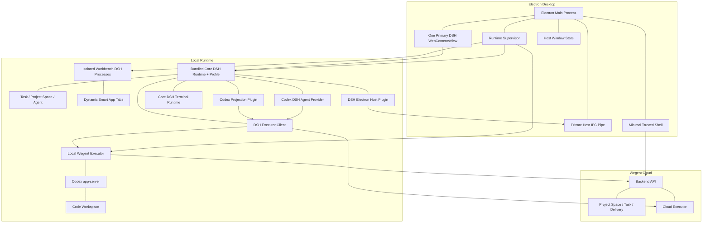

# Wework 从 Tauri 完整迁移到 Electron + DSH 的实施计划

> 对应项目空间任务：`WEWORKC2FA61-351`
>
> 本文件是中文主计划，也是上下文压缩、人员交接和中断恢复后的唯一续作入口。英文文件只用于同步架构摘要；发生差异时以本文件为准。

## 0. 续作协议

任何执行者开始或恢复本任务时，必须按以下顺序操作：

1. 完整阅读本文件，尤其是“架构不变量”“当前进度”“下一检查点”和“决策日志”。
2. 运行 `git status --short`，不得覆盖或删除不属于本任务的改动。
3. 检查当前分支、最近提交和本文件中的“最后核对提交”；如果代码事实与计划不一致，先更新“当前进度”，再继续实现。
4. 只领取“下一检查点”中的一个可独立验收工作包；不要跨阶段同时铺开多个半成品。
5. 完成工作包后，更新：
   - 工作包状态；
   - 实际变更文件；
   - 验证命令与结果；
   - 新发现的风险或决策；
   - 新的“下一检查点”。
6. 如果上下文即将压缩但工作未完成，必须先在“中断恢复记录”中写明：
   - 正在做什么；
   - 已改哪些文件；
   - 最后一个成功命令；
   - 当前失败及完整复现命令；
   - 下一步唯一动作。

状态标记统一使用：

- `DONE`：代码、测试、文档和证据全部完成。
- `IN PROGRESS`：当前唯一正在执行的工作包。
- `READY`：依赖已满足，可立即执行。
- `BLOCKED`：存在明确外部阻塞，并记录解除条件。
- `PLANNED`：尚未满足前置依赖。

## 1. 背景与结论

目标不是简单地“用 Electron 套一个网页”，也不是让 Tauri UI 与 DSH UI 长期并存，而是把 Wework 完整迁移成四层：

1. Electron 桌面宿主。
2. DSH 产品 UI 与应用运行时。
3. 同时服务本地设备和云设备的 Wegent executor。
4. 持有云项目协作事实的 Wegent Backend。

最终产品只有三项固定 Tab，全部使用 DSH 重写：

- **任务**：任务列表、对话、执行、审批和结果。
- **项目空间**：项目看板、任务详情、评论、附件、交付和工作流。
- **智能体**：智能体、机器人、模型、技能、MCP 和相关配置。

除三个固定 Tab 外，保留**智能工作台**能力，用于发现、安装、启动和承载任意经过验证的 DSH App。智能工作台打开的 App 可以形成动态 Tab，但不能改变三个固定 Tab 的存在和职责。

当前结论：

- Electron 作为新的桌面宿主。
- 侧边栏浏览器、原生窗口、文件选择、系统菜单等宿主能力继续由 Electron
  原生实现；DSH 前端只持有入口、路由和业务状态，通过受限 desktop capability
  调用宿主，不在 React 中复制浏览器内核或原生生命周期。
- 固定版本的 DeepSeek Harness 与 `dsh-web-ui` 作为所有产品 UI 和智能工作台 App 的统一运行时。
- 现有 Wegent executor 保留为独立运行时组件，同一协议同时支持本地设备和云设备。
- DSH 通过统一 executor client 与目标设备的 executor 通信；Electron 不转译任务业务。
- 本地 executor 由 Electron 监督，并通过当前用户可访问的 Unix Domain Socket / Windows Named Pipe 访问；云 executor 通过 Backend 已有设备路由和 runtime transport 访问。
- Codex-backed DSH Agent provider 是任务 Tab 使用 executor 的一种 provider，不把 Codex 伪装成普通 LLM adapter。
- Codex thread 始终是本地 AI 对话和执行历史的权威来源。
- DSH Session Log 只是可重建的 UI 投影，不形成第二份事实。
- 云项目空间继续由 Wegent Backend 持有，不能迁入本地 DSH ledger。

## 2. 成功定义

迁移完成必须同时满足以下结果：

1. Electron 版本覆盖现有 Wework 桌面主流程，Tauri 不再是必需运行时。
2. “任务 / 项目空间 / 智能体”三个固定 Tab 均由内置 DSH App 实现，并且不能被用户删除。
3. 智能工作台可以安装、启动、切换、关闭和恢复额外 DSH App。
4. 用户可从任务或项目空间打开持久化执行 Tab，每个执行会话稳定绑定同一 Codex thread。
5. 应用重启、DSH 重启、renderer 崩溃或网络短暂中断后，界面能从 Codex transcript、executor 和 Backend 状态重建。
6. 创建、续聊、follow-up、steer、取消、审批和执行事件均通过目标设备的 executor 完成。
7. 同一 DSH executor client 能按 `deviceId` 路由到本地或云 executor，业务组件不维护两套实现。
8. 本地执行、云项目协作、代码工作空间和 UI 会话四种状态边界清晰，不出现三方双向同步。
9. 安装包不依赖运行时下载 `@latest`，可复现、可升级、可回滚。
10. 现有桌面 E2E 场景迁移到 Electron 后保持真实后端请求，不通过跳过、重试或弱化断言换取通过。
11. Electron + DSH 替代链路稳定后，删除对应 Tauri 和旧 React 产品 UI，不保留双前端。

## 3. 范围与非目标

### 3.1 本计划范围

- Electron 主进程、窗口、Tab、View、菜单、深链、更新和进程监督。
- 固定 DSH runtime/profile 与 `dsh-web-ui` 组合。
- 一个模块化单体 DSH 产品 App 内的三个固定 surface：任务、项目空间、智能体。
- 智能工作台和第三方/个人 DSH App 的安装、运行、权限与生命周期。
- Electron 到 Wegent executor 的 stdio 客户端。
- DSH 到本地/云 executor 的统一 client 和 transport。
- Codex 事件投影插件。
- Codex-backed DSH Agent provider。
- 旧 React 任务、项目空间、智能体、代码工作空间、终端、Git、文件、浏览器等桌面模块的分批删除或迁移。
- Tauri 到 Electron 的数据迁移、灰度、回滚和最终删除。

### 3.2 明确非目标

- 不重写 Codex app-server 协议状态机。
- 不让 Electron 直接管理 Codex thread、turn 或 approval 的内部状态。
- 不把 Codex 当成 DSH 的文本补全 LLM adapter。
- 不把云项目空间完整复制到 DSH Session Log。
- 不在第一阶段重写 Wegent Backend 或云 Executor。
- 不让 Electron 主进程成为本地/云 executor 的业务 API 聚合层。
- 不维护长期 Tauri/Electron 双实现。
- 不维护长期旧 React 产品 UI/DSH 产品 UI 双实现。
- 不在未固定 DSH 版本前承诺对任意最新插件兼容。
- 不因迁移修改现有 E2E 语义；只有完整日志证据证明 E2E 自身错误时才允许修改。

## 4. 架构不变量

这些规则优先于阶段性实现便利：

1. **单一执行权威**：目标设备的 Wegent executor 是调用 Codex app-server 和归约执行状态的唯一入口。
2. **单一历史权威**：Codex thread 是 AI 对话与执行记录的权威；DSH ledger 可删除并重建。
3. **云端协作权威**：项目、任务、成员、评论、附件、交付和工作流由 Wegent Backend 持有。
4. **宿主不懂业务协议**：Electron 负责生命周期、安全边界和运输，不在主进程内归约 Codex 业务状态。
5. **插件不持有系统权限**：DSH renderer 无任意 Shell、文件系统、子进程或 executor stdin 权限。
6. **版本可复现**：DSH core、UI、sidebar、Wegent 插件及 profile 使用锁定版本和完整性校验。
7. **失败可恢复**：任何 renderer 或 DSH 崩溃不得导致 Codex thread 丢失或 executor 被重复创建。
8. **按能力迁移并删除旧路**：每个模块只有在 Electron 验收后才删除 Tauri 对应路径；删除后不保留隐式 fallback。
9. **单核心 DSH 实例**：任务、项目空间、智能体三个固定 Tab 只使用一个内置
   Core DSH runtime/profile 和一个主 View；智能工作台动态 Tab 可以各自启动
   隔离的 Workbench DSH 进程，但不能复用或替代核心执行运行时。
10. **控制面与执行面分离**：DSH ↔ Electron 只传桌面宿主能力；DSH ↔ executor 传任务和执行能力，两条协议不能合并成一个万能 bridge。

## 5. 目标架构



### 5.1 产品 Tab 模型

主窗口的三个固定产品面不是“多个 DSH 页面组成的浏览器”，而是一个 Core DSH
工作台；智能工作台 App 是受隔离的动态进程：

| Tab            | 类型                    | 实现                                            | 可关闭 | 主要数据源                      |
| -------------- | ----------------------- | ----------------------------------------------- | ------ | ------------------------------- |
| 任务           | 固定核心 Tab            | `@wegent/dsh-app-wework/features/tasks`         | 否     | executor + Backend              |
| 项目空间       | 固定核心 Tab            | `@wegent/dsh-app-wework/features/project-space` | 否     | Backend                         |
| 智能体         | 固定核心 Tab            | `@wegent/dsh-app-wework/features/agents`        | 否     | Backend + executor capabilities |
| 智能工作台 App | 动态隔离 Tab            | 独立 Workbench DSH 进程中的已安装 App           | 是     | App 自身声明的能力              |
| 任务/会话详情  | 动态子 Tab 或内部 route | 任务 App                                        | 是     | executor                        |

要求：

- 三个固定 Tab 在同一个 DSH context/profile 中注册，共享登录态、主题、设备目录和 executor client。
- 三个固定 Tab 的切换只改变 Core DSH 内部 route/state，不启动新 DSH 或 executor。
- 每个运行中的智能工作台 App Tab 持有独立 Workbench DSH 进程和嵌入 View；关闭
  Tab 必须终止对应进程，不能影响 Core DSH 和 executor。
- Core DSH 使用一个主 `WebContentsView`；工作台 View 属于动态 Tab 原生承载层，
  不加入核心 View/PID 唯一性断言。
- 智能工作台负责 DSH App 的发现、安装、权限展示、启动、停用和升级；Electron 不维护一份平行 App registry。
- Workbench runtime 默认不携带 `@wegent/dsh-app-wework`、
  `@wegent/dsh-electron-host` 或 `@wegent/dsh-executor-runtime`，也不继承核心
  pipe token、executor endpoint 或 credential。

### 5.2 所有权矩阵

| 状态或能力             | 唯一所有者                         | Electron/DSH 中的表现                  |
| ---------------------- | ---------------------------------- | -------------------------------------- |
| 云项目与任务           | Wegent Backend                     | 查询、命令和缓存视图                   |
| 本地/云执行生命周期    | 目标设备的 Wegent executor         | executor client RPC 和事件             |
| Codex thread/turn/item | Codex app-server，经 executor 暴露 | DSH 投影                               |
| 代码目录与 worktree    | Workspace service / executor       | 只引用稳定 workspace ID 和路径         |
| DSH 核心插件组合       | 固定 profile                       | 安装包内不可变资产                     |
| 本地桌面终端           | Core DSH terminal runtime          | 同源 RPC/SSE、受限 PTY registry        |
| 固定和动态 App Tab     | DSH workspace/router               | DSH 状态与可重建绑定                   |
| 桌面窗口与原生窗口状态 | Electron                           | `host-state.json`                      |
| UI 临时布局            | DSH/插件                           | 可丢弃本地偏好                         |
| 用户认证               | 现有 Wegent/Codex 认证组件         | 受控状态查询，不向 renderer 暴露 token |
| 更新与回滚             | Electron updater                   | release channel 和版本清单             |

### 5.3 第一版插件组合：模块化单体

第一版不把三个固定 Tab 分别做成三个可独立安装的 DSH 插件。完整功能迁移采用三个 Wework 内部模块边界；它们全部位于 `wework/`，不按假设中的跨产品复用提前放入根 `packages/`：

| 插件                           | 权限级别         | 第一版责任                                                           |
| ------------------------------ | ---------------- | -------------------------------------------------------------------- |
| `@wegent/dsh-electron-host`    | 高权限基础设施   | DSH ApiProxy service、私有 host pipe、桌面 capability                |
| `@wegent/dsh-executor-runtime` | 执行基础设施     | 本地/云 executor client、设备路由、事件流、Codex provider/projection |
| `@wegent/dsh-terminal-runtime` | 本地交互基础设施 | Core DSH 内的 PTY 生命周期、快照和同源事件流                         |
| `@wegent/dsh-app-wework`       | 产品 UI          | 任务、项目空间、智能体、智能工作台和现有 Wework 完整前端             |

`@wegent/dsh-app-wework` 是**模块化单体插件**：

```text
@wegent/dsh-app-wework/
  src/
    app/
      register.ts
      routes.ts
      fixed-tabs.ts
    features/
      tasks/
      project-space/
      agents/
      smart-workbench/
      settings/
      browser/
      files/
      git/
      terminal/
    services/
      backend/
      executor/
      desktop/
    shared/
      components/
      hooks/
      state/
      types/
```

规则：

- 一个 package、一个 DSH bundle、一个生命周期，但内部 feature 之间只能通过公开 service/type 边界依赖。
- 产品插件不包含 Electron pipe、socket、token 或原始 transport 实现，只依赖注入的 `ctx.weworkDesktop` 和 `ctx.wegentExecutor`。
- Wework 内置浏览器继续属于 Electron host feature；产品插件只调用
  `ctx.weworkDesktop.browser.*` 一类受限 capability 并呈现必要控制状态。
- 现有 React 组件和业务 service 直接迁移/抽取进 feature；不通过 iframe 长期嵌入旧 Wework 前端。
- Tauri API 先替换为 host-neutral interface，再接 DSH service；不在组件里增加 `if (electron)` / `if (tauri)`。
- 三个固定 Tab 是该插件注册的固定 routes，不是三个进程，也不是三个 bundle。

后续只有满足以下条件才提取子插件：

- feature 有稳定公开 API 和独立生命周期。
- 跨 feature 私有 import 已清零。
- 可以独立测试、版本化和回滚。
- 拆分能带来权限隔离、按需加载或独立交付价值，而不只是目录更好看。

## 6. 进程拓扑与生命周期

### 6.1 进程

主窗口正式版本至少包含：

- 一个 Electron main process。
- 一个最小可信 Shell renderer；如果标题栏可以由主 DSH 页面安全承载，可进一步删除 Shell renderer。
- 一个主 `WebContentsView`，承载三个固定 Tab 和智能工作台动态 App。
- 宿主级辅助 View（例如 Wework 内置浏览器）可以由 Electron 按需创建，但它们
  不是 DSH 产品 Tab，不加载第二份 DSH 页面，也不得启动额外 DSH backend。
- 一个固定 Core DSH runtime 进程，三个固定 Tab 和内置产品服务共享。
- 每个活动智能工作台 App Tab 一个隔离 Workbench DSH 进程。
- 一个 Wegent executor 进程；所有本地 Codex 会话共享。
- executor 管理的 Codex app-server 及其必要子进程。

额外窗口不等于额外 DSH runtime。弹出窗口优先连接同一 DSH 服务和 profile；只有隔离或崩溃域证据充分时才允许独立 renderer，仍不得重复启动 DSH backend。

### 6.2 启动状态机

```text
BOOT
  -> LOAD_HOST_STATE
  -> CREATE_HOST_IPC_PIPE
  -> START_EXECUTOR
  -> WAIT_EXECUTOR_READY
  -> START_DSH
  -> WAIT_DSH_PROFILE_HEALTHY
  -> CREATE_WINDOW
  -> LOAD_PRIMARY_DSH_VIEW
  -> DSH_RESTORE_TABS
  -> READY
```

要求：

- Electron 创建 DSH host pipe 和本地 executor endpoint 后，把 opaque 连接参数交给受管 DSH 进程。
- 在 executor ready 前，DSH executor client 的所有执行 RPC 返回结构化 `runtime_not_ready`。
- DSH 健康检查必须验证实际 profile 和插件版本，不只验证端口可连接。
- Shell 必须在 runtime 失败时显示诊断和重试入口，不能白屏。
- 同一启动阶段只允许一个实例；并发调用复用同一个 Promise。
- 每个阶段有明确超时、错误码和日志上下文。

### 6.3 运行时故障状态机

```text
READY
  -> DEGRADED_DSH       renderer/runtime failed; executor continues
  -> DEGRADED_EXECUTOR  DSH remains readable; commands disabled
  -> RESTARTING
  -> READY | FAILED
```

- DSH 崩溃：保留 executor 和 Codex thread，重启 DSH 后从 transcript 重建。
- executor 崩溃：拒绝新命令，完成中的请求失败；限制次数重启并恢复 thread 映射。
- executor transport 断线：插件使用 `lastEventSeq` 重连；无法补齐时调用 transcript rebuild。
- host pipe 断线：桌面能力变为 unavailable；Electron 与 DSH 进行一次重新握手，不能触发任务重跑。
- 主 View 崩溃：重建 View 并重新连接仍在运行的 DSH runtime；不重启 executor，不重复提交 turn。
- 单个动态 App 崩溃：由 DSH app runtime 卸载/重载该 App，不重启共享 DSH backend。
- 连续崩溃达到阈值后停止自动重启，显示日志位置和手动恢复入口。

### 6.4 退出状态机

顺序固定：

1. 阻止新 RPC。
2. 通过 host pipe 通知 DSH 进入只读/closing。
3. 在上限时间内由 DSH 持久化 Tab、App 和 UI 偏好，由 Electron 持久化窗口状态。
4. 关闭 host pipe 和 executor transport。
5. 请求 DSH 单一进程正常退出，超时后终止其进程组。
6. 请求本地 executor 正常退出，超时后终止其进程组。
7. 确认 Codex 和子进程没有遗留。
8. Electron 真正退出。

macOS 的关闭窗口与退出应用必须分开处理；自动化要覆盖 `before-quit` 重入和强制退出。

## 7. 身份与数据模型

禁止使用一个模糊的 `sessionId` 贯穿所有层。稳定身份如下：

| 字段            | 来源              | 生命周期       | 用途                   |
| --------------- | ----------------- | -------------- | ---------------------- |
| `projectId`     | Backend           | 云项目长期存在 | 项目空间               |
| `taskId`        | Backend           | 云任务长期存在 | 协作任务               |
| `executionId`   | Backend/executor  | 一次执行       | 云或本地执行记录       |
| `workspaceId`   | Workspace service | 工作区长期存在 | 代码目录/worktree      |
| `deviceId`      | Backend/设备注册  | 设备级         | 本地或云执行路由       |
| `codexThreadId` | Codex app-server  | 对话长期存在   | 对话与执行权威         |
| `codexTurnId`   | Codex app-server  | 单轮           | follow-up/steer/cancel |
| `dshSessionId`  | DSH               | UI 投影周期    | 可重建的 ledger        |
| `tabId`         | DSH               | 工作台布局周期 | 核心/动态 App route    |

### 7.1 绑定记录

宿主只持有引用，不复制完整实体：

```ts
interface WorkbenchBinding {
  version: 1
  tabId: string
  projectId?: string
  taskId?: string
  executionId?: string
  workspaceId?: string
  codexThreadId?: string
  dshSessionId?: string
  appKind: 'tasks' | 'project-space' | 'agents' | 'smart-app'
  route: string
  lastOpenedAt: string
}
```

约束：

- `codexThreadId` 只能由 executor 返回和恢复，renderer 不得自行生成。
- `dshSessionId` 丢失时由 projection plugin 基于 `codexThreadId` 重建。
- 一个 `taskId` 可有多个 execution，但一个活动任务 route 同时只指向一个 execution/thread。
- workspace 与 task 是正交关系；不能把目录路径当 task ID。
- 本地路径不上传到云项目空间，除非现有产品能力明确要求。
- 三个固定 Tab 的 ID 和 app kind 由 profile 声明，不写入 Electron 的可编辑 Tab 列表。

### 7.2 本地持久化

规划文件：

```text
<userData>/
  host-state.json
  runtime/
    versions.json
    crash-state.json
  logs/
    electron-main.log
    dsh.log
    executor.log
```

- 使用带 `version` 的 schema、临时文件和原子 rename。
- 读取旧 schema 时显式迁移；不做静默猜测。
- 损坏时保留原文件为诊断副本，创建最小空状态并提示用户。
- bearer token、Codex token、Backend token 不写入上述文件。

## 8. 版本冻结与物化

### 8.1 版本清单

在 `wework/harness-runtime/manifest.json` 固定：

| 组件                           | 必须记录                            |
| ------------------------------ | ----------------------------------- |
| DeepSeek Harness core          | commit、package version、integrity  |
| `dsh-web-ui`                   | commit、package version、integrity  |
| `dsh-better-sidebar`           | commit、package version、integrity  |
| `@wegent/dsh-electron-host`    | workspace version、build hash       |
| `@wegent/dsh-executor-runtime` | workspace version、build hash       |
| `@wegent/dsh-app-wework`       | workspace version、build hash       |
| Node runtime                   | major/minor/patch                   |
| Electron                       | exact version                       |
| executor protocol              | protocol version和最低/最高兼容版本 |
| profile                        | schema version和内容 hash           |

规则：

- 禁止安装、启动或更新时解析 `latest`。
- CI 在 lockfile、manifest、profile 三者不一致时失败。
- 安装包内物化完整 profile；离线首次启动可用。
- 升级先在临时目录构建和健康检查，再原子切换 `current` 指针。
- 保留最近一个成功版本用于回滚。

### 8.2 兼容检查

DSH `/health` 或专用 metadata endpoint 必须返回：

```json
{
  "profileVersion": "...",
  "dshVersion": "...",
  "webUiVersion": "...",
  "plugins": {
    "@wegent/dsh-electron-host": "...",
    "@wegent/dsh-executor-runtime": "...",
    "@wegent/dsh-app-wework": "..."
  }
}
```

Electron 只接受 manifest 声明的组合。版本不匹配时停止进入工作台，显示修复/回滚操作。

## 9. 跨进程接口契约

### 9.1 Executor NDJSON

现有协议事实：

```json
{"type":"request","id":"uuid","method":"...","params":{}}
{"type":"ready","...":"..."}
{"type":"response","id":"uuid","ok":true,"result":{}}
{"type":"response","id":"uuid","ok":false,"error":{"message":"..."}}
{"type":"event","event":"...","payload":{}}
```

正式化要求：

- 增加协议版本协商；不兼容时启动失败。
- 每个请求有 timeout、cancel 和日志 correlation ID。
- 非 JSON stdout 行不得被悄悄忽略；记录为协议错误并设阈值。
- stderr 只用于诊断，不解析业务事件。
- 进程退出时立即拒绝所有 pending request。
- 所有 Codex 方法名由 executor 的显式 runtime API 暴露；任何 transport 都不直接透传任意 app-server 方法。

### 9.2 DSH ↔ Electron：私有宿主管道

这是桌面**控制面**，只承载窗口、系统对话框、通知、更新、深链、剪贴板和诊断等 Electron 宿主能力，不承载 task/thread/turn。

物理通道：

- Electron 启动唯一 DSH 子进程时创建专用匿名 pipe，作为额外 stdio fd/handle 继承给 DSH。
- Electron 和 DSH backend 在 pipe 上使用版本化、双向 JSON-RPC；初版使用 NDJSON，只有出现可测的 framing 问题时才升级为 length-prefixed frames。
- pipe 不监听 TCP 端口，不向普通网页暴露，不通过 renderer `ipcRenderer` 转发。
- DSH frontend 通过 DSH 自己的 ApiProxy/HTTP + WebSocket 调用 `@wegent/dsh-electron-host` 后端插件；插件再调用私有 pipe。
- DSH 单独运行在浏览器或 CLI 环境时，该插件暴露 `host.unavailable` capability，而不是伪造 Electron。

逻辑调用链：

```text
DSH App
  -> injected ctx.weworkDesktop capability
  -> DSH ApiProxy / browser transport
  -> @wegent/dsh-electron-host backend plugin
  -> private inherited pipe
  -> Electron HostCapabilityRouter
```

握手：

```json
{
  "type": "hello",
  "protocol": "wework.desktop",
  "version": 1,
  "profileHash": "...",
  "dshPid": 12345
}
```

Electron 返回 capability 清单，不返回通用 IPC：

```json
{
  "type": "welcome",
  "version": 1,
  "desktopSessionId": "...",
  "capabilities": ["window.control", "dialog.open", "notification.show", "update.read", "logs.open"]
}
```

初始宿主方法：

| Domain       | 方法示例                                  | 限制                            |
| ------------ | ----------------------------------------- | ------------------------------- |
| window       | minimize、toggleMaximize、close、getState | 只作用当前拥有窗口              |
| dialog       | openFiles、openDirectory、saveFile        | schema、扩展名和数量限制        |
| external     | openUrl、revealPath                       | URL scheme/path scope allowlist |
| clipboard    | readText、writeText                       | 需要 manifest capability        |
| notification | show                                      | 长度、频率和来源限制            |
| app          | getVersion、getPlatform、quit             | 不暴露 process/env              |
| update       | getState、check、install                  | 仅内置核心 App 可用             |
| diagnostics  | openLogs、exportBundle                    | 不返回未去敏日志内容            |

安全要求：

- 不向 DSH 页面暴露原始 `ipcRenderer.send/invoke/on`。
- 每个方法由 DSH plugin manifest 声明 capability；第三方 App 默认没有 Electron 能力。
- 后端插件根据调用 plugin identity 做授权，不能仅相信前端传入的 plugin name。
- 请求和响应都做 schema 校验、timeout、大小限制和 correlation ID。
- Electron 验证 DSH 子进程 PID、profile hash 和协议版本。
- pipe 断开立即撤销全部 capability；重连必须重新握手。
- host event 只包含去敏数据，例如主题、窗口状态、update 状态和 deep-link action。

### 9.3 DSH ↔ Executor：统一 Runtime Transport

这是任务**执行面**。DSH 的核心 App、Codex provider 和其他获授权 App 通过 `@wegent/dsh-executor-runtime` 使用同一逻辑协议：

```ts
interface ExecutorAddress {
  deviceId: string
  kind: 'local' | 'cloud'
  endpoint: string
  protocolVersion: number
  capabilities: string[]
}
```

物理通道：

- 本地设备：Electron 启动 executor；executor 暴露仅当前用户可访问的 Unix Domain Socket / Windows Named Pipe，DSH backend 直接连接。迁移早期可由 Electron 做无业务语义的 byte forwarding，但正式版不能由 Electron 解释 executor method。
- 云设备：DSH executor client 复用 Backend 的认证设备路由和 runtime WebSocket/stream，连接目标云 executor。
- 两种 transport 共享 method、event、错误码、重连和 capability 协商；业务 DSH App 只选择 `deviceId`，不分叉本地/云实现。

逻辑调用链：

```text
DSH App / Codex Agent Provider
  -> injected ctx.wegentExecutor
  -> @wegent/dsh-executor-runtime
  -> local socket OR authenticated cloud runtime transport
  -> target Wegent executor
```

正式接口至少包含：

| Domain     | 能力                                             |
| ---------- | ------------------------------------------------ |
| runtime    | health、capabilities、version                    |
| devices    | list、resolve、availability                      |
| tasks      | list、create、inspect、search、rollback、compact |
| threads    | start、resume、read transcript                   |
| turns      | start、steer、interrupt、status                  |
| approvals  | inspect、respond                                 |
| workspaces | inspect、files、Git、terminal scoped operations  |
| events     | 带序号的 task/thread/turn/runtime stream         |

当前 P0 的 Electron `/health`、`/rpc`、`/events` bridge 只用于验证 executor 连通性，正式 transport 完成后删除；不能成为永久中间层。

RPC 失败统一为：

```json
{
  "requestId": "uuid",
  "ok": false,
  "error": {
    "code": "runtime_not_ready",
    "message": "...",
    "retryable": true,
    "details": {}
  }
}
```

要求：

- method 必须 allowlist，按能力分类：thread、turn、approval、workspace、runtime。
- 请求体上限 1 MiB；附件和大 transcript 使用现有文件/Backend API，不走 RPC JSON。
- 本地 socket 验证当前用户和每次启动的连接凭据；云 transport 使用现有设备认证。
- 设置连接数、并发请求、单方法 timeout 和每 App/Tab 速率限制。
- 错误响应不得包含 token、环境变量、认证文件内容或完整本地敏感路径。

### 9.4 Executor 事件信封

```ts
interface ExecutorEvent {
  protocolVersion: 1
  seq: number
  emittedAt: string
  source: 'executor' | 'codex' | 'runtime'
  event: string
  scope: {
    taskId?: string
    executionId?: string
    workspaceId?: string
    threadId?: string
    turnId?: string
  }
  payload: Record<string, unknown>
}
```

- `seq` 由目标 executor 在其 runtime 生命周期内单调递增。
- transport 支持从最后 event ID 恢复。
- executor 或其 gateway 保存有界事件 ring buffer；范围外重连返回 `rebuild_required`。
- 慢消费者达到上限后断开，不能无限缓存。
- projection 必须按 `threadId + turnId + itemId` 去重。
- 不认识的事件进入诊断通道，但不能污染正常 transcript。

## 10. Codex 投影模块

位置：`@wegent/dsh-executor-runtime/codex-projection`。

职责：

- 连接统一 executor event stream。
- 把 Codex/executor 事件映射为 DSH UI 可消费的 session event。
- 根据 Codex transcript 全量重建 DSH session。
- 保存最后消费的 `seq` 和投影 schema version。
- 提供 Codex 特有 item renderer；不修改 DSH core。

### 10.1 映射目录

正式实现至少覆盖：

| Codex 语义                       | DSH 投影                               |
| -------------------------------- | -------------------------------------- |
| user message                     | `user/message`                         |
| agent message delta/completed    | `assistant/chunk`、`assistant/message` |
| reasoning delta/summary          | `assistant/reasoning-*`                |
| command started/output/completed | `codex/command-*`                      |
| file change started/completed    | `codex/file-change-*`                  |
| MCP call started/result          | `codex/mcp-*`                          |
| web search/open                  | `codex/web-*`                          |
| plan update                      | `codex/plan`                           |
| approval request/resolution      | `codex/approval-*`                     |
| turn started/completed/failed    | `turn/*`                               |
| token/rate usage                 | `codex/usage`                          |
| runtime warning                  | `codex/runtime-warning`                |

每个映射要有 fixture 测试，fixture 来源必须去敏，并记录对应 executor/Codex 版本。

### 10.2 重建算法

1. 用 `codexThreadId` 请求权威 transcript。
2. 规范化 transcript 为稳定 item 模型。
3. 按 thread/turn/item 顺序生成 DSH session events。
4. 原子替换目标 DSH session 投影。
5. 记录 transcript revision 或最后权威 item ID。
6. 建立 executor event stream，从 rebuild 边界之后继续消费。
7. 重复事件按稳定键丢弃。

禁止把旧 DSH ledger 反向写回 Codex thread。

## 11. Codex-backed DSH Agent Provider

位置：`@wegent/dsh-executor-runtime/codex-agent`。

DSH 的 Agent 接口与具体 agent loop 解耦，因此 provider 直接把 Agent 操作映射到 executor，而不是重新运行 DSH 默认 loop。

### 11.1 操作映射

| DSH Agent 操作           | Executor/Codex 语义                          | 结果                           |
| ------------------------ | -------------------------------------------- | ------------------------------ |
| `create`                 | 创建任务上下文和 `thread/start`              | 返回 agent handle 与 thread ID |
| `resume`                 | `thread/resume`                              | 恢复同一 thread                |
| 初始 prompt / `followup` | `turn/start`                                 | 创建新 turn                    |
| `steer`                  | `turn/steer`                                 | 修改活动 turn                  |
| `inject`                 | 由 capability 决定 steer 或 queued follow-up | 不伪造 user history            |
| `cancel`                 | `turn/interrupt`                             | 幂等取消                       |
| `whenIdle`               | 观察 turn terminal event                     | resolve/reject                 |
| `status`                 | executor thread/turn 状态                    | 统一状态枚举                   |
| approval response        | executor approval API                        | 绑定原请求 ID                  |
| dispose                  | 取消订阅，不删除 thread                      | 可再次 resume                  |

具体 executor method 名在 WP-120 的协议审计后冻结；计划中的 Codex app-server 方法名只描述语义，不允许 renderer 直接调用。

### 11.2 并发规则

- 同一 thread 默认只有一个活动 turn。
- follow-up 在活动 turn 存在时进入明确队列，除非用户选择 steer。
- cancel 幂等；terminal turn 上 cancel 返回成功且说明已结束。
- 多 Tab 打开同一 thread 时只有一个写 lease，其他 Tab 只读或显式接管。
- approval 只能由持有写 lease 的 Tab 响应。
- provider 重启后通过 executor 状态恢复活动 turn，不靠内存猜测。

## 12. Electron 宿主接口

Electron 主进程实现类型化 `HostCapabilityRouter`。最小 Shell renderer 可以通过 preload 调用其中少量启动/诊断能力；DSH App 必须通过 9.2 节的 DSH host plugin 和私有 pipe 调用，不直接获得 preload。

```ts
interface WeworkDesktopHost {
  runtime: {
    getState(): Promise<RuntimeState>
    retry(): Promise<void>
    openLogs(): Promise<void>
  }
  window: {
    minimize(): Promise<void>
    toggleMaximize(): Promise<void>
    close(): Promise<void>
  }
  dialog: {
    openFiles(input: OpenFilesInput): Promise<SelectedFile[]>
    openDirectory(input: OpenDirectoryInput): Promise<SelectedDirectory | null>
  }
  notification: {
    show(input: NotificationInput): Promise<void>
  }
}
```

要求：

- preload IPC 和 host pipe method 共用同一 capability router、schema、授权和测试，不实现两套行为。
- DSH View 不直接获得通用 Electron preload；其能力只来自注入的 DSH host service。
- Tab 的创建、切换、关闭、固定和恢复由 DSH 管理；Electron 不提供产品 Tab CRUD。
- 关闭有未提交输入或活动 turn 的动态 Tab 时，由 DSH App 给出明确行为，不以隐藏 View 代替决策。
- 深链只解析 allowlist action 和 ID，不接受任意 URL/文件路径执行。

## 13. 代码布局

目标结构：

```text
wework/
  electron/
    src/
      main/
        app-lifecycle.ts
        window-manager.ts
        view-manager.ts
        capability-router.ts
        preload-ipc.ts
        host-pipe.ts
      runtime/
        supervisor.ts
        managed-process.ts
        managed-executor-runtime.ts
        dsh-runtime.ts
      security/
        navigation-policy.ts
        redaction.ts
      codex/
        event-mapper.ts
      shell/
  dsh/
    electron-host/
    executor-runtime/
      src/
        client/
        transports/
        codex-agent/
        codex-projection/
    app/
      src/
        app/
        features/
          tasks/
          project-space/
          agents/
          smart-workbench/
          settings/
          browser/
          files/
          git/
          terminal/
        services/
        shared/
  harness-runtime/
    manifest.json
    profile/
    scripts/
  plans/
```

`@wegent/dsh-electron-host`、`@wegent/dsh-executor-runtime` 和 `@wegent/dsh-app-wework` 可以保留为构建时包名，但源码与发布生命周期都归属 `wework/`。只有出现已验证的第二个非 Wework 消费者后，才讨论提取到根级共享包。

当前 P0 的 `src/main.ts` 会在 P1 拆分；其中通用多 DSH View/Tab 和 localhost executor bridge 是技术验证，不是终态，应在单 DSH 主 View、host pipe 和 executor transport 建立后删除。

## 14. Tauri 复用与迁移映射

先复用业务能力，再替换宿主绑定：

| 现有区域                                 | 迁移策略                                                                     |
| ---------------------------------------- | ---------------------------------------------------------------------------- |
| `wework/src-tauri/src/local_executor.rs` | 保留协议和行为作为参考，Electron 使用 TS stdio client；协议测试共用 fixtures |
| `wework/src-tauri/src/harness_apps.rs`   | 提取 profile 安装/版本规则，重写为平台无关脚本和 Electron supervisor         |
| 前端任务/工作区组件                      | 先抽成宿主无关 feature package，再包装为 DSH plugin                          |
| 认证、Backend API client                 | 复用现有服务层，不复制 token 管理                                            |
| 文件/Git/终端能力                        | 优先通过现有 executor/本地服务接口，不给 renderer Node 权限                  |
| Wework 内置浏览器                        | Electron 建立独立受控 View 和导航策略，不能退化成任意 webview                |
| 更新机制                                 | Electron updater 重建；发布期保持独立 channel                                |
| Tauri commands                           | 逐条建立 typed host capability；迁移完成即删除 command                       |

删除原则：

- 一个能力完成 Electron 验收并进入默认 channel 后，删除对应 Tauri 主路径。
- 删除后用编译器和聚焦测试修复引用。
- 不增加“如果 Electron 失败就调用 Tauri”的兼容层。

### 14.1 `deepseek-harness-desktop` 参考实现采纳

2026-08-22 以本地最新源码
`/Users/axb-mac/dev/aigc/deepseek-harness-desktop` 的
`6201080cfaa2f9b0864333e9da695cde71d3f1e1` 为准核对
[`anywhere-labs/deepseek-harness-desktop`](https://github.com/anywhere-labs/deepseek-harness-desktop)
后，确认它与本计划在 Electron 桌面宿主、DSH Profile/插件管理、renderer
health、更新和诊断层高度重合，但不包含 Wegent Executor、设备路由、Backend
项目协作、Codex thread 权威模型和三个固定产品 Tab。

采用原则：

1. 直接借鉴已经验证的 desktop service 边界、Profile 安装事务、known-good
   回滚、renderer health、安全默认值、诊断和更新状态机。
2. 适配其 Marketplace、终端、sandbox 和 Profile 管理，不改变 Wework
   的状态权威与 Executor 边界。
3. 不照搬其“DSH Host 与 Electron main 同进程”的拓扑。当前 DSH 仍处于快速
   演进期，必须与窗口、托盘、更新和 Executor 监督处于不同崩溃域。
4. 不用 DSH Session、DSH Workspace 或 DSH 本地工具替代 Task、Project Space、
   Code Workspace、Wegent Executor 或 Codex thread。
5. 不用其精确锁定并 patch 单个 DSH 版本的发行方式替代 8.2 节的多版本物化。

#### 可高度照搬的设计

| 参考实现能力                     | Wework 采纳方式                                                     |
| -------------------------------- | ------------------------------------------------------------------- |
| Desktop Cordis services          | 收敛为 `ctx.weworkDesktop` 的类型化、host-neutral capability        |
| Profile installation coordinator | staging → closure 校验 → 原子激活 → boot audit → known-good 回滚    |
| Renderer health                  | `loading/ready/unresponsive/crashed/recreating/failed` 状态机       |
| Electron 安全默认值              | `nodeIntegration: false`、`contextIsolation: true`、`sandbox: true` |
| 导航和外链策略                   | 主 View 只允许受管 DSH origin；外链交给系统；未知协议拒绝           |
| 日志与诊断                       | Electron、DSH、executor 分文件滚动日志和脱敏诊断包                  |
| 更新和渠道                       | stable/Beta、签名清单、known-good 应用版本和失败回滚                |
| 托盘和窗口生命周期               | macOS close/quit 分离、`before-quit` 防重入、分阶段 shutdown        |

DSH 产品插件看到的 Electron 能力必须保持 Cordis service 体验：

```ts
interface WeworkDesktop {
  app: AppCapabilities
  window: WindowCapabilities
  dialog: DialogCapabilities
  browser: BrowserCapabilities
  terminal: TerminalCapabilities
  profiles: ProfileCapabilities
  updates: UpdateCapabilities
  diagnostics: DiagnosticsCapabilities
  rendererHealth: RendererHealthCapabilities
}
```

底层实现仍经过 `@wegent/dsh-electron-host` 和私有鉴权 pipe。产品组件不直接
导入 Electron，不接触 pipe token、Node 文件描述符、Executor credential，
也不获得通用 `executeJavaScript`、任意 shell 命令或任意 Electron API。

#### 适配后采用的设计

- **Marketplace → 智能工作台**：复用发现、安装、状态、卸载和回滚模型；
  browser-only App 默认低权限，Host plugin 必须签名、审核、声明权限并明确确认；
  第一方基础设施插件由安装包固定，不能被社区插件替换。
- **Terminal**：复用终端窗口和交互模型，但 PTY、工作目录、环境和进程由目标
  设备 Executor 持有，调用链固定为
  `DSH UI → ctx.wegentExecutor → target device → Executor PTY`。
- **Sandbox**：复用产品入口、状态和诊断模型；实际执行由 Executor capability
  决定，Electron main 不维护第二套容器或命令执行实现。
- **Profile generation**：复用 staging、known-good 和 rollback；同时保留默认
  最新 DSH、声明支持的旧版、独立依赖树、`requirements.dsh` 选择和 source
  fingerprint。
- **Wework 内置浏览器**：复用安全导航、renderer health 和恢复思路，但实现继续
  属于 Electron 原生 `WebContentsView`。DSH 只持有 browser binding、入口和控制
  状态，通过 `ctx.weworkDesktop.browser.*` 调用宿主；浏览器 MCP、Session、下载、
  TLS、popup 和原生生命周期由 Electron 持有。打开浏览器不得增加 DSH 或
  Executor 进程。

#### 明确不采纳

- 不把 DSH Host 放进 Electron main。
- 不把 DSH Session Log 变成第二份执行权威。
- 不用官方 DSH Sidebar 替代任务、项目空间、智能体三个固定 Tab。
- 不允许市场 Host plugin 因安装进 Profile 就隐式获得 Electron、文件系统、
  子进程、Executor credential、Backend token 或 Codex token。
- 不直接同步针对单一 DSH 版本的不可移植上游 patch。

未来只有在 DSH 达到明确稳定版本、Host plugin 权限经过安全审计、连续真实
桌面 E2E 证明崩溃隔离不再必要，且合并进程带来量化收益时，才重新评估
in-process DSH Host。

#### 模块和工作包映射

| 参考实现概念                     | Wework 目标模块                                         |
| -------------------------------- | ------------------------------------------------------- |
| `ElectronShellGeneration`        | 主窗口、单 DSH View 和原生辅助 View 生命周期            |
| `RendererHealthService`          | `electron/src/host/renderer-health.ts`                  |
| `ProfileInstallationCoordinator` | `electron/src/host/profile-installation-coordinator.ts` |
| `desktopRuntime`                 | `ctx.weworkDesktop`                                     |
| `desktopProfiles`                | 智能工作台 Profile service                              |
| `desktopUpdates`                 | Wework update service                                   |
| `desktopTerminal`                | Core DSH terminal plugin + Electron 原生终端窗口        |
| `desktopSandbox`                 | Executor sandbox capability adapter                     |
| `desktopShell`                   | 受限 dialog/window/external URL capability              |

相关工作并入现有里程碑，不另起平行架构：

- P1/WP-150 增加单主 View renderer health、崩溃重建和 desktop service contract。
- P2/WP-210、WP-220 建立 `ctx.weworkDesktop`、智能工作台 Marketplace/Profile
  adapter 和 browser-only/Host plugin 权限分类。
- P4 功能对照阶段迁移 Wework 内置浏览器、Core DSH 终端和 sandbox；Executor
  继续作为任务、Codex 和云设备执行权威，不再持有桌面交互式 PTY。
- P5 完成 known-good Profile、应用更新回滚、脱敏诊断和跨平台打包。

同步上游时必须记录上游 commit、核对文件、采用或拒绝原因及对应 contract test；
只跟踪 desktop service、Profile transaction、renderer health、Electron 安全、
Marketplace 状态机、更新、诊断和跨平台打包，不自动跟随进程耦合、产品领域重定义
或社区 Host plugin 隐式提权。

## 15. 工作包与里程碑

### P0：宿主与协议原型

#### WP-001 架构核验 — `DONE`

- 确认 executor 已拥有 Codex app-server 生命周期和事件处理。
- 确认 DSH Agent 与默认 loop 解耦。
- 确认采用 custom Agent provider，不采用 LLM adapter。

证据：本计划决策、Codex app-server v2 接口审计、DSH Agent 源码审计。

#### WP-002 Electron 骨架 — `DONE`

已实现的是宿主技术验证，不是终态 Tab 模型：

- Electron package、构建和静态 Shell。
- `WebContentsView` 加载配置 DSH URL。
- 基础多 Tab 创建、切换、关闭和持久化。
- renderer 沙箱与导航限制。

其中“一个 Tab 一个 DSH View”只用于验证 Electron View 生命周期；P1 必须收敛为一个 DSH runtime + 一个主 View，并删除 Electron 产品 Tab 管理。

#### WP-003 Executor 连通原型 — `DONE`

已实现：

- executor NDJSON ready/request/response/event。
- pending timeout 和退出拒绝。
- loopback bearer RPC/SSE。
- 1 MiB body 上限。
- 基础 Codex 事件映射。

#### WP-004 P0 验证 — `DONE`

- typecheck 通过。
- 4 个测试文件、11 个测试通过。
- build 通过。
- Electron + mock DSH 保持运行 5 秒。

遗留进入 P1：自动化优雅退出未验收；原型 localhost bridge 不是终态，需要被私有 host pipe 和统一 executor transport 替代。

### P1：冻结运行时与正式宿主

#### WP-110 DSH 版本矩阵 — `DONE`

交付：

- 默认运行时固定为最新 `0.1.1-rc.2`。
- Electron 只保留 `0.1.0-rc.8` 独立兼容运行时；`0.1.0-rc.7` 不再属于
  Electron 支持矩阵。
- 每个版本在 `wework/harness-runtime/runtimes/<version>` 中使用独立精确
  manifest 和 frozen lockfile。
- 运行时资产记录 DSH 版本、源码指纹、SHA-256、字节数和下载地址。
- Wework 插件按稳定公开接口同时打包进所有受支持运行时。

验收：

- 全新离线目录可从仓库/构建产物物化同一 profile。
- CI 检测 `@latest`、未锁定 Git ref 和 hash 漂移。

#### WP-120 Executor Runtime 协议冻结 — `DONE`

交付：

- 列出现有 executor 可供桌面使用的方法和事件。
- 为 device/task/thread/turn/approval/transcript/workspace/runtime 定义稳定 executor API。
- 增加 protocol version、capability negotiation 和错误码。
- 从真实日志生成去敏 contract fixtures。

已完成：

- Executor App IPC protocol version 固定为 `1`，ready 与 describe 返回设备身份、runtime identity、capabilities、transport 和 feature flags。
- Electron 端冻结完整桌面方法 allowlist；默认拒绝未声明方法和 `codex.app_server_request`。
- `ExecutorClient` 只依赖统一 `ExecutorTransport`，本地 stdio 与云端 Socket.IO runtime relay 共用协商、请求、响应、事件、压缩结果和结构化错误处理。
- 事件 envelope 优先使用顶层 `sequence`，并兼容 executor 已有 payload `eventSeq`；v1 明确声明 `event_resume: false`，补发 ring buffer 在 WP-140 引入并通过下一协议 feature 协商启用。
- 现有 Tauri 调用路径保持兼容，旧 `codex.app_server_request` 仅留给迁移期旧客户端，不属于新 Electron 协议。

涉及：

- `executor/` 对应 stdio/API 模块。
- `wework/electron/src/runtime/protocol/`。
- 现有 Tauri client 需要保持兼容直到迁移阶段。

验收：

- TS client 与真实 executor 的 contract test 通过。
- 本地和云 transport 使用同一 contract。
- 不允许任何 transport 任意透传 Codex app-server method。

#### WP-130 Runtime Supervisor — `DONE`

交付：

- 拆分 `main.ts`。
- 实现启动、健康、退避重启、崩溃阈值、退出和进程组清理。
- DSH/executor 日志写入轮转文件并去敏。
- macOS、Windows 分别实现进程树清理。

验收：

- 自动化验证正常退出、启动失败、DSH 崩溃、executor 崩溃和连续崩溃停止。
- 测试结束后无遗留进程和监听端口。

已完成：

- `RuntimeSupervisor` 统一 DSH/executor 的启动、健康检查、指数退避、稳定窗口、
  崩溃阈值和显式停止。
- Unix 使用进程组终止，Windows 使用 `taskkill /t` 清理进程树。
- 轮转日志限制文件大小和保留数，并去敏 Authorization、token、cookie、
  password 等凭据。
- 自动化测试覆盖启动失败、运行中崩溃、崩溃阈值和完整子进程树清理。

#### WP-140 DSH 通信边界 — `DONE`，依赖 WP-120、WP-130

交付：

- 创建 `@wegent/dsh-electron-host`，实现 DSH ApiProxy service 和 Electron 私有匿名 pipe。
- 创建 `HostCapabilityRouter`，让最小 preload 和 host pipe 共用 schema/授权实现。
- 创建 `@wegent/dsh-executor-runtime`，支持本地 socket 与云 runtime transport。
- 实现 executor event sequence、resume、ring buffer 和 rebuild。
- 删除 P0 localhost bridge。

验收：

- DSH App 不能访问原始 Electron IPC。
- 第三方 App 无 manifest capability 时无法调用桌面方法。
- host pipe 握手、版本不兼容、断线和权限测试通过。
- 相同 executor client contract 同时通过本地和云 transport 测试。
- 断线补发、慢消费者和 buffer 越界测试通过。

当前已完成：

- Electron `HostCapabilityRouter` 固定桌面能力 allowlist，并按 principal 授权。
- `@wegent/dsh-electron-host` 在当前 Cordis generation 内提供类型化
  `ctx.weworkDesktop`；旧 generation 卸载后，保留引用以
  `service_disposed` 拒绝调用。
- `@wegent/dsh-electron-host` 是 dual-face DSH 插件：Host 侧通过私有 pipe
  提供能力，Renderer 侧通过同源 route 在自己的 Cordis generation 中提供同名
  `ctx.weworkDesktop` client service。
- `@wegent/dsh-app-wework` 只注入 `weworkDesktop`，不拼装 HTTP、不读取 pipe
  环境变量，也不依赖 Electron preload。
- `ctx.weworkDesktop` 当前已实现 `app`、`window`、`dialog`、`notification`、
  `shell` 和 `rendererHealth` 六组窄能力；不暴露 Electron 对象、pipe、token
  或通用 Node API。
- Electron 与 DSH 使用 fd 3/4 的继承私有 NDJSON 管道；握手包含随机 token、
  protocol version、principal 和 capabilities。
- `@wegent/dsh-electron-host` 位于 `wework/dsh/electron-host`，通过 DSH
  `webServer` 提供版本化同源 HTTP carrier。
- 默认最新版 `0.1.1-rc.2` 和兼容版 `0.1.0-rc.8` 均通过真实 DSH CLI
  安装、真实 DSH 进程握手和 `app.getVersion` 调用 smoke verifier。
- Electron runtime selector 明确拒绝 `0.1.0-rc.7`；rc.7 runtime manifest 和
  lockfile 已删除，Electron 资产清单只保留 rc.2 与 rc.8。
- Electron 侧测试使用真实子进程验证 inherited file descriptors。
- Electron Core 主路径固定选择内置 `0.1.1-rc.2` 并幂等准备
  `wework-core` Profile，不接受环境变量切换核心版本。Workbench 版本由动态
  App 安装要求单独选择，不影响 Core。
- `@wegent/dsh-executor-runtime` 位于 `wework/dsh/executor-runtime`，产品浏览器
  只访问同源版本化接口，不接触 relay token、executor stdio 或 Electron IPC。
- DSH executor client 已实现结构化错误、事件序号、1024 条有限 ring buffer、
  `Last-Event-ID`/`after` 续传和 `event_history_lost` 越界信号。
- rc.8 与 rc.2 均同时完成 Electron host capability、Renderer desktop service
  bundle 和 executor health/RPC smoke verifier。
- Executor App IPC 新增 `local-endpoint-ndjson`：Unix Domain Socket 权限为
  `0600`，父目录为 `0700`；Windows 使用拒绝远程客户端的 Named Pipe。
- 每次 Electron 启动生成随机 endpoint 和 256-bit token；DSH 必须在 RPC 前完成
  protocol v1 凭据握手。
- Electron 只监督 executor 进程并传递 opaque endpoint，不再解析 executor
  request/response/event。
- `@wegent/dsh-executor-runtime` 的本地 endpoint transport 和云 Socket.IO runtime
  relay 使用同一 `ExecutorRuntimeClient` contract。
- DSH client 已覆盖断线重连与重新协商、gzip 云响应、结构化错误、事件序号、
  ring buffer、历史越界和 SSE 慢消费者主动断开。
- P0 `BridgeServer`、Electron `ExecutorClient`、stdio parser、云 relay adapter 和
  bearer HTTP/SSE bridge 已删除。
- 真实 `wegent-executor → local endpoint → DSH → same-origin API` 与 Electron host
  pipe 在同一 managed-runtime verifier 中通过。
- `@wegent/dsh-terminal-runtime` 已成为本地桌面终端唯一 Electron 主路径；
  executor App IPC 不再承载 `terminal.*`。插件在 Core DSH 内持有 `node-pty`
  registry，通过 `/wework/terminal/v1` 提供受限 RPC、SSE、快照、resize 和清理。
- Core DSH ready 探针必须同时取得 Electron Host、executor、terminal 和 Wework
  App 四个 2xx 响应；404 不再被误判为 ready。

#### WP-150 单核心 DSH 与工作台进程模型 — `IN PROGRESS`，依赖 WP-130、WP-140

交付：

- 一个内置 Core DSH profile、一个核心 backend 进程、一个主
  `WebContentsView`。
- 在 DSH 内注册任务、项目空间、智能体三个不可关闭固定 Tab。
- 建立智能工作台动态 App Tab 和 `WorkbenchBinding` schema。
- 主 View 崩溃恢复、动态 App 卸载/重载和同 thread 写 lease。
- Workbench App Tab 独立 DSH 进程、独立 View、凭据隔离和关闭清理。
- 深链和导航策略。

验收：

- 启动后三个固定 Tab 共用同一个 DSH PID。
- 连续切换三个固定 Tab 不创建额外 DSH 进程或 executor。
- 打开工作台 App 只增加该 Tab 的 Workbench DSH 进程，不增加 executor；
  关闭该 Tab 后对应进程退出。
- 至少 20 个动态 App/详情 Tab 下内存行为可控。
- 两个 Tab 指向同一 thread 时写权限明确。
- 重启后恢复 active Tab 和绑定，不自动重复执行 turn。

当前已完成：

- Electron 产品主路径已删除 `TabStore`、多 View map 和产品级 Tab IPC，只保留
  一个主 `WebContentsView`。
- `@wegent/dsh-app-wework` 已注册任务、项目空间、智能体三个不可关闭固定 Tab，
  以及智能工作台动态 Tab。
- active route、动态 `WorkbenchBinding`、卸载清理和最多 20 个动态 Tab 的恢复
  contract 已实现；不会持久化或重放执行状态。
- 同一 Codex thread 的多 Tab writer lease 已实现并通过测试。
- 主 View 已实现
  `loading/ready/unresponsive/crashed/recreating/failed` renderer health 状态机，
  连续崩溃超过阈值后停止自动重建。
- Electron runtime diagnostics 暴露单一 DSH PID 和 executor PID。
- `WorkbenchRuntimeManager` 按动态 Tab 拥有独立 DSH 进程；重复打开同一 Tab
  复用同一进程，关闭 Tab 单独停止，应用退出统一清理。
- Workbench 子进程环境主动剥离 Electron Host pipe、executor endpoint/token
  和 App IPC credential。
- rc.8 与 rc.2 的真实 Host 启动均按顺序加载
  `@wegent/dsh-electron-host` browser service 和
  `@wegent/dsh-app-wework` browser bundle。

尚缺退出证据：

- 真实 Electron 图形会话中点击三个固定 Tab，并记录切换前后 DSH/executor PID
  不变。当前 agent 会话中 Electron `app.whenReady()` 超时，不能把该环境失败
  误报为产品通过或修改 E2E 规避。

P1 出口：

- 固定 profile 能随安装包启动。
- 真实 executor 和真实 DSH 连通。
- Electron 可重复启动/退出，无遗留进程。
- DSH ↔ Electron host pipe 与 DSH ↔ executor transport 达到正式安全和恢复契约。
- 三个固定 Tab 只使用一个 Core DSH runtime；工作台进程不计入核心唯一性。

### P2：完整前端迁入模块化单体 DSH 插件

#### WP-210 Wework App 骨架 — `PLANNED`，依赖 P1

- 创建 `@wegent/dsh-app-wework`。
- 注册任务、项目空间、智能体三个固定 Tab 和智能工作台入口。
- 建立 app/features/services/shared 目录边界和禁止跨 feature 私有 import 的 lint 规则。
- 复用现有主题、i18n、认证状态和基础 UI，不复制一套 design system。

#### WP-220 Host-neutral service 适配 — `PLANNED`，依赖 WP-210

- 从旧前端提取 Backend、task、project space、agent、workspace 和 preferences service interfaces。
- 用 `ctx.weworkDesktop` 和 `ctx.wegentExecutor` 实现 DSH adapters。
- 删除迁入组件中的 Tauri import，不增加 Electron 条件分支。
- 为旧 React UI 和 DSH App 暂时共用的领域 service 建立 contract tests。

#### WP-230 三个固定 Tab UI 迁移 — `PLANNED`，依赖 WP-220

- 按“项目空间 → 智能体 → 任务”的顺序迁移；任务最后迁移，因为执行、流式事件和工作区耦合最大。
- 每迁完一个 Tab，完成路由、加载、空态、错误态、搜索、详情、编辑和现有 E2E 语义对照。
- 三个 Tab 始终在同一个 package/bundle/context 中，不提前拆插件。

#### WP-240 智能工作台与通用桌面功能迁移 — `PLANNED`，依赖 WP-220

- 迁移 DSH App 市场、安装、运行、动态 Tab、权限和恢复。
- 迁移设置、快捷键、通知、托盘、深链、文件选择、外链和更新入口。
- 文件、Git、终端和浏览器只接 host/executor capability，不接 Node API。

P2 出口：

- 所有现有 Wework 页面均由 `@wegent/dsh-app-wework` 渲染，不依赖旧 React App route host。
- 三个固定 Tab 在一个 Core DSH runtime 中完整可导航；智能工作台动态 Tab
  通过独立 Workbench DSH 进程嵌入。
- 非执行类功能达到现有产品语义；执行类功能进入 P3 做权威 runtime 验收。

### P3：Executor、Codex 与任务执行完整迁移

#### WP-310 Codex Projection — `PLANNED`，依赖 P2

- 在 `@wegent/dsh-executor-runtime` 中定义稳定投影事件和 Codex item 模型。
- 建立真实去敏 fixtures，覆盖 message、reasoning、command、file、MCP、web、plan、approval、usage 和 turn。
- 消费 executor event stream，完成去重、排序、断线恢复和 transcript rebuild。
- 大 output 虚拟化/折叠，10,000 item thread 建立性能基线。

#### WP-320 Codex Agent Provider — `PLANNED`，依赖 WP-310

- 在 `@wegent/dsh-executor-runtime` 中实现 create、resume、followup、steer、inject、cancel、whenIdle、status、dispose。
- 所有调用限定到 executor runtime API。
- DSH ledger 继续只是可重建投影。

#### WP-330 审批、并发与恢复 — `PLANNED`，依赖 WP-320

- approval 展示与响应绑定原 request ID。
- 实现活动 turn、follow-up 队列、steer、cancel、幂等 request ID 和多 Tab 写 lease。
- 验证 provider、DSH、View、Electron、本地 executor 和云连接重启恢复。

#### WP-340 本地与云设备真实 E2E — `PLANNED`，依赖 WP-330

- 同一任务 App 分别选择本地和云 `deviceId`，不切换业务实现。
- 执行只读任务、文件修改、approval、cancel、崩溃恢复和重启续聊。
- 所有恢复路径保持同一 `codexThreadId`。

P3 出口：

- Electron + 单 Core DSH + executor 完成现有 Wework 任务执行主流程。
- 本地和云设备使用同一 DSH executor client contract。
- 删除 DSH ledger 或重启任何 UI 组件都不丢失权威执行历史。

### P4：全功能对照、旧 UI 删除与渐进拆分准备

#### WP-410 全功能对照 — `PLANNED`，依赖 P3

- 逐项对照任务、项目空间、智能体、智能工作台、设置、文件、Git、终端、Wework 内置浏览器和窗口能力。
- 缺失功能直接补到模块化单体，不用 iframe 或旧页面 fallback。
- 现有 E2E 语义全部切到 Electron + DSH 主路径。

#### WP-420 删除旧前端主路径 — `PLANNED`，依赖 WP-410

- 删除旧 React App route host、Tauri-specific hooks/components 和已替代 service adapters。
- 删除 P0 Electron 多 DSH Tab 和 localhost bridge。
- 用编译器和聚焦测试修复剩余引用，不保留双 UI。

#### WP-430 子插件提取契约 — `PLANNED`，依赖 WP-420

- 为 feature 定义公开 contribution、service、route、state 和 capability contract。
- 建立 dependency graph 和跨 feature import CI。
- 只把达到 5.3 节提取条件的 feature 标为候选。

#### WP-440 按价值渐进拆分 — `PLANNED`，依赖 WP-430

- 优先提取需要权限隔离、独立发布或按需加载的模块。
- 每次只提取一个 feature，并保留相同 E2E 和回滚能力。
- 不要求完成所有拆分后才能发布 Electron；模块化单体本身是可长期维护的正确状态。

P4 出口：

- 功能迁移不再依赖旧 Tauri/React UI 主路径。
- `@wegent/dsh-app-wework` 内部边界可验证。
- 有价值的子插件可以渐进提取，但不是 Electron 上线前置条件。

### P5：产品完整性与迁移

#### WP-510 功能对照表 — `PLANNED`

- 逐项盘点 Tauri 菜单、快捷键、认证、更新、通知、托盘、深链、终端、Git、文件、浏览器和设置。
- 每项标注 owner、Electron 状态、测试和删除位置。

#### WP-520 用户数据迁移 — `PLANNED`

- 明确可迁移设置、Tab、最近工作区、窗口状态。
- 不迁移可由 Backend/Codex 重建的数据。
- 首次启动前备份旧数据；迁移幂等且可重复验证。

#### WP-530 跨平台打包签名 — `PLANNED`

- macOS notarization、Windows signing、安装和自动更新。
- 固定 runtime 资产进入签名边界。
- SBOM、许可证和完整性清单。

#### WP-540 回归与可访问性 — `PLANNED`

- 现有桌面 E2E 等价迁移。
- 键盘、焦点、缩放、主题、屏幕阅读器和高对比度。
- 不修改原 E2E 逻辑掩盖产品缺陷。

P5 出口：

- Electron 候选版覆盖功能对照表。
- 支持干净安装、Tauri 用户升级和版本回滚。
- 发布、签名和更新链路可复现。

### P6：切换与删除

#### WP-610 灰度 — `PLANNED`，依赖 P5

- internal -> canary -> beta -> stable。
- 以远程配置控制“提供 Electron 下载/默认推荐”，不在单个功能内部维护双实现。
- 每阶段定义 crash-free、启动成功率、任务完成率和回滚阈值。

#### WP-620 默认切换 — `PLANNED`

- Electron 成为默认桌面端。
- Tauri 进入只读维护窗口，不再新增能力。

#### WP-630 删除 Tauri — `PLANNED`

- 删除已替代 Rust commands、Tauri 配置、构建和发布路径。
- 删除迁移期协议兼容和 feature flags。
- 更新中英文架构文档。

P6 出口：

- 仓库和发布系统只保留 Electron 主路径。
- 全量 CI、打包、升级和核心 E2E 通过。

## 16. 测试与验证矩阵

| 层级             | 必测内容                                                                   | 运行位置             |
| ---------------- | -------------------------------------------------------------------------- | -------------------- |
| Unit             | protocol parser、event mapper、binding migration、redaction、state machine | package CI           |
| Contract         | host pipe、executor client 对真实 fixtures；plugin 对 DSH API              | package CI           |
| Integration      | 真 DSH/executor、私有 pipe、本地 socket、云 transport、真实 profile        | desktop CI           |
| Core integration | Core DSH/Host/executor 全链路、单核心 PID、主 View、退出、无遗留进程       | macOS/Windows CI     |
| Workbench smoke  | 每 Tab 独立 DSH 启停、页面可达、View 嵌入、关闭清理；不跑 executor 全链路  | macOS/Windows CI     |
| Recovery         | DSH/executor/View/App 崩溃、断线、gap、损坏状态                            | desktop CI           |
| Security         | capability、pipe peer、socket auth、allowlist、外链、深链                  | package + desktop CI |
| Performance      | 冷启动、动态 Tab 内存、长 transcript、event burst                          | scheduled/release CI |
| E2E              | 登录、任务、workspace、Codex 执行、approval、重启续聊                      | GitHub CI            |
| Packaging        | 签名、安装、升级、回滚、离线首次启动                                       | release CI           |

### 16.1 最低基线

在性能预算实测前采用以下初始门槛，WP-240/P5 可基于数据收紧，但不能无证据放宽：

- 安装包内 runtime 冷启动到 Shell 可交互：目标 3 秒内，硬上限 8 秒。
- executor + DSH 到 READY：目标 8 秒内，硬上限 30 秒。
- 事件投影 P95 延迟：小于 200 ms。
- 10,000 item transcript 重建：目标 5 秒内。
- 三个固定 Tab 始终只允许一个 Core DSH backend 和一个本地 executor。
- 每个活动工作台 App Tab 最多一个 Workbench DSH 进程；工作台进程总数等于活动
  工作台进程 Tab 数，且全部不得继承核心 executor/Host credential。
- 正常退出 10 秒内完成；随后无本任务进程和监听端口。

### 16.2 测试规则

- 聚焦测试先运行；push 会运行全量检查，不需要每次提前手工跑全量。
- 不用 rerun 或 retry 掩盖间歇失败。
- 所有新增 E2E 必须被 GitHub CI 套件调用。
- 长桌面 E2E 使用共享 runner checkpoint，每个 checkpoint 自建最小前置状态。
- 真实 E2E 不允许静默 skip、降级到 mock 或吞掉失败。

## 17. 可观测性与诊断

统一 correlation 字段：

- `desktopSessionId`
- `requestId`
- `tabId`
- `taskId`
- `executionId`
- `workspaceId`
- `threadId`
- `turnId`

日志要求：

- main、DSH、executor 分文件，统一时间和级别。
- 结构化记录启动阶段、版本矩阵、状态迁移、RPC 耗时和进程退出。
- 默认不记录 prompt、文件内容、token、API key 或认证文件。
- thread/task/workspace ID 在用户诊断包中按现有隐私策略处理。
- 一键导出诊断包前展示包含项，并排除工作区源码。
- 崩溃报告关联组件版本和最近状态，不附完整 transcript。

指标：

- 冷启动和 READY 时间。
- DSH/executor/View crash rate。
- host pipe RPC 与 executor transport RPC 成功率、P50/P95/P99。
- executor event stream 重连、gap rebuild、慢消费者断开次数。
- transcript rebuild 时间和 item 数。
- 固定/动态 Tab 数、Core/Workbench DSH backend 数、活跃 View 数和内存。
- turn success/cancel/approval timeout。

## 18. 安全清单

- Electron `nodeIntegration: false`、`contextIsolation: true`、`sandbox: true`。
- 启用 CSP，禁止任意远程脚本和 `unsafe-eval`，除非 DSH 固定构建有书面例外。
- `WebContentsView` 导航、popup、下载和权限请求全部有策略。
- 禁止 renderer 读取 `process.env`。
- DSH 页面不获得原始 Electron IPC 或通用 preload。
- 私有 host pipe 验证 DSH PID、profile hash、协议版本和 capability。
- 本地 executor socket 仅当前用户可访问，并使用每次启动凭据；云 transport 使用设备认证。
- host capability 和 executor RPC 都执行 allowlist 与 schema 校验。
- 文件/Git/终端操作保持 workspace scope 和 approval。
- 自动更新校验签名和 manifest hash。
- DSH 插件依赖纳入供应链扫描和许可证审计。
- 诊断和日志统一去敏。

正式发布前安排针对以下边界的安全审计：

- 恶意 DSH plugin。
- 被攻陷的 DSH 页面。
- 同 origin 第三方 App 尝试越权调用内置宿主能力。
- host pipe 冒充、继承句柄泄漏和本地 executor socket 劫持。
- 深链参数注入。
- 外部 URL、下载和自定义协议。
- 子进程参数/环境注入。
- 更新包和 profile 替换。

## 19. 发布、迁移与回滚

### 19.1 发布通道

| 通道     | 用户           | 进入条件        | 回滚条件               |
| -------- | -------------- | --------------- | ---------------------- |
| internal | 开发团队       | P3 E2E 通过     | 阻断主流程             |
| canary   | 自愿内部用户   | P4 核心流程通过 | crash/任务失败超阈值   |
| beta     | 小比例真实用户 | P5 打包迁移通过 | 指标连续异常           |
| stable   | 默认用户       | 灰度指标达标    | 签名热修或回退上一版本 |

### 19.2 数据迁移

- 首次 Electron 启动只读取明确列入映射表的 Tauri 配置。
- 迁移前复制备份，记录 migration version 和结果。
- Tab 可迁移为 binding；活动执行必须向 executor 查询，不能假定仍在运行。
- Codex thread 不复制，只保存 ID 并恢复。
- DSH ledger 不迁移；由 transcript 重建。
- 用户可以在稳定窗口内继续安装旧 Tauri，但两端不得同时写同一份本地状态文件。

### 19.3 回滚

- 应用回滚：保留上一签名版本和其 runtime manifest。
- profile 回滚：原子切回上一成功 profile。
- 数据回滚：schema migration 在发布前验证向前兼容；新版本不得破坏旧版本读取所需的 Tauri 备份。
- 云端不因桌面回滚迁移权威数据。
- 触发回滚后停止自动再次升级到已知坏版本。

## 20. 风险登记

| 风险                           | 概率/影响 | 监测                    | 缓解                                            |
| ------------------------------ | --------- | ----------------------- | ----------------------------------------------- |
| DSH API 快速变化               | 高/高     | 兼容 CI                 | 固定 commit、adapter package、profile hash      |
| DSH ledger 与 Codex 分叉       | 中/高     | rebuild diff            | Codex 单一权威、ledger 只读投影                 |
| DSH App 越权调用宿主能力       | 中/高     | capability deny 指标    | plugin identity、manifest capability、私有 pipe |
| 本地 executor transport 被劫持 | 低/高     | 握手/认证失败指标       | 用户权限 socket、启动凭据、协议握手             |
| executor 协议隐式变化          | 中/高     | contract CI             | 版本协商、真实 fixtures                         |
| 多 Tab 重复执行                | 中/高     | thread active-turn 指标 | 写 lease、幂等 request ID                       |
| 子进程遗留                     | 中/中     | 退出检查                | 进程组、分阶段 shutdown、平台 E2E               |
| 长 transcript 卡顿             | 高/中     | rebuild/内存指标        | 增量投影、虚拟化、output folding                |
| Electron 包体/内存上涨         | 高/中     | release 基准            | 单 runtime、LRU View、资产裁剪                  |
| Tauri 数据迁移损坏             | 低/高     | migration report        | 备份、幂等、canary                              |
| 插件供应链风险                 | 中/高     | SBOM/扫描               | 固定完整性、离线物化、签名                      |
| 功能迁移期双路径漂移           | 高/中     | 功能矩阵                | 按能力切换并及时删除旧路                        |
| E2E 被迁移掩盖                 | 中/高     | CI 场景对照             | 保留语义和真实请求，不弱化测试                  |

## 21. 完成定义与证据审计

本任务不能仅以“Electron 能打开 DSH 页面”标记完成。最终审计逐项要求证据：

- [ ] 版本 manifest、lockfile 和安装包 profile 一致。
- [ ] executor desktop protocol 有版本、capability 和 contract tests。
- [ ] DSH ↔ Electron 私有 host pipe、capability 和错误契约完成。
- [ ] DSH ↔ executor 本地/云统一 transport、重连和限流契约完成。
- [ ] 三个固定 Tab 共用一个 Core DSH runtime 和一个主 View。
- [ ] 每个工作台 App Tab 使用独立 Workbench DSH 进程，关闭后无遗留进程，
      且默认不具备核心 Host/executor credential。
- [ ] projection 覆盖全部 Codex 事件，并通过 rebuild 对照。
- [ ] Agent provider 覆盖 create/resume/followup/steer/cancel/approval/recovery。
- [ ] 任务、项目空间、智能体三个固定 Tab 完成 DSH 重写。
- [ ] 智能工作台保留 DSH App 安装、运行、权限和恢复能力。
- [ ] Wework 内置浏览器、终端、Git、文件和设置达到功能对照要求。
- [ ] macOS、Windows 的签名、安装、升级、回滚通过。
- [ ] 核心 E2E 在 GitHub CI 中真实运行。
- [ ] 性能、安全、可访问性和诊断验收通过。
- [ ] Electron 成为默认版本并完成灰度。
- [ ] 被替代的 Tauri 路径、兼容层和 feature flags 已删除。
- [ ] 中英文文档、发布说明和运维手册更新。

每项证据必须是以下一种：

- CI job URL/名称和成功 commit。
- 可复现命令及输出摘要。
- 发布构建 hash、签名或 manifest。
- 去敏 E2E 日志、截图或诊断包。
- 对应删除提交。

## 22. 当前进度

最后更新：2026-08-22。

- 当前分支：`feature/electron-dsh-codex-poc`
- 当前阶段：P0 已完成，P1 进行中。
- 当前唯一可执行工作包：`WP-150 单核心 DSH 与工作台进程模型`。
- 最后核对提交：尚未提交；当前改动位于工作树。
- 项目空间任务：`WEWORKC2FA61-351`，状态 `pending`。

已实现文件位于 `wework/electron/`：

- Electron 主进程和静态 Shell。
- 可选启动 Wegent executor 和 DSH runtime。
- executor 本地 socket/named-pipe 生命周期监督。
- DSH 本地/云统一 executor client。
- 安全 `WebContentsView`。
- 单一主 DSH `WebContentsView` 与 renderer health/崩溃重建。
- 基础 Codex 事件投影映射。
- 一个内置 Core DSH backend/profile 进程。
- 每个活动智能工作台 App Tab 一个隔离 Workbench DSH 进程。
- DSH 内部的任务、项目空间、智能体三个固定 Tab。
- DSH 内部的智能工作台动态 App Tab。
- generation-scoped `ctx.weworkDesktop` 与私有 host pipe。
- DSH ↔ 本地/云 executor 统一 runtime transport。
- Core DSH 本地终端插件与前端同源 terminal transport。
- Electron 原生 Wework 内置浏览器、Smart App 管理、原生选择器、偏好和文件打开能力。
- 可直接运行的 macOS arm64 应用包：
  `wework/electron/release/WeWork-darwin-arm64/WeWork.app`。

当前验证：

- `pnpm --dir wework run prepare:harness-runtime -- --materialize`：Core rc.2
  与 Workbench rc.8 frozen asset 生成成功；Core fingerprint 为
  `89a7977c70531f1ba2da29a43980fd78ca61e47cf867e5377017c4fff13cd493`，
  Workbench fingerprint 为
  `2cb0897f787836669d005363cbfeed5c926046424e8b2449057e7b4903e626ad`。
- 未改代码时连续两次完整物化得到相同 Core fingerprint；构建脚本会规范化
  file-viewer 生成清单中的时间戳和绝对路径。
- Core `runtime.json` 标记 `role: core` 并物理包含 Wework App、Electron Host、
  executor runtime 和 terminal runtime；Workbench 标记 `role: workbench`
  且不包含这些核心插件目录。
- `pnpm --dir wework/electron verify:core-dsh-host <core-runtime-root> <core-plugins-root>`：Core rc.2
  通过真实 DSH CLI 安装、私有管道握手、桌面能力调用、executor health/RPC，
  并确认 Renderer boot graph 包含
  `@wegent/dsh-electron-host → @wegent/dsh-app-wework`。
- `node --test wework/dsh/*/*.test.mjs
wework/scripts/harness-runtime-metadata.test.mjs`：26 个测试通过，覆盖 Host
  pipe、typed
  desktop service、generation dispose、固定/动态 Tab、恢复、writer lease，
  Renderer 同源 client service、结构化错误、本地/云 executor transport，以及
  Core DSH PTY 的启动、输入、resize、快照、退出和清理。
- `pnpm --dir wework/electron typecheck`：通过。
- `pnpm --dir wework/electron test`：15 个文件、40 个测试通过；覆盖每 Tab
  独立 Workbench DSH、同 Tab 复用、关闭清理、核心 credential 剥离，以及本地
  附件分块写入、大小/偏移校验和失败清理。
- `pnpm --dir wework/electron build`：通过。
- `pnpm --dir wework/electron verify:core-runtime <core-runtime-root>
<executor-binary>`：真实 executor、本地 endpoint、Core DSH、Electron host
  pipe、executor health 和真实 PTY 全部通过。
- 从最终 `.app` 解出 Core runtime，并使用包内 Node 与包内 executor 运行同一
  verifier：terminal 命令输出事件与快照通过，包内只含 rc.2 和 rc.8。
- `pnpm --dir wework test src/api/dsh/executorTransport.test.ts
src/api/dsh/terminalTransport.test.ts src/lib/local-terminal.test.ts`：
  3 个文件、33 个测试通过。
- Electron 本地工作区目录树、文本读取和二进制分块读取已复用
  `device.execute_command` 与云设备相同的响应校验；相关 3 个文件、90 个测试
  通过。
- Electron 本地附件通过 `attachment.begin/append/finish/abort` 原生能力分块
  写入 `~/.wework/workspace/attachments/draft`，单帧保持低于 Host bridge 1 MiB
  上限；Tauri 原路径不变。
- Electron 标题栏拖拽、最小化/最大化/关闭、折叠侧栏按钮、系统通知和全局工作台
  快捷键已进入 desktop-neutral 主路径。
- `node --test wework/scripts/harness-runtime-metadata.test.mjs`：2 个测试通过。
- `cargo test --manifest-path executor/Cargo.toml --test app_startup_contract`：
  6 个测试通过。
- `cargo test --manifest-path executor/Cargo.toml --lib
local_endpoint_authenticates_before_serving_requests`：通过。
- `cargo test --manifest-path executor/Cargo.toml --test local_app_ipc_contract app_ipc_`：20 个真实 Executor App IPC contract 测试通过。
- 本地 endpoint 与云 Socket.IO relay 通过同一个 DSH `ExecutorRuntimeClient`
  contract；云 adapter 同时验证 gzip response、结构化错误和事件序列。
- Prettier check：通过。
- `git diff --check`：通过。
- Electron `43.4.1` 可构建；当前无图形 agent 会话中的
  `verify:core-ui` 在 `app.whenReady()` 超时，保留给桌面/CI 环境执行；
  verifier 已在该失败路径确定性清理并以非零状态退出。
- Electron 沙箱 preload 使用 CommonJS `.cjs`；主 View 保持
  `nodeIntegration: false`、`contextIsolation: true`、`sandbox: true`。

已知未完成：

- WP-150 仍缺真实 Electron 图形会话中的固定 Tab 点击与单 Core DSH/executor PID
  不变证据。
- projection plugin 和 Agent provider 尚未创建。
- 真实 executor + DSH transport + Core terminal 集成已通过；完整产品 UI E2E
  尚未开始。
- Windows target 交叉检查在第三方 `ring` 编译阶段因本机缺少 Windows/MSVC C
  headers 中止，尚未进入 Wegent crate；Named Pipe 仍需 Windows CI/真机验证。
- 同一 DSH 页面内的静态浏览器插件共享信任域；第一方 Profile 在建立更强的
  插件隔离前不得安装不受信任插件。

## 23. 下一检查点

### 当前主动作：WP-150 图形证据与 WP-210 功能对照并行

执行顺序：

1. 在真实 Electron 图形会话运行 `pnpm --dir wework/electron
verify:core-ui`，点击任务、项目空间、智能体三个固定 Tab。
2. 记录切换前后 runtime diagnostics，确认 DSH PID 和 executor PID 均不变。
3. 若 verifier 失败，保留完整 Electron/DSH/executor 日志并修复主路径，不修改
   现有 E2E 规避。
4. 无图形会话不再阻塞可独立验证的 WP-210 功能对照；继续逐项删除
   Electron 下的 Tauri-only 分支，并用 Host/Core DSH/Executor 的明确归属替换。
5. 图形证据通过后将 WP-150 标为 `DONE`；Renderer `ctx.weworkDesktop` client
   adapter、工作区读取、本地附件、终端、窗口和通知能力已提前完成。

WP-150 退出证据：

- Electron 代码中不存在产品级多 DSH View/Tab 管理。
- 三个固定 Tab 由同一个 DSH App 注册且不可关闭。
- 切换固定 Tab 不创建新 DSH/executor 进程。
- 重启恢复 active route，但不重复执行任何 turn。

## 24. 决策日志

### ADR-001：Electron 替代 Tauri 宿主

- 状态：已接受。
- 原因：需要稳定的 Chromium 宿主、窗口/进程/更新能力，并与单一 DSH Web UI runtime 组合。
- 约束：不能因此把 Node 权限暴露给 DSH renderer。

### ADR-002：复用 Wegent executor

- 状态：已接受。
- 原因：executor 已拥有 Codex app-server 生命周期、认证、thread 映射、事件归约和恢复。
- 否决方案：Electron 再实现一份 Codex JSON-RPC 状态机。

### ADR-003：Codex thread 为权威，DSH ledger 为投影

- 状态：已接受。
- 原因：避免双写历史和恢复分叉。
- 结果：任何恢复都从 Codex transcript 向 DSH 单向重建。

### ADR-004：实现 DSH Agent provider，不实现 Codex LLM adapter

- 状态：已接受。
- 原因：DSH Agent 接口与 loop 解耦，Codex 自己拥有完整 agent loop 和工具执行。
- 结果：provider 适配 Agent 生命周期到 executor。

### ADR-005：DSH 与 Electron 使用私有匿名 pipe

- 状态：已接受；取代 P0 localhost bridge。
- 原因：宿主能力只应对 Electron 启动的 DSH backend 可见，不需要开放端口或把通用 IPC 暴露给 renderer。
- 调用链：DSH App → DSH ApiProxy/service → `@wegent/dsh-electron-host` → private pipe → Electron capability router。
- 结果：P0 localhost bridge 在 executor transport 完成后删除。

### ADR-006：三个固定 Tab 共用一个 DSH runtime

- 状态：已接受。
- 原因：任务、项目空间和智能体是同一工作台的三个产品 surface，共享 profile、登录态、设备目录和插件服务；为每个 Tab 启动 DSH 会重复状态、内存和执行运行时。
- 结果：Electron 只为三个固定 Tab 承载一个 Core DSH 主 View；动态工作台 App
  使用独立 Workbench DSH 进程和嵌入 View。

### ADR-007：DSH 与 executor 独立通信

- 状态：已接受。
- 原因：executor 是同时服务本地设备和云设备的运行时组件，不应成为 Electron 私有实现。
- 结果：`@wegent/dsh-executor-runtime` 提供统一逻辑协议，本地走用户级 socket/named pipe，云端走现有认证 runtime transport；Electron 只监督本地进程和交付连接信息。

### ADR-008：完整前端先迁入模块化单体 DSH 插件

- 状态：已接受。
- 原因：一次性拆成多个产品插件会同时引入 UI 迁移、状态拆分、插件协议和发布边界四类风险，延迟功能对照。
- 结果：第一版由 `@wegent/dsh-app-wework` 承载完整产品 UI，内部按 feature/service/shared 分层；Electron 上线不依赖子插件拆分完成。
- 提取规则：只有存在稳定 API、独立生命周期、权限隔离或独立交付价值时，才把一个 feature 渐进提取为子插件。

### ADR-009：采纳 `deepseek-harness-desktop` 的桌面模式，但保持 DSH 进程隔离

- 状态：已接受。
- 原因：该参考实现已经验证 Desktop Cordis service、Profile 事务、renderer
  health、Marketplace、更新和诊断模式，重复发明没有价值；但其 in-process
  DSH Host 会把仍不稳定的 DSH 与 Electron main 放入同一崩溃和权限域。
- 结果：Wework 复用其 service contract 和状态机设计，底层仍使用独立 DSH
  进程、私有 host pipe 和 capability router；任务/Codex/云设备执行、
  workspace 和 Git 继续由 Wegent Executor 持有，本地桌面终端由 Core DSH
  terminal runtime 持有。
- 原生边界：Wework 内置浏览器继续由 Electron `WebContentsView` 实现，不迁入
  DSH React 前端，也不启动第二个 DSH runtime。

### ADR-010：区分 Core DSH 与 Workbench DSH

- 状态：已接受。
- Core DSH：固定 `0.1.1-rc.2`，随应用内置，承载三个固定 Tab，并且自带
  `@wegent/dsh-app-wework`、`@wegent/dsh-electron-host` 和
  `@wegent/dsh-executor-runtime`、`@wegent/dsh-terminal-runtime`。发布门禁
  必须覆盖真实 executor、本地/云 transport、真实 PTY、Host pipe、Renderer
  service、恢复和退出清理。
- Workbench DSH：首个兼容资产为 `0.1.0-rc.8`，每个智能工作台 App Tab 使用
  独立进程和独立 View。默认不携带核心插件，不继承 Host/executor credential；
  验收只要求安装/启动、页面可达、嵌入、关闭和无遗留进程，不重复核心全链路。
- rc.7：已从 harness runtime 源定义和 Electron 资产清单删除，不属于 Core、
  Workbench 或打包支持矩阵。

### ADR-011：本地桌面终端属于 Core DSH，不属于 executor

- 状态：已接受。
- 原因：本地终端是当前桌面 UI 的交互式 PTY 能力，不需要进入任务、Codex 或云
  设备执行协议；经 executor 转发会重复 session registry、事件缓冲和生命周期。
- 结果：Core DSH 内置 `@wegent/dsh-terminal-runtime`，一个 Core 进程持有所有
  本地终端；前端通过同源 RPC/SSE 访问。executor 保留远程设备和任务执行所需
  的终端/session 能力，但 Electron 本地终端不再使用其 App IPC。
- 安全边界：只启动当前用户 shell；限制 session ID、cwd、尺寸、环境项、输入、
  session 数、快照和事件历史；Cordis generation 销毁时清理全部 PTY。

### ADR-012：发布通用 Wework 扩展协议，右侧栏是首个扩展点

- 状态：实施中。
- 原因：现有右侧栏已经覆盖审查、文件、终端、浏览器、临时聊天、Harness 和 Issue
  详情，并且拥有完整的尺寸、标题栏、持久化和 E2E 契约。直接挂载上游
  `dsh-better-sidebar` 的整套面板会产生第二套壳和重复运行时，无法保持原
  Wework 效果。同时，若把产品协议命名为 sidebar 或 better-sidebar，未来底部
  面板、工具栏、输入区等能力会被迫依赖错误抽象。
- 决策：Core DSH 发布通用宿主服务 `ctx.wework`，宿主协议标识为
  `wework.host.v1`；扩展注册表位于 `ctx.wework.extensions`，协议标识为
  `wework.extensions.v1`。扩展点采用稳定的产品级分层命名
  `wework.<surface>.<slot>.<kind>`；首个扩展点是
  `wework.workspace.sidebar.tab`。后续可平行增加
  `wework.workspace.bottom-panel.tab`、`wework.workspace.toolbar.action`、
  `wework.composer.action`，但只有实现并冻结契约后才进入
  `extensionPoints`。
- 结果：保留原 `RightWorkspacePanel` 的 DOM、样式、尺寸、持久化、E2E selector
  和 Electron 原生浏览器边界。插件通过
  `ctx.wework.extensions.register('wework.workspace.sidebar.tab', contribution)`
  把 Tab 加入原启动器、原“新建标签页”菜单和原标签栏。主路径的 TypeScript
  契约使用 `WeworkWorkspaceSidebar*` 命名，不把兼容来源泄漏到产品 API。
- 兼容边界：`ctx.betterSidebar` 和
  `window.__WEWORK_DSH_BETTER_SIDEBAR__` 仅是旁路适配器，用于接收现有
  better-sidebar 的 `registerTab`、生命周期、scope、single/dedupe、badge 和
  state subscription 词汇，再转投同一个 Wework 扩展宿主。它不拥有第二套 UI
  壳，也不是新增 Wework 扩展点时的命名模板。
- 页面边界：React component 函数不能跨 WebContents 序列化。Core DSH
  同源 client module 在自身 React runtime 中渲染贡献，再挂入 Wework 提供的
  surface host；独立 Workbench DSH 进程仍在自己的页面内承载其插件。
- 当前支持范围：`wework.workspace.sidebar.tab` 支持注册、排序、隐藏、可用性、
  单例/去重、自定义创建、图标、metadata、打开/激活/关闭/更新、按 session
  scope 路由和状态订阅。其他候选扩展点尚未发布，不伪装为已兼容。

## 25. 中断恢复记录

最后更新：2026-08-24。

WP-140 已完成，WP-150 图形证据待补，WP-210 功能对照并行进行。已删除 Electron
产品级多 View/Tab 管理，完成
`@wegent/dsh-app-wework` 固定/动态 Tab、writer lease、单主 View renderer
health，以及 Host/Renderer 双 generation 的 `ctx.weworkDesktop`。运行时已拆成
内置 Core rc.2 与隔离 Workbench rc.8；Core 资产独占三个 Wework 核心插件，
Workbench 资产不携带它们。`WorkbenchRuntimeManager` 已实现每 Tab 独立进程、
凭据剥离和关闭清理。Core 新增独立 terminal runtime，executor 中误加的
`terminal.*` 已删除。最终 macOS 包只含 rc.2/rc.8；包内 Node、executor、
Host、App、terminal 的真实联合 verifier 已通过。Electron 本地工作区文件、
附件分块写入、窗口控制、标题栏拖拽、通知和快捷键已迁入 desktop-neutral 主路径。
右侧工作区已发布通用 `ctx.wework.extensions` 注册表和每 pane controller；
`wework.workspace.sidebar.tab` 是第一个正式 extension point。better-sidebar
仅通过兼容适配器转投该注册表；扩展 Tab 使用原 Wework launcher、标签栏、面板
尺寸和持久化状态，并通过聚焦单测验证注册、定向路由、打开、渲染和关闭。

Core DSH 的终端 SSE 已改为单连接多路分发。此前每个 terminal view 分别建立
output/exit 两条从 `after=0` 开始的流，打开第二个终端会重放 harness 全部历史并
阻塞 Renderer；现在所有 terminal view 共享一条带全局 cursor 的事件流，各自再
用 snapshot 建立 session 状态。真实 Electron `local-harness` 场景已完整通过
OpenCode、Kimi Code、Claude Code、会话恢复、右侧工作区和底部 Terminal，证据
目录为 `2026-08-24T00-00-46-823Z-96548`。

最新聚焦验证为前端 137 项、Electron 8 项、前后端 TypeScript 检查，以及真实
Electron `workspace-tabs`、`browser-multi-tabs`、`local-harness` 三条核心流程。
下一位执行者继续依据 CI 新证据修复剩余 Electron 迁移问题；不得通过修改旧 E2E
断言或重试掩盖产品缺陷。
