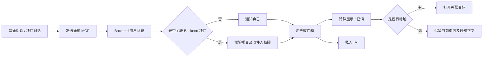
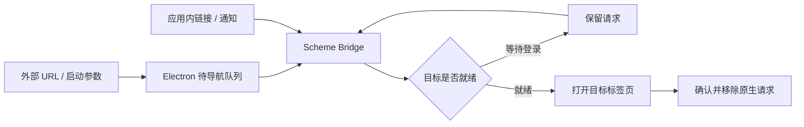
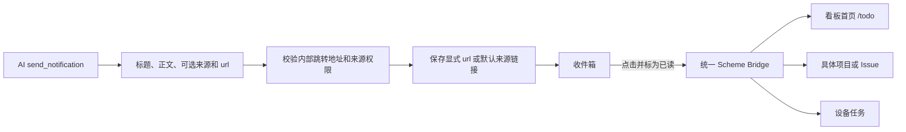
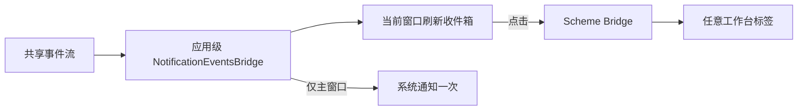

# 通知验收记录

## 用户级通知验证计划（2026-09-08）

通知归属当前 Backend 用户；项目及 Issue 仅是可选来源。普通会话和本地项目会话使用同一发送接口，没有来源时不生成跳转地址。

| 场景         | 前置条件与步骤                                                                                                 | 预期结果                                                            |
| ------------ | -------------------------------------------------------------------------------------------------------------- | ------------------------------------------------------------------- |
| 普通对话     | 隔离 Electron、真实 Backend 和 Codex、确定性模型响应；输入“给我发个通知，说你好”，调用实际 MCP，仅传标题和正文 | 当前用户收件箱保存“你好”，url 为 null；另一用户不可见               |
| 无项目用户   | Backend 测试用户无项目；省略收件人或显式指定自己                                                               | 201、持久化、可以标为已读                                           |
| 本地项目来源 | Rust 执行器持有本地项目和 Issue 上下文；发送通知                                                               | 通过认证 Backend 发送个人通知，不把本地 ID 当作 Backend 项目        |
| 权限和参数   | 无认证；未连接 Backend；无项目指定别人；只传 Issue                                                             | 分别拒绝；不保存无权限通知、不调用本地看板实现                      |
| 无来源交互   | 打开无地址通知                                                                                                 | 标为已读；正文仍可见、无报错、不跳转看板                            |
| 原有看板功能 | 执行现有 project-assignment-notification checkpoint                                                            | 分配去重、静默分配、权限及 Issue 跳转保持正确                       |
| IM           | 无来源和有来源分别发送，模拟实时事件失败                                                                       | 正文始终正确；只有有来源时追加真实地址                              |
| 迁移         | 隔离 SQLite 升级、写入无地址记录、降级、重新升级                                                               | 保留通知内容；新版本允许无地址，旧版本用空地址保存，重升后恢复 null |

复用 CI 已注册的 `project-assignment-notification` checkpoint。测试仅使用隔离用户和本地服务；完成后清理 Electron 会话及测试进程。

### 用户级通知实际结果

- Backend 通知服务、API、MCP：22 项通过；Rust MCP：28 项通过；通知中心：5 项通过。
- Renderer 类型检查、ESLint、Python Black/isort、Prettier 检查通过。
- 隔离 SQLite 完成升级、携带已有通知降级、再次升级；通知正文、关联链接和无来源状态均保留。
- 独立真实 Electron + 隔离 Backend：无项目用户发送“你好”、铃铛展示、已读持久化、不跳转、重载后内容及已读状态保留，均通过。
- Electron 会话：`wework/test-results/ai-verify/2026-09-08T09-30-13-023Z-87707/`；已停止。截图：`wework/test-results/notification-manual/general-notification-read.png`，已检查。
- 保留环境失败证据：`2026-09-08T09-25-35-393Z-73604/app.log` 记录了并行打包共用资源目录造成的 DSH 压缩包大小校验失败。改为串行构建后已确认两份 runtime 的大小和 SHA-256 与清单一致。
- 首次手动重载验证使用了仅保存在 localStorage 的临时登录配置，重载后失效；后续改为验收框架支持的 E2E 登录注入，并通过完整重载验证。
- 完整对话场景固定选择 runner 注册的 GPT 5.6 Luna 测试模型，避免继承机器上的默认模型配置；模型响应使用现有延迟工具搜索协议，实际执行 `send_notification` 并检查真实 Backend 保存结果后才回复成功。
- 最终完整桌面 checkpoint 通过（2 分 2 秒）：`wework/test-results/desktop-e2e/2026-09-08T09-37-27-147Z-16413/`。`space-mcp.log` 确认调用参数只有 `body,title`；真实 Backend 返回已保存通知。普通通知显示及已读、收件人隔离、原有分配通知、去重、静默分配及 Issue 跳转全部通过，截图 `wework-general-notification.png` 已检查。
- 模型夹具失败证据保留在 `2026-09-08T09-32-51-598Z-99576/` 和 `2026-09-08T09-35-22-499Z-9631/`：前者在无工具请求上尝试搜索工具；后者确认继承的默认模型请求没有工具定义。夹具增加首个无工具预热处理，并显式选择已注册、支持工具的测试模型后通过。

环境：macOS arm64；隔离 Electron；Backend 测试使用隔离 SQLite，桌面 E2E 使用 runner 启动的真实 Backend。禁止操作个人 Wework 窗口和真实联系人。

| 场景         | 前置条件与步骤                                          | 预期结果                                   | 验证                                       |
| ------------ | ------------------------------------------------------- | ------------------------------------------ | ------------------------------------------ |
| 人工通知选择 | 项目负责人修改 Issue 负责人，分别选择通知与不通知后保存 | API 接收到明确选择；只有通知分支落库       | TodoEditor 单测、Backend 分配测试          |
| 事务一致性   | 用过期版本分配给另一成员                                | 409；负责人和通知均回滚；不调度发送        | Backend 事务测试                           |
| 重复与自分配 | 连续分配给同一人；人工自分配；AI 交回当前用户           | 不重复；人工自分配静默；AI 交回通知        | Backend 分配测试、桌面场景                 |
| 收件人隔离   | 两个用户的通知并存，互相请求已读接口                    | 列表仅含自己的记录；跨用户操作 404         | Backend API、真实 Backend E2E              |
| 持久化与跳转 | 分配后从数据库读取通知，再从铃铛打开                    | 正确标题及 Issue；已读状态保存在数据库     | project-assignment-notification checkpoint |
| IM 投递      | 已连接私人会话，模拟 WebSocket 失败                     | IM 仍收到正文及 scheme；不修改当前会话任务 | IM 外部服务边界单测                        |
| 断线与恢复   | 请求失败后恢复 API 并刷新；切换账号                     | 显示错误、保留通知、刷新恢复；账号不串数据 | NotificationCenter 单测                    |
| Scheme 输入  | 看板、外部 Issue 编号、设备任务、非法 scheme 和地址参数 | 合法目标正确编码；非法目标拒绝             | scheme 单测                                |
| 安装包与启动 | Electron 注册协议；启动前及运行中接收 URL               | 就绪后通过统一 scheme 路由导航             | Electron 构建及原生队列验证                |
| 迁移         | 临时数据库 upgrade head → downgrade → upgrade head      | 表可创建、删除、重建                       | 已通过 SQLite Alembic 命令                 |

桌面回归复用 CI 已注册的 `project-assignment-notification` checkpoint，不增加本地专用测试入口。runner 清理隔离服务和数据库；独立 `ai:verify` 会话在验收后 stop，移除认证链接。

## 实际结果（2026-09-07）

- Backend 通知、负责人分配、外部看板及 MCP 回归：46 项通过。
- Rust MCP：27 项通过，包含认证请求、通知参数及自动化工具范围。
- 通知、scheme、编辑器界面回归此前 43 项通过；原生队列改动后 Bridge 4 项通过，覆盖 StrictMode 重挂载和登录恢复。
- 标题栏及看板回归：104 项通过。Electron 宿主、能力路由及队列：22 项通过。
- Renderer 与 Electron TypeScript 检查通过；新增界面 ESLint、Prettier、Python Black/isort、技能验证通过。
- Alembic 在隔离 SQLite 上完成升级、降级、重新升级；未连接生产 MySQL。
- 最终安装包连接真实 Backend 的桌面 checkpoint 通过，包含落库、已读、跨用户拒绝、重复分配抑制、不通知、主动通知、通知跳转和原生 scheme 跳转。
- 最终证据：`wework/test-results/desktop-e2e/2026-09-07T09-37-09-125Z-90169/`；界面截图：`wework-notifications-inbox.png`，已检查。
- 独立真实 Electron 验证：`wework/test-results/ai-verify/2026-09-07T09-04-16-363Z-58248/`，已停止并清理认证链接。
- IM 外部传输使用 mock 验证正文、地址、收件人及 WebSocket 失败后的独立投递；没有给真实联系人发送消息。

保留失败证据：`2026-09-07T09-30-18-702Z-61112` 中新标签页已经展示目标 Issue，但测试的全局选择器读到了后台标签页的旧标题。断言已限定到 `aria-hidden="false"` 的工作空间标签页；修正后最终场景通过，未通过重试隐藏失败。

## 最终跳转结构

队列读取不会删除请求；导航后按请求 ID 确认，未登录或组件重挂载不会提前消费。请求仅在当前 Electron 进程中保留。

## 独立点击目标（2026-09-08）

复核：来源仍只决定发送权限和默认链接；点击地址独立保存。看板首页可离线打开，具体 Backend 看板继续等待认证。无新增数据库字段或迁移。

验收计划：隔离 macOS Electron、真实隔离 Backend、测试用户，无真实 IM 联系人。

- API：不带项目分别发送无链接、看板首页及设备任务通知；确认保存、列表、已读状态及收件人隔离。非法 scheme、命令、路径、编码、控制符均 422 且不落库；项目显式地址优先于默认来源。
- 工具：Backend MCP 和 Rust 本地会话均传递 url；无项目/本地项目不继承无效来源。
- 路由：看板首页不依赖云账号；项目链接等待登录恢复；未知路由拒绝。
- CI 桌面 checkpoint：普通“你好”通知后，继续对话要求点击打开看板，真实工具落库，点击前仍在对话，点击后展示看板且已读持久化；继续原分配通知、去重、静默和 Issue 跳转回归。
- 独立 Electron：真实 API 创建带看板首页链接的通知，从铃铛点击到看板；重载后检查已读仍保留。保留截图并停止所有隔离服务及会话。

本轮结果：

- Backend 通知及 MCP：41 项通过；新增显式地址 IM 投递后，IM 分支 3 项通过（唯一用例总数 42）。Rust MCP 28 项通过；界面、Scheme 和 Bridge 24 项通过；TypeScript、ESLint、Black/isort、Prettier 通过。
- 首次桌面回归失败证据：`wework/test-results/desktop-e2e/2026-09-08T09-53-20-727Z-75533/`。通知外观的同期修改移除了行内“未读”文字，旧断言提前通过；Backend 日志确认 GET 列表早于 POST 已读提交完成。断言改为等待全局未读计数消失且通知仍在弹层，再检查 Backend 持久状态。
- 独立 Electron 验证通过：`wework/test-results/ai-verify/2026-09-08T09-55-33-323Z-79187/`。真实 Backend 的无项目通知保存 `wework://boards`，点击进入工作空间首页；重载后通知保留，`read_at` 非空且未读数为 0。截图 `wework/test-results/notification-manual/click-board-home.png` 已检查；结果 `click-result.json`。会话已停止，隔离 Backend/Redis 已清理。

### 多标签通知订阅修正

`2026-09-08T09-58-18-988Z-92696/` 与 `2026-09-08T10-02-01-377Z-5124/` 中，普通通知及点击看板均通过，随后分配通知重复。第二次加入完整通知诊断并按分配标题计数，确认两条通知正文完全一致，排除了对话完成提示。代码根因：每个 `WorkbenchProvider` 都订阅全局通知事件，新开看板标签后同一事件由多个 Provider 处理。

将通知订阅移到 `AppRoutes` 中的 `NotificationEventsBridge`，不随标签数量增长；每个窗口负责刷新自己的收件箱，只有主窗口发送系统提示。删除 Provider 内原订阅。复核图：

新增验证：StrictMode 下保持单一订阅、卸载释放、辅助窗口不发系统提示；既有 E2E 在先打开看板新标签后再分配，必须只收到一次提示，继续重复分配和静默分配回归。修正后通知相关 26 项单测、TypeScript 和 ESLint 通过。

最终验收通过：

- CI 桌面 checkpoint：`wework/test-results/desktop-e2e/2026-09-08T10-06-49-817Z-20443/`，1 分 47 秒，全部断言通过。真实 MCP 日志分别记录 `body,title` 和 `body,title,url`；点击看板后再分配只收到一条系统通知。继续通过已读、跨用户拒绝、重复分配抑制、自分配静默、显式静默及 Issue/原生 scheme 跳转。
- 最终独立 Electron：`wework/test-results/ai-verify/2026-09-08T10-07-31-393Z-21455/`，新代码从通知进入看板并在重载后保留已读状态。结果 `wework/test-results/notification-manual/click-result-final.json`；截图 `click-board-home-final.png`。会话和隔离 Backend/Redis 已停止，认证夹具已删除。
- 边界复核：通知持久化、来源权限、点击目标、标签页生命周期分别由原有对应模块负责；通知事件只由应用级 Bridge 消费，不在各标签页执行全局通知副作用。无需额外迁移来保存点击目标。
