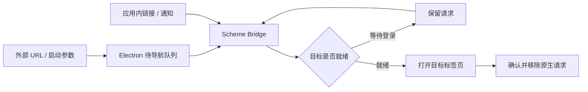

# 通知验收记录

环境：macOS arm64；隔离 Electron；Backend 测试使用隔离 SQLite，桌面 E2E 使用 runner 启动的真实 Backend。禁止操作个人 Wework 窗口和真实联系人。

| 场景         | 前置条件与步骤                                          | 预期结果                                   | 验证                                       |
| ------------ | ------------------------------------------------------- | ------------------------------------------ | ------------------------------------------ |
| 人工通知选择 | 项目负责人修改 Issue 负责人，分别选择通知与不通知后保存 | API 接收到明确选择；只有通知分支落库       | TodoEditor 单测、Backend 分配测试          |
| 事务一致性   | 用过期版本分配给另一成员                                | 409；负责人和通知均回滚；不调度发送        | Backend 事务测试                           |
| 重复与自分配 | 连续分配给同一人；人工自分配；AI 交回当前用户           | 不重复；人工自分配静默；AI 交回通知        | Backend 分配测试、桌面场景                 |
| 收件人隔离   | 两个用户的通知并存，互相请求已读接口                    | 列表仅含自己的记录；跨用户操作 404         | Backend API、真实 Backend E2E              |
| 持久化与跳转 | 分配后从数据库读取通知，再从铃铛打开                    | 正确标题及 Issue；已读状态保存在数据库     | project-assignment-notification checkpoint |
| IM 投递      | 已连接私人会话，模拟 WebSocket 失败                     | IM 仍收到正文及 scheme；不修改当前会话任务 | IM 外部服务边界单测                        |
| 断线与恢复   | 请求失败后恢复 API 并刷新；切换账号                     | 显示错误、保留通知、刷新恢复；账号不串数据 | NotificationCenter 单测                    |
| Scheme 输入  | 看板、外部 Issue 编号、设备任务、非法 scheme 和地址参数 | 合法目标正确编码；非法目标拒绝             | scheme 单测                                |
| 安装包与启动 | Electron 注册协议；启动前及运行中接收 URL               | 就绪后通过统一 scheme 路由导航             | Electron 构建及原生队列验证                |
| 迁移         | 临时数据库 upgrade head → downgrade → upgrade head      | 表可创建、删除、重建                       | 已通过 SQLite Alembic 命令                 |

桌面回归复用 CI 已注册的 `project-assignment-notification` checkpoint，不增加本地专用测试入口。runner 清理隔离服务和数据库；独立 `ai:verify` 会话在验收后 stop，移除认证链接。

## 实际结果（2026-09-07）

- Backend 通知、负责人分配、外部看板及 MCP 回归：46 项通过。
- Rust MCP：27 项通过，包含认证请求、通知参数及自动化工具范围。
- 通知、scheme、编辑器界面回归此前 43 项通过；原生队列改动后 Bridge 4 项通过，覆盖 StrictMode 重挂载和登录恢复。
- 标题栏及看板回归：104 项通过。Electron 宿主、能力路由及队列：22 项通过。
- Renderer 与 Electron TypeScript 检查通过；新增界面 ESLint、Prettier、Python Black/isort、技能验证通过。
- Alembic 在隔离 SQLite 上完成升级、降级、重新升级；未连接生产 MySQL。
- 最终安装包连接真实 Backend 的桌面 checkpoint 通过，包含落库、已读、跨用户拒绝、重复分配抑制、不通知、主动通知、通知跳转和原生 scheme 跳转。
- 最终证据：`wework/test-results/desktop-e2e/2026-09-07T09-37-09-125Z-90169/`；界面截图：`wework-notifications-inbox.png`，已检查。
- 独立真实 Electron 验证：`wework/test-results/ai-verify/2026-09-07T09-04-16-363Z-58248/`，已停止并清理认证链接。
- IM 外部传输使用 mock 验证正文、地址、收件人及 WebSocket 失败后的独立投递；没有给真实联系人发送消息。

保留失败证据：`2026-09-07T09-30-18-702Z-61112` 中新标签页已经展示目标 Issue，但测试的全局选择器读到了后台标签页的旧标题。断言已限定到 `aria-hidden="false"` 的工作空间标签页；修正后最终场景通过，未通过重试隐藏失败。

## 最终跳转结构

队列读取不会删除请求；导航后按请求 ID 确认，未登录或组件重挂载不会提前消费。请求仅在当前 Electron 进程中保留。
