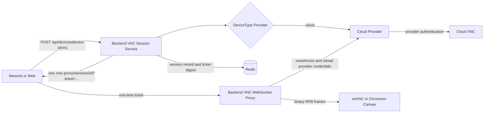

# Wework Cloud Device VNC Desktop

## Implementation boundary

Wework and the Web frontend both use `@novnc/novnc`. RFB decoding and rendering stay in a Chromium Canvas. Electron Main does not run a VNC client, decoder, renderer, or native VNC service; it only exposes system clipboard operations bound to the focused window and an active lease.

The internal DSH plugin `@wegent/dsh-ui-device-desktop` registers Wework's desktop route. The desktop page, `VncViewer`, device-command clipboard bridge, and entry components live in `wework/wecode/dsh/ui-device-desktop/src/device-desktop/`. Backend session APIs, the WebSocket proxy, and the provider live under `backend/wecode/`; the Web viewer lives under `frontend/wecode/`. Public host code only exposes generic extension, session, and isolated-surface hooks.

The Wework host defines a generic device-surface slot in `wework/src/extensions/device-surface-contract.ts`; `wework/wecode/extensions/device-surface.tsx` provides the internal implementation. The internal extension owns cloud-device eligibility, the desktop menu label and icon, and the telemetry value. The public host leaves this entry unavailable when the internal extension is absent.

The client and Backend session contract is provider-agnostic. Backend registers a provider only for cloud devices today, so only cloud devices expose a desktop.

The client receives only a short-lived Backend WebSocket URL. It must never receive a provider URL, sandbox ID, provider credential, Runtime token, or long-lived user JWT. Provider-specific settings live alongside the provider implementation, not in this guide.

## Final architecture



The fixed constraints are:

1. `VncViewer` accepts only `websocketUrl`; it is unaware of device type and upstream authentication.
2. A provider is registered only for `DeviceType.CLOUD` today. Remote, local, and other device types fail closed without falling back to the Runtime or a legacy path.
3. The actor and target owner are fixed during the authenticated HTTP request. WebSocket query parameters cannot override the owner.
4. Redis stores session authorization metadata and a one-time ticket digest, never a provider credential.
5. Before opening the upstream WebSocket, Backend rechecks the user, delegated admin access, device ownership, device type, sandbox mapping, and live state.
6. Active connections recheck the session and authorization every five seconds. Revocation, expiry, device stop/deletion, or an access change closes the connection.

## Session API

Create a session:

```http
POST /api/devices/{device_id}/vnc
Authorization: Bearer <access-token>
Content-Type: application/json

{
  "owner_user_id": 42
}
```

`owner_user_id` is only for admin delegation. A regular user omits it or can specify only their own ID.

Response:

```json
{
  "session_id": "vnc-random",
  "device_id": "device-id",
  "type": "vnc",
  "path": "",
  "url": "wss://backend.example.com/vnc-proxy/sessions/vnc-random?ticket=single-use",
  "transport": "websocket",
  "expires_at": "2026-09-14T12:00:00Z"
}
```

Revoke a session:

```http
DELETE /api/devices/vnc-sessions/{session_id}
Authorization: Bearer <access-token>
```

Security limits:

| Item                  | Value                                              |
| --------------------- | -------------------------------------------------- |
| Connect ticket        | 32 random URL-safe bytes, single use               |
| Ticket Redis key      | SHA-256 digest, never the bearer value             |
| Ticket TTL            | 60 seconds                                         |
| Session TTL           | At most one hour                                   |
| Client frame limit    | 1 MiB                                              |
| Upstream frame limit  | 64 MiB                                             |
| WebSocket compression | Disabled to avoid recompressing encoded image data |
| Origin                | Strict production allowlist                        |

## Backend deployment

Public configuration:

```env
WEGENT_BACKEND_PUBLIC_URL=https://backend.example.com
VNC_ALLOWED_ORIGINS=["https://web.example.com","http://127.0.0.1:*"]
```

- Configure the Web frontend with an exact origin.
- Wework Core DSH uses a random loopback port, so production explicitly allows `http://127.0.0.1:*`.
- Wildcards are recognized only for `http(s)://127.0.0.1:*` and `http(s)://localhost:*`, never for ordinary domains.
- Development allows loopback origins with an explicit port. Production fails closed without configuration.

Internal provider credentials stay Backend-only and are documented beside the provider implementation. Backend resolves them immediately before connecting, sends them only in the upstream request, and excludes them from REST responses, Redis session records, browser logs, and metric labels.

## Cloud device capability

The desktop entry is available only for cloud devices. It is disabled while the device is offline and hidden when the capability explicitly reports `desktop.available: false`. Older cloud devices without a `desktop` field retain the entry; Backend validates their live state when creating a session. Normally Backend reports:

```json
{
  "schemaVersion": 4,
  "desktop": {
    "version": 1,
    "available": true,
    "protocol": "rfb",
    "transport": "websocket",
    "clipboard": "text"
  }
}
```

The Backend projects this capability from provider configuration and live device state. No executor advertises it: a Runtime reports only the interactive sessions it actually serves.

The current contract advertises only base `text` clipboard support. Change it to `extended-text` only after a real server passes bidirectional UTF-8 extension tests.

## Chromium image-quality and stutter tuning

noVNC continues to render inside Chromium and exposes controlled profiles:

| Profile            | qualityLevel | compressionLevel | Remote DPR cap | H.264 |
| ------------------ | -----------: | ---------------: | -------------: | ----- |
| Clarity            |            9 |                1 |            1.5 | Off   |
| Balanced (default) |            8 |                2 |           1.25 | Off   |
| Smooth             |            6 |                4 |            1.0 | Off   |

Implementation details:

- The default raises noVNC quality from 6 to 8 to reduce JPEG blur around text and icons.
- Remote resize uses a 250 ms debounce so window dragging does not repeatedly rebuild the framebuffer.
- Each profile caps DPR so a Retina display does not automatically request twice the pixels.
- noVNC's existing pointer coalescing of roughly 17 ms remains in place; no high-frequency Electron IPC was added.
- A viewer outside the visible surface disconnects after 30 seconds and requests a new session when visible again.
- The Backend proxy awaits writes for backpressure and rejects text WebSocket frames.
- H.264 requires an explicit opt-in. It remains off until the remote encoder and Chromium WebCodecs combination is validated.

The Viewer emits `wework:vnc-metric` events without URLs, tickets, or clipboard text:

- `connected`: RFB connection time;
- `first-frame`: time to the first complete framebuffer update;
- `encoding`: actual server-selected RFB encoding;
- `frame-gap`: five-second-window P95, maximum gap, and sample count.

Compare profiles with first-frame time, frame-gap P95, CPU, GPU, RSS, and network throughput. Visual impressions alone are not sufficient.

## Clipboard

Electron Main exposes only:

- `isolatedClipboard.activate`
- `isolatedClipboard.deactivate`
- `isolatedClipboard.readText`
- `isolatedClipboard.writeText`

Every call is bound to the focused window and a random lease. The Viewer obtains a lease only while the page is visible, the window is focused, and the desktop surface is active. Blur, hiding, unmount, and background suspension deactivate it.

The remote is a full Linux desktop, not a terminal, so copy and paste send plain `Control+C` / `Control+V` and let the focused remote application handle them. Clipboard text moves separately through the bridge; terminal-specific shortcuts are not an alternative.

The write direction carries the whole base64 payload in one process environment variable, and Linux caps a single environment entry at `MAX_ARG_STRLEN` (128 KiB with 4 KiB pages). The write limit is therefore a 32 KiB UTF-8 payload, rejected in the client rather than failing while the remote process starts. The read direction returns through stdout, is not subject to that cap, and keeps its 1 MiB limit.

Base RFB clipboard does not guarantee arbitrary Unicode extensions. The release contract remains the validated `text` capability. Chinese, emoji, multiline text, and tabs become byte-exact release gates only after the real server passes the UTF-8 or Extended Clipboard path.

## Error semantics

| Condition                                   | HTTP / WebSocket behavior |
| ------------------------------------------- | ------------------------- |
| Missing device or access                    | HTTP 404                  |
| Regular user delegates another owner        | HTTP 403                  |
| Unsupported/offline/misconfigured desktop   | HTTP 409                  |
| Disallowed origin or revoked authorization  | WS 4003                   |
| Missing, invalid, expired, or used ticket   | WS 4001                   |
| Non-binary frame                            | WS 1003                   |
| Redis or upstream authorization unavailable | WS 1011                   |

Errors must not contain tokens, tickets, signatures, upstream URLs, or clipboard text.

## Acceptance matrix

Automation must cover:

1. Regular users access only their devices; admin owner override is authorized during HTTP creation.
2. A one-time ticket cannot be replayed; long-lived JWT URLs and the old device-ID proxy path are rejected.
3. Redis session records do not contain provider credentials.
4. The WebSocket handshake rechecks the user, device, and sandbox.
5. Wework and Web consume the same session URL contract.
6. noVNC completes an RFB handshake and framebuffer update in real Chromium/Electron.
7. Balanced defaults are quality 8, compression 2, DPR capped at 1.25, and H.264 off.
8. Resize debounce, background suspension, reconnect, and session revocation work.
9. Clipboard leases do not cross devices or tabs.

For performance acceptance, use the same device, resolution, and interaction script. Record the previous release as a baseline, then run Clarity, Balanced, and Smooth:

- Balanced text clarity must be no worse than the previous release.
- First-frame time and frame-gap P95 must not regress.
- A 30-minute interaction has no sustained RSS growth.
- RFB decode traffic stops after the Viewer has been in the background for 30 seconds.
- REST responses, browser logs, and Backend logs contain neither a signature nor a long-lived JWT.

## Removed legacy paths

The migration removes:

- `/vnc-config`;
- `/vnc-proxy/{device_id}?token=<jwt>`;
- the Frontend Node VNC proxy;
- the copied `vnc.html` and `rfb.min.js`;
- Electron `vnc.prepareSession`, `vnc.externalBridgeUrl`, and its VNC session manager;
- system-browser and embedded-browser launch paths for the legacy noVNC page.

Roll back the whole release when deployment fails. Do not restore a legacy authentication fallback at runtime.
