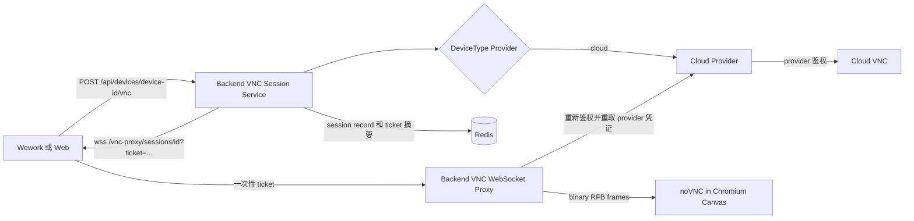

# Wework 云设备 VNC 远程桌面

## 实现边界

Wework 和 Web 前端统一使用 `@novnc/novnc`，在 Chromium Canvas 中完成 RFB 解码与渲染。Electron Main 不运行 VNC client、解码器或原生渲染服务，只提供绑定窗口焦点和 lease 的系统剪贴板能力。

Wework 的桌面路由由内网 DSH 插件 `@wegent/dsh-ui-device-desktop` 注册。桌面页、`VncViewer`、设备剪贴板命令桥接和入口组件位于 `wework/wecode/dsh/ui-device-desktop/src/device-desktop/`。Backend 会话 API、WebSocket 代理和 provider 位于 `backend/wecode/`；Web viewer 位于 `frontend/wecode/`。公开宿主只提供通用扩展、会话与隔离 surface 接口。

Wework 宿主通过 `wework/src/extensions/device-surface-contract.ts` 定义通用设备界面插槽；内网实现由 `wework/wecode/extensions/device-surface.tsx` 接入。云设备适用性、桌面菜单的文案与图标、遥测标识都由内网扩展提供。没有内网扩展时，公开宿主的对应入口不可用。

客户端与 Backend 的会话契约与具体 provider 无关。Backend 目前只为云设备注册 provider，因此只有云设备会暴露桌面。

客户端只能获得 Backend 生成的短时 WebSocket 地址，不能获得 provider 地址、sandbox ID、provider 凭证、Runtime token 或长期用户 JWT。Provider 自身的配置写在 provider 实现旁，不在本指南内。

## 最终架构



核心约束：

1. `VncViewer` 只接收 `websocketUrl`，不感知设备类型和上游鉴权。
2. Provider 只为 `DeviceType.CLOUD` 显式注册；远程设备、本地设备和其他类型失败关闭，不回退到 Runtime 或旧链路。
3. HTTP 会话创建阶段确定发起人和目标 owner。WebSocket 查询参数不能覆盖 owner。
4. Redis 只保存会话授权元数据和一次性 ticket 摘要，不保存 provider 凭证。
5. WebSocket 连接前重新确认用户、管理员权限、设备归属、设备类型、sandbox 映射和运行状态。
6. 活动连接每 5 秒复核会话和授权状态；撤销、过期、设备停机/删除或权限变化会关闭连接。

## 会话 API

创建：

```http
POST /api/devices/{device_id}/vnc
Authorization: Bearer <access-token>
Content-Type: application/json

{
  "owner_user_id": 42
}
```

`owner_user_id` 仅用于管理员代管；普通用户省略或只能填写自己。

响应：

```json
{
  "session_id": "vnc-random",
  "device_id": "device-id",
  "type": "vnc",
  "path": "",
  "url": "wss://backend.example.com/vnc-proxy/sessions/vnc-random?ticket=single-use",
  "transport": "websocket",
  "expires_at": "2026-09-14T12:00:00Z"
}
```

撤销：

```http
DELETE /api/devices/vnc-sessions/{session_id}
Authorization: Bearer <access-token>
```

安全参数：

| 项目                | 值                                  |
| ------------------- | ----------------------------------- |
| Connect ticket      | 32 随机字节，URL-safe，只能使用一次 |
| Ticket Redis key    | SHA-256 摘要，不包含 bearer 原文    |
| Ticket TTL          | 60 秒                               |
| Session TTL         | 最长 1 小时                         |
| Client frame 上限   | 1 MiB                               |
| Upstream frame 上限 | 64 MiB                              |
| WebSocket 压缩      | 关闭，避免对已压缩图像重复压缩      |
| Origin              | 生产环境严格 allowlist              |

## Backend 部署配置

公共配置：

```env
WEGENT_BACKEND_PUBLIC_URL=https://backend.example.com
VNC_ALLOWED_ORIGINS=["https://web.example.com","http://127.0.0.1:*"]
```

- Web 页面填写精确 origin。
- Wework Core DSH 使用随机 loopback 端口，因此生产环境显式配置 `http://127.0.0.1:*`。
- 通配只支持 `http(s)://127.0.0.1:*` 或 `http(s)://localhost:*`，不能用于普通域名。
- 开发环境允许带端口的 loopback origin；生产环境未配置时失败关闭。

Provider 自身的凭证继续由 Backend 持有，配置项目写在 provider 实现旁的内网文档里。Backend 只在建连前即时解析，并且不进入 REST 响应、Redis 会话记录、浏览器日志或监控标签。

## 云设备能力

UI 只为云设备提供桌面入口。设备离线时入口不可用；如果能力明确声明 `desktop.available: false`，入口不显示。旧云设备未返回 `desktop` 字段时仍保留入口，由 Backend 在创建会话时验证实时状态。正常情况下 Backend 返回：

```json
{
  "schemaVersion": 4,
  "desktop": {
    "version": 1,
    "available": true,
    "protocol": "rfb",
    "transport": "websocket",
    "clipboard": "text"
  }
}
```

Backend 根据 provider 配置和设备的实时状态投影该能力。该能力不由 Executor 上报：Runtime 只会上报自己实际提供的交互式会话。

当前只声明基础 `text` 剪贴板。只有真实服务端双向 UTF-8 扩展协议验证通过后，才能改为 `extended-text`。

## Chromium 画质与卡顿优化

noVNC 保持在 Chromium 中渲染，并增加以下受控参数：

| 档位         | qualityLevel | compressionLevel | 远端 DPR 上限 | H.264 |
| ------------ | -----------: | ---------------: | ------------: | ----- |
| 清晰         |            9 |                1 |           1.5 | 关闭  |
| 均衡（默认） |            8 |                2 |          1.25 | 关闭  |
| 流畅         |            6 |                4 |           1.0 | 关闭  |

实现细节：

- 默认从 noVNC 的 `quality=6` 提升到 `quality=8`，降低文字和图标的 JPEG 模糊。
- 远端 resize 使用 250 ms debounce，窗口拖动时不会连续重建 framebuffer。
- DPR 按档位封顶，避免 Retina 屏幕无条件请求 2 倍像素造成解码和传输放大。
- noVNC 原有鼠标移动约 17 ms 合并保留，不增加高频 IPC。
- Viewer 离开可视区域 30 秒后断开，重新可见时申请新会话，避免后台持续解码。
- WebSocket 双向传输使用 await backpressure，禁止 text frame。
- H.264 必须显式打开；当前默认关闭，避免在未验证远端 encoder 和 Chromium WebCodecs 组合前改变编码路径。

Viewer 通过 `wework:vnc-metric` 事件提供不含 URL、ticket 和剪贴板正文的观测值：

- `connected`：WebSocket/RFB 连接耗时；
- `first-frame`：首个完整 framebuffer update 的时间；
- `encoding`：服务端实际选择的 RFB encoding；
- `frame-gap`：5 秒窗口中的帧间隔 P95、最大值和样本数。

对比不同档位时至少记录首帧、frame-gap P95、CPU、GPU、RSS 和网络吞吐，不能只凭肉眼判断。

## 剪贴板

Electron Main 只暴露：

- `isolatedClipboard.activate`
- `isolatedClipboard.deactivate`
- `isolatedClipboard.readText`
- `isolatedClipboard.writeText`

所有调用都绑定当前聚焦窗口和随机 lease。Viewer 仅在页面可见、窗口已聚焦且桌面 surface 激活时获得 lease；blur、隐藏、卸载和后台 suspend 会撤销。

远端是一整套 Linux 桌面而不是终端，因此复制和粘贴向远端发送通用 `Control+C` / `Control+V`，由获得焦点的远端应用自行处理；剪贴板正文则由 bridge 单独搬运，复用终端专用快捷键不是备选方案。

写入方向把整个 Base64 正文放在单个进程环境变量里，而 Linux 对单个环境变量有 `MAX_ARG_STRLEN`（4 KiB 页时为 128 KiB）限制。因此写入上限固定为 32 KiB UTF-8 正文，超出时前端直接报错，不会在远端进程启动阶段失败。读取方向走标准输出，不受该限制，仍为 1 MiB。

基础 RFB clipboard 不保证任意 Unicode 扩展能力。当前验收范围固定为服务端已验证的 `text` 能力；中文、emoji、多行和制表符只有在真实服务端支持的 UTF-8/Extended Clipboard 路径通过后，才作为字节级发布门槛。

## 错误语义

| 场景                             | HTTP / WebSocket 行为 |
| -------------------------------- | --------------------- |
| 设备不存在或无权限               | HTTP 404              |
| 普通用户代管他人设备             | HTTP 403              |
| 设备不支持桌面、离线或配置不完整 | HTTP 409              |
| Origin 不允许或授权被撤销        | WS 4003               |
| ticket 缺失、错误、过期或已使用  | WS 4001               |
| 非 binary frame                  | WS 1003               |
| Redis 或上游授权不可用           | WS 1011               |

错误响应不得包含 token、ticket、signature、上游 URL 或剪贴板正文。

## 验收矩阵

自动化必须覆盖：

1. 普通用户只能访问自己的设备；管理员 owner override 在 HTTP 阶段鉴权。
2. 一次性 ticket 不能重放，长期 JWT URL 和旧 device-ID proxy 路径被拒绝。
3. Redis 会话中不存在 provider 凭证。
4. WebSocket 建连时重新确认用户、设备和 sandbox。
5. Wework 与 Web 都消费统一会话 URL。
6. noVNC 在真实 Chromium/Electron 中完成 RFB 握手和 framebuffer 更新。
7. 默认均衡档位为 quality 8 / compression 2 / DPR 1.25 上限 / H.264 off。
8. resize debounce、后台 suspend、断开重连和 session revoke 正常。
9. 剪贴板 lease 在多个设备和标签页之间不串用。

发布前的真实性能验收使用同一云设备、同一分辨率和同一操作脚本，先记录旧版本基线，再分别运行清晰/均衡/流畅档位。建议门槛：

- 默认均衡档文字清晰度不低于旧版本；
- 首帧和 frame-gap P95 不劣化；
- 连续 30 分钟操作无持续 RSS 增长；
- 后台 30 秒后不再保持 RFB 解码流；
- REST、浏览器、Backend 日志中检索不到 signature 或长期 JWT。

## 已移除的旧链路

迁移完成后不再保留：

- `/vnc-config`；
- `/vnc-proxy/{device_id}?token=<jwt>`；
- Frontend Node VNC proxy；
- 内置 `vnc.html` 和复制的 `rfb.min.js`；
- Electron `vnc.prepareSession`、`vnc.externalBridgeUrl` 和 VNC session manager；
- 通过系统浏览器或 embedded-browser 打开旧 noVNC 页面的路径。

部署失败时按版本整体回滚，不在运行时恢复旧鉴权链路。
